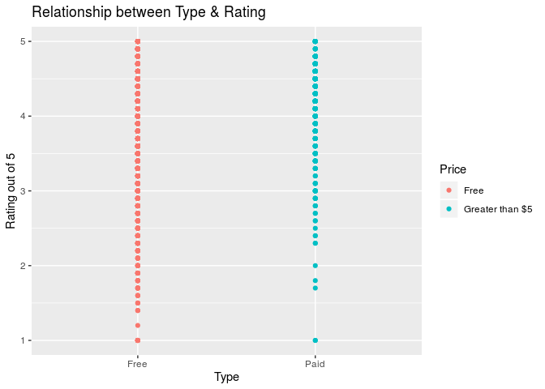

Understanding Google Play Application Reviews
================
RTime2Shine
October 29, 2019

## Section 1. Introduction

As technology has become increasingly prevalent around the world, there
has been a change in the consumption of media. One of these ways is via
the purchase of applications (apps) for various smartphones and other
devices. Several technology companies, including Apple and Google, run
virtual stores for these apps in which a person can download an app for
their device. These apps can be for various purposes like socializing,
playing games, or watching television and movies, among others. While
any user of a phone can agree that apps hold an important effect on how
one interacts with technology on a daily basis, the weight of the impact
becomes even more shocking when one looks at the figures- in 2018,
global app downloads topped 194 billion (Dignan).

Our motivation for this project is to understand what makes apps (from
the Google Play store specifically) have favorable ratings.
Understanding the ratings of an app is important for several reasons.
First, ratings can be important to the provider- in this case Google-
who can decide whether an app should continue to be sold to maintain
their quality standards. Ratings are additionally useful as a direct
line of communication between the user and the developers- often,
developers are made aware of changes that need to be made to their apps
through user feedback. Lastly, reviews serve to inform potential users
of an app whether or not it is worth their time and can affect future
downloads. Considering that app users are predicted to spend about $120
billion in app stores in 2019, understanding which apps do well on the
Play Store and what factors affect app performance is an immensely
important question to gain more insight into. Thus leads us to introduce
our main research questions- What are the relevant factors that affect
the rating given for apps in the Google Play store? Although this
project will give a detailed attempt to answer this question, our
preliminary hypothesis is that the variables Category, Price/Type,
Genre, Content Rating are the predictor variables that will most affect
a given app rating and popularity, as measured by the number of installs
of the app. Furthermore, once we test our hypothesis and determine which
factors are relevant, we will attempt to use that information to predict
the success of an app.

## Section 2. Exploratory Data Analysis

The dataset is obtained from Kaggle. It was scraped directly from the
Google Play Store in August 2018. Each observation represents one
individual app on the Google Play
    Store.

``` r
library(tidyverse)
```

    ## ── Attaching packages ────────────────────────────────────────────────────────────────────────────────────────────────────────────────────────────────────── tidyverse 1.2.1 ──

    ## ✔ ggplot2 3.2.1     ✔ purrr   0.3.2
    ## ✔ tibble  2.1.3     ✔ dplyr   0.8.3
    ## ✔ tidyr   0.8.3     ✔ stringr 1.4.0
    ## ✔ readr   1.3.1     ✔ forcats 0.4.0

    ## ── Conflicts ───────────────────────────────────────────────────────────────────────────────────────────────────────────────────────────────────────── tidyverse_conflicts() ──
    ## ✖ dplyr::filter() masks stats::filter()
    ## ✖ dplyr::lag()    masks stats::lag()

``` r
library(broom)
library(knitr) 
library(skimr)
```

    ## 
    ## Attaching package: 'skimr'

    ## The following object is masked from 'package:knitr':
    ## 
    ##     kable

    ## The following object is masked from 'package:stats':
    ## 
    ##     filter

``` r
library(ggplot2)
```

``` r
apps <- read_csv("/cloud/project/02-data/googleplaystore.csv")
```

    ## Parsed with column specification:
    ## cols(
    ##   App = col_character(),
    ##   Category = col_character(),
    ##   Rating = col_double(),
    ##   Reviews = col_double(),
    ##   Size = col_character(),
    ##   Installs = col_character(),
    ##   Type = col_character(),
    ##   Price = col_character(),
    ##   `Content Rating` = col_character(),
    ##   Genres = col_character(),
    ##   `Last Updated` = col_character(),
    ##   `Current Ver` = col_character(),
    ##   `Android Ver` = col_character()
    ## )

    ## Warning: 2 parsing failures.
    ##   row     col               expected     actual                                         file
    ## 10473 Reviews no trailing characters M          '/cloud/project/02-data/googleplaystore.csv'
    ## 10473 NA      13 columns             12 columns '/cloud/project/02-data/googleplaystore.csv'

``` r
apps <- apps %>%
  na.omit(apps)
```

``` r
ggplot(data = apps, aes(x = Rating)) + geom_histogram(binwidth = 0.1, fill = "blue") + xlim(0,5) +
  labs(title = "Distribution of App Rating")
```

    ## Warning: Removed 2 rows containing missing values (geom_bar).

<!-- -->

``` r
apps %>% 
  summarise(median(Rating), IQR(Rating))
```

    ## # A tibble: 1 x 2
    ##   `median(Rating)` `IQR(Rating)`
    ##              <dbl>         <dbl>
    ## 1              4.3           0.5

``` r
count(apps, Category) %>% 
  arrange(desc(n)) 
```

    ## # A tibble: 33 x 2
    ##    Category          n
    ##    <chr>         <int>
    ##  1 FAMILY         1747
    ##  2 GAME           1097
    ##  3 TOOLS           734
    ##  4 PRODUCTIVITY    351
    ##  5 MEDICAL         350
    ##  6 COMMUNICATION   328
    ##  7 FINANCE         323
    ##  8 SPORTS          319
    ##  9 PHOTOGRAPHY     317
    ## 10 LIFESTYLE       314
    ## # … with 23 more rows

We determined median and IQR as our summary statistics because the
distribution of `rating` appears to be slightly left-skewed. The median
rating of an app is approximately **4.3** and the IQR is **0.5**

  - In the possible interactions below, we can also see the relationship
    between our responsible variable `rating` and predictor variables of
    interest.

## Section 3. Regression Analysis Plan

### Possible Interactions

``` r
apps$Price <- as.numeric(apps$Price)
```

    ## Warning: NAs introduced by coercion

``` r
skim(apps, Price)
```

    ## Skim summary statistics
    ##  n obs: 9365 
    ##  n variables: 13 
    ## 
    ## ── Variable type:numeric ──────────────────────────────────────────────────────────────────────────────────────────────────────────────────────────────────────────────────────
    ##  variable missing complete    n mean sd p0 p25 p50 p75 p100     hist
    ##     Price     647     8718 9365    0  0  0   0   0   0    0 ▁▁▁▇▁▁▁▁

``` r
filter(apps, Category == "FAMILY", Category == "GAME", Category =="TOOLS",Category =="PRODUCTIVITY", Category =="MEDICAL", Category =="COMMUNICATION", Category =="FINANCE", Category =="SPORTS",Category =="PHOTOGRAPHY", Category =="LIFESTYLE")
```

    ## # A tibble: 0 x 13
    ## # … with 13 variables: App <chr>, Category <chr>, Rating <dbl>,
    ## #   Reviews <dbl>, Size <chr>, Installs <chr>, Type <chr>, Price <dbl>,
    ## #   `Content Rating` <chr>, Genres <chr>, `Last Updated` <chr>, `Current
    ## #   Ver` <chr>, `Android Ver` <chr>

``` r
#mutate(Price = case_when(Price == 0 ~ "Free", Price < 5 & Price > 0~ "Between $0 and $4.99", Price > 5 ~ "Greater than $5"))

skim(apps, Category)
```

    ## Skim summary statistics
    ##  n obs: 9365 
    ##  n variables: 13 
    ## 
    ## ── Variable type:character ────────────────────────────────────────────────────────────────────────────────────────────────────────────────────────────────────────────────────
    ##  variable missing complete    n min max empty n_unique
    ##  Category       0     9365 9365   4  19     0       33

Since our question of interest is measuring the effect of various
qualities of an app on its rating, there are a number of interactions
within our predictor variables to consider. First, there is a possible
interaction between content rating and
categories.

``` r
filter(apps, Category == "FAMILY", Category == "GAME", Category =="TOOLS",Category =="PRODUCTIVITY", Category =="MEDICAL", Category =="COMMUNICATION", Category =="FINANCE", Category =="SPORTS",Category =="PHOTOGRAPHY", Category =="LIFESTYLE")
```

    ## # A tibble: 0 x 13
    ## # … with 13 variables: App <chr>, Category <chr>, Rating <dbl>,
    ## #   Reviews <dbl>, Size <chr>, Installs <chr>, Type <chr>, Price <dbl>,
    ## #   `Content Rating` <chr>, Genres <chr>, `Last Updated` <chr>, `Current
    ## #   Ver` <chr>, `Android Ver` <chr>

``` r
ggplot(apps, aes(x = Category, y = Rating, color = `Content Rating`)) + geom_point() +
labs( title = "Relationship between Category and Rating", x ="Category", y = "Rating out of 5")
```

<!-- -->

As shown in the plot above, there may be a correlation between having a
lower content rating and being in a “family-friendly” category such as
Family or game. This interaction will have to be considered when
building the model. As well, there is a clear interaction between other
categories such as Mature or Teen being heavily represented among
certain Categories. Secondly, there may be an interaction between number
of reviews and
installs.

``` r
ggplot(apps, aes(x = Reviews, y = Rating, color = Installs)) + geom_point() +
labs( title = "Relationship between Reviews and Rating", x ="# of Reviews ", y = "Rating out of 5")
```

<!-- -->

As shown in this plot, as the number of reviews for an app increases, so
does the number of installs. This is indicative of an app being popular
so there is most likely some interaction between these two variables in
the dataset. Thirdly, there may be an interaction between Type and
Price. Since Type is an indicator measuring wether an app is paid or
free, all apps that are free will be correlated with apps that have a
price = 0 and apps that are paid will be correlated with apps that have
a price greater than 0.

``` r
ggplot(apps, aes(x = Type, y = Rating, color = Price)) + geom_point() +
labs( title = "Relationship between Type & Rating", x ="Type", y = "Rating out of 5")
```

<!-- -->

This is further illustrated through the above plot, which clearly shows
this interaction. These interactions along with any further ones we may
find after our preliminary analysis will have to be explored further and
considered when building our model.

### Model Selection

Our ultimate goal is to create the model which most accurately and
concisely predicts the Rating of an app given the predictors in the
dataset. We will attempt to choose a model using a minimization of BIC
as our criteria as this will allow us to calculate a precise prediction
of our response variable while also removing extraneous predictors. We
will use BIC as the selection criteria as it penalizes more for
erroneous predictors. We will not use R-squared as a criteria for model
selection. R squared increases strictly as the number of predictors
increases and does not tell us if these additional predictors are
significant or not. If we used r-squared we would always choose models
with the largest numbers of predictors, which would not always produce
the simplest, most accurate model. Unlike R squared, AIC, BIC, and
adjusted R squared do penalize for insignificant predictors and can give
us a better idea of which predictors actually contribute to the response
variable. In order to find our final model, we will use a process of
backwards selection slowly adding a combination of relevant predictors
into our model. We will then check the BIC values for each of these
models as well as the adj-R squared values and find the model with the
highest value- this will be the model that most accurately predicts our
response with the fewest number of predictors. We will then plot each
predictor on the response to determine if the effect is relevant or if
there are possible interactions between other variables. As well, we
will need to consider potential outliers and extraneous values in our
model. Using the distributions of standardized residuals and a
calculation of Cook’s distance, we will attempt to determine those
observations with high standardized residuals or cook’s distance and
determine if those observations have a significant effect on our model.
Lastly, we will need to find the VIF factor for each of our final
predictors to see if there is any collinearity between them. A VIF
greater than 10 would require us to explore possible ways to mitigate
interactions between variables or consider dropping predictors are are
too heavily correlated.

### Use of Model and Reason

The regression modeling technique we will use will be Multiple Linear
Regression (MLR). Since we are exploring the effect of multiple
predictor variables on our response, `rating`, it is apt that we use MLR
to model our data. MLR allows us to see the effect of multiple
predictors on a response and explore both the significance of each
predictor on the response as well as the effect of each predictor on the
response. As opposed to Simple Linear Regression, MLR allows us to
measure the effect of multiple predictors on your response in one model
- SLR only allows us to measure the effect of one predictor on the
response in one model. This is very taxing and inefficient for the
number of predictors we want to measure. As well, there may be
interactions between these predictors that we will be unable to view
using SLR. MLR allows us to both model and view the amalgamation of
these predictors in their effects on the response variable. MLR from
both an efficiency and relevancy perspective is much better suited to
model your data as opposed to other methods.

## Section 4. References

Gupta, Lavanya. Kaggle. Jan. 2019,
www.kaggle.com/lava18/google-play-store-apps?fbclid=IwAR36EMS2jg5fhPi-BQlX6Mv4MCk8YUm2XmyOLt0zsKkNyc9JK-JD7aLy-6I.
Accessed 30 Oct. 2019.

Dignan, Larry. “App Economy Expected to Be $120 Billion in 2019 as Small
Screen Leads Digital Transformation Efforts.” ZDNet, ZDNet, 16
Jan. 2019,
www.zdnet.com/article/app-economy-expected-to-be-120-billion-in-2019-as-small-screen-leads-digital-transformation-efforts/

## The Data

``` r
glimpse(apps)
```

    ## Observations: 9,365
    ## Variables: 13
    ## $ App              <chr> "Photo Editor & Candy Camera & Grid & ScrapBook…
    ## $ Category         <chr> "ART_AND_DESIGN", "ART_AND_DESIGN", "ART_AND_DE…
    ## $ Rating           <dbl> 4.1, 3.9, 4.7, 4.5, 4.3, 4.4, 3.8, 4.1, 4.4, 4.…
    ## $ Reviews          <dbl> 159, 967, 87510, 215644, 967, 167, 178, 36815, …
    ## $ Size             <chr> "19M", "14M", "8.7M", "25M", "2.8M", "5.6M", "1…
    ## $ Installs         <chr> "10,000+", "500,000+", "5,000,000+", "50,000,00…
    ## $ Type             <chr> "Free", "Free", "Free", "Free", "Free", "Free",…
    ## $ Price            <dbl> 0, 0, 0, 0, 0, 0, 0, 0, 0, 0, 0, 0, 0, 0, 0, 0,…
    ## $ `Content Rating` <chr> "Everyone", "Everyone", "Everyone", "Teen", "Ev…
    ## $ Genres           <chr> "Art & Design", "Art & Design;Pretend Play", "A…
    ## $ `Last Updated`   <chr> "January 7, 2018", "January 15, 2018", "August …
    ## $ `Current Ver`    <chr> "1.0.0", "2.0.0", "1.2.4", "Varies with device"…
    ## $ `Android Ver`    <chr> "4.0.3 and up", "4.0.3 and up", "4.0.3 and up",…
