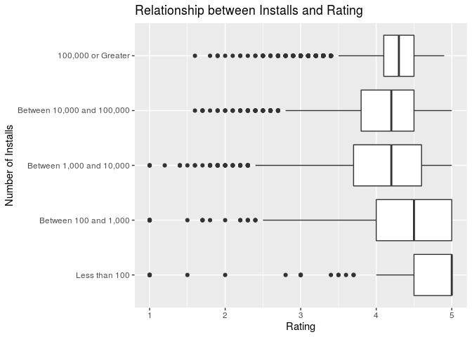

Understanding Google Play Application Reviews
================
RTime2Shine
11/20/19

To Do: - Edit current version (Lukengu) - Edit Date Since Update (Sara)
DONE - Size should be in bins (lukengu) - Make the model (sanjay) -
Univariate Analysis (Zoe) - Explanation of Model Process (Sanjay)

Your regression analysis results go here. At a minimum, the regression
analysis should include the following:

  - Description of the response variable
  - Updated exploratory data analysis, incorporating any feedback from
    the proposal (Zoe, Sara, Lukengu)
      - Univariate analysis, include the changed variables, explain why
        we are taking out what we are taking out, response vs all
        predictor variables.
  - Explanation of the modeling process and why you chose those metohds,
    incorporating any feedback from the proposal (Sanjay)
  - Output of the final model (Sanjay)
  - Discussion of the assumptions for the final model (Zoe)
  - Interpretations / interesting findings from the model coefficients
    (Sara and Sanjay)
  - Additional work of other models or analylsis not included in the
    final model.(Sanjay)

<!-- end list -->

    ## Warning: 2 parsing failures.
    ##   row     col               expected     actual                                         file
    ## 10473 Reviews no trailing characters M          '/cloud/project/02-data/googleplaystore.csv'
    ## 10473 NA      13 columns             12 columns '/cloud/project/02-data/googleplaystore.csv'

### Research Question and Modeling Objective:

What are the relevant factors that affect the rating given for apps in
the Google Play store?

Our ultimate goal is to create a model which most accurately and
concisely predicts the Rating of an app given the predictors in the
dataset. This will enable us to see which predictor variables interact
with each other to effect the rating for a given app. We posit that
examining such relationships will help developers understand what
factors may influence an app’s rating and use that information to create
better applications for consumers. As well, conglomerates such as Google
(whom this dataset is from) can use this information to more accurately
display or promote apps that meet these characteristics or promote ads
related to these apps and generate revenue.

### Response Variable:

The response variable in our investigation is `Rating` which is the mean
rating out of 5.0 for an application in the Google Play Store. This is a
numeric variable.

### Updated Exploratory Data Analysis

Below is some additional exploratory data analysis to further understand
the response variable.

    ## Skim summary statistics
    ##  n obs: 10841 
    ##  n variables: 13 
    ## 
    ## ── Variable type:character ─────────────────────────────────────────────────────────────────────────────────────────────────────────────────────────────────────────────────────────────────────────────────────────────
    ##        variable missing complete     n min max empty n_unique
    ##     Android Ver       1    10840 10841   3  18     0       34
    ##             App       0    10841 10841   1 194     0     9660
    ##        Category       0    10841 10841   3  19     0       34
    ##  Content Rating       1    10840 10841   4  12     0        6
    ##     Current Ver       1    10840 10841   1  50     0     2833
    ##          Genres       0    10841 10841   4  37     0      120
    ##        Installs       0    10841 10841   1  13     0       21
    ##    Last Updated       0    10841 10841   6  18     0     1378
    ##           Price       0    10841 10841   1   8     0       93
    ##            Size       0    10841 10841   2  18     0      462
    ##            Type       0    10841 10841   1   4     0        4
    ## 
    ## ── Variable type:numeric ───────────────────────────────────────────────────────────────────────────────────────────────────────────────────────────────────────────────────────────────────────────────────────────────
    ##  variable missing complete     n      mean         sd p0 p25    p50
    ##    Rating    1474     9367 10841      4.19       0.54  1   4    4.3
    ##   Reviews       1    10840 10841 444152.9  2927760.6   0  38 2094  
    ##      p75     p100     hist
    ##      4.5 19       ▁▇▁▁▁▁▁▁
    ##  54775.5  7.8e+07 ▇▁▁▁▁▁▁▁

#### Data Wrangling

##### Removing Missing Values

Upon examining our predictor variables, it looks like there are
occasionally one or two observations missing in the dataset, which does
not raise lots of concern. It is worth noting, however, that 1474 of our
response variable values are missing. This is roughly 10% of the data.
Given that the data was web scraped, we will assume that the reason
behind these missing values is that there was not a mean rating value
for those particular observations (app). Thus, we will omit all of the
NA values and continue to investigate only those apps for which we have
ratings.

Furthermore, here it is worth noting that the variable, `Genres`
contains the same information in the `category` variable - the only
difference being that the data is just displaid a bit differently.
Therefore, as to avoid being redundant, we will only be using `category`
in our analysis. We will not deleting the variable from the dataset as
to maintain integrity.

##### Recoding Variables

We also have a lot of predictors that are coded as characters in the
dataset, so we will recode them as factors. We also have some variables
that are coded as characters due to the existence of a particular a
symbol (ex. $), we will also recode these inot a format which will be
useable for our analysis.

Looking at the data, there are two variables related to the version, or
iteration of the app as provided by the developers. Given that Google
owns both Android and the Google Play Store, the company would likely be
more interested in the Android version of the app. Furthermore, Android
users are unlikely to be using other operating system’s application
stores, so a developer who is interested in creating apps for the
Andriod market would gain more information through an examination of the
compatibility of certain apps with a particular version of Android. Some
data wrangling is necessary to make this variable suitable for analysis.

##### Creating `date_since`

Now, we’re going to create a variable called `date_since`, which marks
the number of days that the app has been updated since the day that the
data was scraped on August 8, 2018. This will allow us to determine how
recent the last update was for a particular app and provides some
information related to the relative frequency of updates and how that
may affect an app’s rating.

Now we are ready to do some preliminary analysis and vizualization to
have a more complete idea of the data we are working with.

##### Releveling `size`

Explain and relevel
size

#### Distribution of Response

    ## Warning: Removed 2 rows containing missing values (geom_bar).

<!-- -->

    ## # A tibble: 1 x 2
    ##   `median(Rating)` `IQR(Rating)`
    ##              <dbl>         <dbl>
    ## 1              4.3           0.5

As shown above, the distribution of our response variable, `rating`
appears to be left-skewed. This will be important to take into account
as we continue our analysis as it may require a transformation; however,
our model is robust to departures in normality so we will continue. We
determined to report median and IQR as our summary statistics because
the distribution of `rating` appears to be left-skewed. The median
rating of an app is approximately **4.3** and the IQR is **0.5**.

#### Univariate Analysis

    ## # A tibble: 33 x 2
    ##    Category          n
    ##    <fct>         <int>
    ##  1 FAMILY         1747
    ##  2 GAME           1097
    ##  3 TOOLS           734
    ##  4 PRODUCTIVITY    351
    ##  5 MEDICAL         350
    ##  6 COMMUNICATION   328
    ##  7 FINANCE         323
    ##  8 SPORTS          319
    ##  9 PHOTOGRAPHY     317
    ## 10 LIFESTYLE       314
    ## # … with 23 more rows

We will now conduct a univariate analysis of all the possible predictor
variables.

    ## Warning: Ignoring unknown parameters: binwidth, bins, pad

<!-- -->

    ## Warning: Ignoring unknown parameters: binwidth, bins, pad

<!-- -->

    ## Warning: Ignoring unknown parameters: binwidth, bins, pad

<!-- -->

    ## Warning: Ignoring unknown parameters: binwidth, bins, pad

<!-- -->

    ## Warning: Ignoring unknown parameters: binwidth, bins, pad

<!-- -->

    ## Warning: Ignoring unknown parameters: binwidth, bins, pad

<!-- --><!-- --><!-- -->

    ## Warning: Ignoring unknown parameters: binwidth, bins, pad

    ## Don't know how to automatically pick scale for object of type difftime. Defaulting to continuous.

<!-- -->

To conduct a bivariate analysis, we will be making a pairs plot.

Given the above pairs plot, we will be investigating some relationships
more in depth:

<!-- -->

Although there is some variation in rating between app categories, the
most telling aspect of this exploratory model is the outliers. It
appears that some categories are more suspectible to outliers with low
ratings. More over there are notable discrepancies between minimum
boxplot rating among categories.

<!-- -->

Based on the scatterplot above, there is likely **not** a relationship
between number of reviews and app rating. As the number of reviews
increased the app rating was concentrated at approximately 4.5 - which
was consistent with apps holding smaller number of reviews.

<!-- -->

The boxplot above clearly shows a significant relationship between
number of installs and rating. As the number of installs increases the
IQR appears to decrease in conjunction. Moreover median rating also
increases with number of installs.

<!-- -->

The boxplots for free and paid apps sport nearly identical median and
IQR values. This tells us that whether an app is free or paid doesn’t
appear to have a major impact on the rating. Further analysis into the
variation of rating among apps of different price levels is needed.

### Explanation of the Model Process

### Final Model

### Final Model Assumptions

Becuase we have conducted Multipule Linear Regression, the model
assumptions we will check are Linearity, Constant Variance, Normality,
and Independence.

#### Linearity

The Linearity Assumptions assumes that the response variable has a
linear relationship with the predictor variables used in the final
model. To assess linearity, we look at the plots created in the
Exploratory Data Analysis. None of these plots seem to have a non-linear
relationship such as a polynomial, however, some are quite skewed.

#### Constant Variance

The Constant Variance Assumption assumges that the regression variance
is the same for all of the predictor variables in the model. To test
this assumption, we will plot the residual values against predictors.

#### Normality

The Normality Assumption assumes that for any given set of predictors,
the response variable, `ratings`, follows a Normal distribution around
its mean. To test this, we will make a Normal QQ plot.

#### Independence

The Independence Assumption assumes that all observations in the data
used to construct the model are independent of each other. Given that
each observation and is not dependent on the time frame or location of
collection for its mean rating. The observations are independent of each
other and thus the Independence Assumption is maintained.

### Interpretations and Findings

  - Interpretations / interesting findings from the model coefficients

### Aditional Model Work

  - Additional work of other models or analylsis not included in the
    final model.
