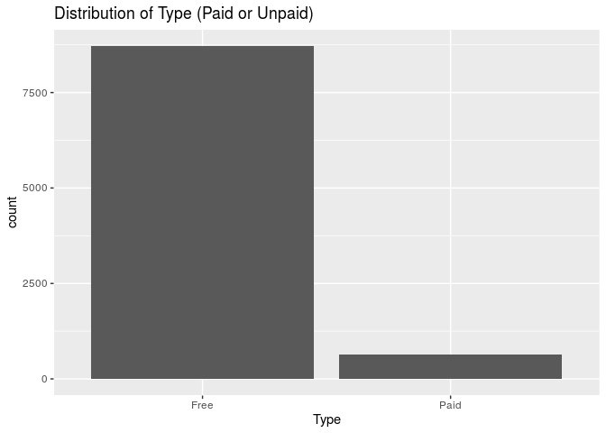
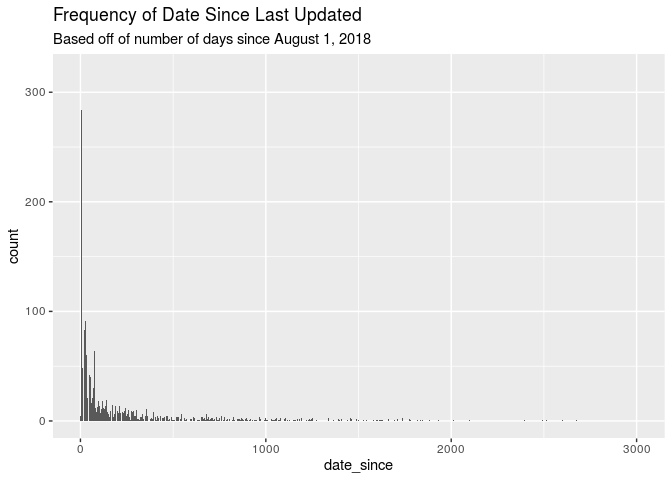
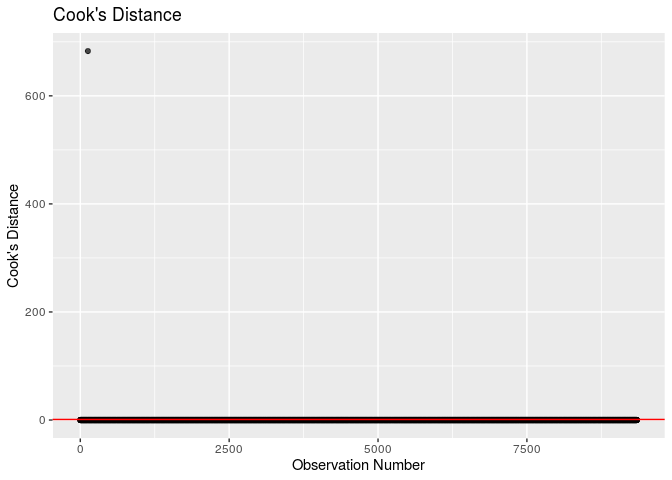

Understanding Google Play Application Reviews
================
RTime2Shine
11/20/19

To Do: - Check Bivaiate Plots - finish interpretation interpret a few
things - final edits

    ## Warning: 2 parsing failures.
    ##   row     col               expected     actual                                         file
    ## 10473 Reviews no trailing characters M          '/cloud/project/02-data/googleplaystore.csv'
    ## 10473 NA      13 columns             12 columns '/cloud/project/02-data/googleplaystore.csv'

### Research Question and Modeling Objective:

What are the relevant factors that affect the rating given for apps in
the Google Play store?

Our ultimate goal is to create a model which most accurately and
concisely predicts the Rating of an app given the predictors in the
dataset. This will enable us to see which predictor variables interact
with each other to effect the rating for a given app. We posit that
examining such relationships will help developers understand what
factors may influence an app’s rating and use that information to create
better applications for consumers. As well, conglomerates such as Google
(whom this dataset is from) can use this information to more accurately
display or promote apps that meet these characteristics or promote ads
related to these apps and generate revenue.

### Response Variable:

The response variable in our investigation is `Rating` which is the mean
rating out of 5.0 for an application in the Google Play Store. This is a
numeric variable.

### Updated Exploratory Data Analysis

Below is some additional exploratory data analysis to further understand
the response variable.

    ## Skim summary statistics
    ##  n obs: 10841 
    ##  n variables: 13 
    ## 
    ## ── Variable type:character ──────────────────────────────────────────────────────────
    ##        variable missing complete     n min max empty n_unique
    ##     Android Ver       1    10840 10841   3  18     0       34
    ##             App       0    10841 10841   1 194     0     9660
    ##        Category       0    10841 10841   3  19     0       34
    ##  Content Rating       1    10840 10841   4  12     0        6
    ##     Current Ver       1    10840 10841   1  50     0     2833
    ##          Genres       0    10841 10841   4  37     0      120
    ##        Installs       0    10841 10841   1  13     0       21
    ##    Last Updated       0    10841 10841   6  18     0     1378
    ##           Price       0    10841 10841   1   8     0       93
    ##            Size       0    10841 10841   2  18     0      462
    ##            Type       0    10841 10841   1   4     0        4
    ## 
    ## ── Variable type:numeric ────────────────────────────────────────────────────────────
    ##  variable missing complete     n      mean         sd p0 p25    p50
    ##    Rating    1474     9367 10841      4.19       0.54  1   4    4.3
    ##   Reviews       1    10840 10841 444152.9  2927760.6   0  38 2094  
    ##      p75     p100     hist
    ##      4.5 19       ▁▇▁▁▁▁▁▁
    ##  54775.5  7.8e+07 ▇▁▁▁▁▁▁▁

#### Data Wrangling

##### Removing Missing Values

Upon examining our predictor variables, it looks like there are
occasionally one or two observations missing in the dataset, which does
not raise lots of concern. It is worth noting, however, that 1474 of our
response variable values are missing. This is roughly 10% of the data.
Given that the data was web scraped, we will assume that the reason
behind these missing values is that there was not a mean rating value
for those particular observations (app). Thus, we will omit all of the
NA values and continue to investigate only those apps for which we have
ratings.

Furthermore, here it is worth noting that the variable, `Genres`
contains the same information in the `category` variable - the only
difference being that the data is just displayed a bit differently.
Therefore, as to avoid being redundant, we will only be using `category`
in our analysis. We will not deleting the variable from the dataset as
to maintain integrity.

##### Recoding Variables

We also have a lot of predictors that are coded as characters in the
dataset, so we will recode them as factors. We also have some variables
that are coded as characters due to the existence of a particular a
symbol (ex. $), we will also recode these into a format which will be
usable for our analysis.

Looking at the data, there are two variables related to the version, or
iteration of the app as provided by the developers. Given that Google
owns both Android and the Google Play Store, the company would likely be
more interested in the Android version of the app. Furthermore, Android
users are unlikely to be using other operating system’s application
stores, so a developer who is interested in creating apps for the
Android market would gain more information through an examination of the
compatibility of certain apps with a particular version of Android. Some
data wrangling is necessary to make this variable suitable for analysis.

##### Creating `date_since`

Now, we’re going to create a variable called `date_since`, which marks
the number of days that the app has been updated since the day that the
data was scraped on August 8, 2018. This will allow us to determine how
recent the last update was for a particular app and provides some
information related to the relative frequency of updates and how that
may affect an app’s rating.

Now we are ready to do some preliminary analysis and visualization to
have a more complete idea of the data we are working with.

##### Releveling `Price`

Since our variable `Price` is currently not numeric and isn’t coded into
categories, it is best that we relevel and factorize this as to
streamline our analysis. We will relevel price into 3 categories: Free,
Between 0 and 4.99 dollars, and greater than 5 dollars.

    ## Skim summary statistics
    ##  n obs: 9365 
    ##  n variables: 15 
    ## 
    ## ── Variable type:factor ─────────────────────────────────────────────────────────────
    ##  variable missing complete    n n_unique
    ##     Price       0     9365 9365        3
    ##                            top_counts ordered
    ##  Fre: 8718, Bet: 507, Gre: 140, NA: 0   FALSE

##### Releveling `Installs`

Since our variable `Installs` is currently very widely distributed, we
will relevel this variable and create new bins as to streamline our
analysis. We will relevel installs into 3 categories: Less than 100,
Between 100 and 1,000, Between 1,000 and 10,000, Between 10,000 and
100,000, and 100,000 or Greater.

    ## Skim summary statistics
    ##  n obs: 9365 
    ##  n variables: 15 
    ## 
    ## ── Variable type:factor ─────────────────────────────────────────────────────────────
    ##  variable missing complete    n n_unique
    ##  Installs       0     9365 9365        5
    ##                                 top_counts ordered
    ##  100: 6096, Bet: 1477, Bet: 1145, Bet: 510   FALSE

##### Releveling `Size`

Since our variable `Size` is currently very widely distributed, we will
relevel this variable and create new bins as to streamline our analysis.
We will relevel size into 3 categories: Varies with Device, Less than
100, and Greater than
100.

#### Distribution of Response

    ## Warning: Removed 2 rows containing missing values (geom_bar).

<!-- -->

    ## # A tibble: 1 x 2
    ##   `median(Rating)` `IQR(Rating)`
    ##              <dbl>         <dbl>
    ## 1              4.3           0.5

As shown above, the distribution of our response variable, `rating`
appears to be left-skewed. This will be important to take into account
as we continue our analysis as it may require a transformation; however,
our model is robust to departures in normality so we will continue. We
determined to report median and IQR as our summary statistics because
the distribution of `rating` appears to be left-skewed. The median
rating of an app is approximately **4.3** and the IQR is **0.5**.

#### Univariate Analysis

We will now conduct a univariate analysis of all the possible predictor
variables. For the purposes of our regression, we will be examining the
following variables: `Category`, `Reviews`, `Size`, `date_since`,
`Installs`, `Type`, `Price`, `Content Rating`, and `Android Version`.

We have decided to not consider the other predictors as they are either
irrelevant to our analysis due to the fact that they are simply
indicator variables to distinguish the observations in our dataset -
such as with `App` , or for redundancy and clarity as mentioned in the
above sections in regards to `Current Version` and `Genres`.

##### Category

    ## # A tibble: 33 x 2
    ##    Category          n
    ##    <fct>         <int>
    ##  1 FAMILY         1747
    ##  2 GAME           1097
    ##  3 TOOLS           734
    ##  4 PRODUCTIVITY    351
    ##  5 MEDICAL         350
    ##  6 COMMUNICATION   328
    ##  7 FINANCE         323
    ##  8 SPORTS          319
    ##  9 PHOTOGRAPHY     317
    ## 10 LIFESTYLE       314
    ## # … with 23 more rows

<!-- -->

##### Reviews

<!-- -->

    ## # A tibble: 1 x 1
    ##   `median(Reviews)`
    ##               <dbl>
    ## 1              5928

    ## # A tibble: 1 x 1
    ##   `max(Reviews)`
    ##            <dbl>
    ## 1       78158306

Reviews is definetley one of our most skewed predictors, as shown by the
strong right skew in this histogram. This is because the median number
of reviews is about 6,000, while we have a max review number of
78158306, which partially explains the skew.

##### Size

<!-- --> As shown by
the distribution of app sizes, it is clear that most of our apps are
less than 100MB, and there are also some that vary with device (meaning
that no specific size information was available). There are very few
apps that have sizes greater than 100 MB.

##### Installs

<!-- --> The
distribution for number of installs is also left skewed but not
particularly abnormal. The majority of reviews have 100k installs or
more, and then from there on, the number of observations for each level
of installs decreases more than the previous one. Few apps have less
than 100 installs.

##### Type

<!-- -->

    ## # A tibble: 2 x 3
    ##   Type      n proportion
    ##   <fct> <int>      <dbl>
    ## 1 Free   8718     0.931 
    ## 2 Paid    647     0.0691

The vast majority (93%) of apps on the Google Play store are free, while
about 7% of the apps on the Google play store are paid.

##### Price

<!-- --> The
distribution of price is, as expected, pretty similar to the
distribution of `Type`. We see a right skewed distribution, with the
majority of apps being free, while the ones that are paid are between 0
and 4.99, and a very small proportion of apps being greater than 5
dollars.

##### Content Rating

<!-- --> The
distribution for content rating is pretty left skewed. The majority of
apps are rated Everyone, while the next most occurring category is Teen.
After that, we see even less apps that are rated mature.

##### Android Version

<!-- --> The
distribution of Android version has a somewhat normal and unimodal
shape. We can see that most of the apps are on version 4 , while there
are also a significant number of apps that are on version 2. It is also
important to note that there are a pretty good amount of apps whose
android version varies with device.

##### Date Since

<!-- --> This
is also another very right skewed variable. We can see that the majority
of apps are last updated within 500 days of the scrape date, however
there are some outliers that go up to even 3000 days since the scrape
date. The plot is still unimodal.

#### Bivariate Analysis

To conduct a bivariate analysis, we will be making a pairs plot.

Given the above pairs plot, we will be investigating some relationships
more in depth:

<!-- -->

Although there is some variation in rating between app categories, the
most telling aspect of this exploratory model is the outliers. It
appears that some categories are more susceptible to outliers with low
ratings. More over there are notable discrepancies between minimum
boxplot rating among categories.

<!-- -->

Based on the scatterplot above, there is likely **not** a relationship
between number of reviews and app rating. As the number of reviews
increased the app rating was concentrated at approximately 4.5 - which
was consistent with apps holding smaller number of reviews.

<!-- -->

The boxplot above clearly shows a significant relationship between
number of installs and rating. As the number of installs increases the
IQR appears to decrease in conjunction. Moreover median rating also
increases with number of installs.

<!-- -->

The boxplots for free and paid apps sport nearly identical median and
IQR values. This tells us that whether an app is free or paid doesn’t
appear to have a major impact on the rating. Further analysis into the
variation of rating among apps of different price levels is needed.

#### Possible Interactions

First, there is a possible interaction between content rating and
categories.

<!-- -->

As shown in the plot above, there may be a correlation between having a
lower content rating and being in a “family-friendly” category such as
Family or game - a clear example of this phenomenon is in the category
dating. This interaction will have to be considered when building the
model. As well, there is a clear interaction between other categories
such as Mature or Teen being heavily represented among certain
Categories. Secondly, there may be an interaction between number of
reviews and rating.

<!-- -->

As shown in this plot, as the number of reviews for an app increases, so
does the rating generally. This is indicative of an app being popular so
as there are more reviews there is most likely more polarization in the
ratings. There is most likely some interaction between these two
variables in the dataset. Thirdly, there may be an interaction between
Type and Price. Since Type is an indicator measuring whether an app is
paid or free, all apps that are free will be correlated with apps that
have a price = 0 and apps that are paid will be correlated with apps
that have a price greater than 0.

<!-- -->

This is further illustrated through the above plot, which clearly shows
this interaction. These interactions along with any further ones we may
find after our preliminary analysis will have to be explored further and
considered when building our model.

#### Correlation

Since our variables are mostly categorical, we will not need to check a
correlation matrix to determine if we need to remove any highly
correlated variables. Instead, our preliminary analysis of interactions
should suffice.

### Explanation of the Model Process

The regression modeling technique we will use will be Multiple Linear
Regression (MLR). Since we are exploring the effect of multiple
predictor variables on our response, `rating`, it is apt that we use MLR
to model our data. MLR allows us to see the effect of multiple
predictors on a response and explore both the significance of each
predictor on the response as well as the effect of each predictor on the
response. As opposed to Simple Linear Regression, MLR allows us to
measure the effect of multiple predictors on your response in one model
- SLR only allows us to measure the effect of one predictor on the
response in one model. This is very taxing and inefficient for the
number of predictors we want to measure. As well, there may be
interactions between these predictors that we will be unable to view
using SLR. MLR allows us to both model and view the amalgamation of
these predictors in their effects on the response variable. MLR from
both an efficiency and relevancy perspective is much better suited to
model our data as opposed to other methods.

Our ultimate goal is to create the model which most accurately and
concisely predicts the Rating of an app given the predictors in the
dataset. We will attempt to choose a model using a minimization of both
BIC and AIC as our criteria as this will allow us to calculate a precise
prediction of our response variable while also removing extraneous
predictors. We will use BIC and AIC as our selection criteria as it
penalizes more for erroneous predictors as compared to adj. R-Squared.
We will not use R-squared as a criteria for model selection. R squared
increases strictly as the number of predictors increases and does not
tell us if these additional predictors are significant or not. If we
used r-squared we would always choose models with the largest numbers of
predictors, which would not always produce the simplest, most accurate
model. Unlike R squared, AIC, BIC, and adjusted R squared do penalize
for insignificant predictors and can give us a better idea of which
predictors actually contribute to the response variable.

In order to find our final model, we will use a process of both forwards
and backwards selection slowly adding a combination of relevant
predictors into our model. We will then check the BIC and AIC values for
each of these models and find the model with the lowest value overall,
or the fewest predictors - this will be the model that most accurately
predicts our response with the fewest number of predictors. We will then
plot each predictor on the response to determine if the effect is
relevant or if there are possible interactions between other variables.
As well, we will need to consider potential outliers and extraneous
values in our model. Using the distributions of standardized residuals
and a calculation of Cook’s distance, we will attempt to determine those
observations with high standardized residuals or cook’s distance and
determine if those observations have a significant effect on our model.
Lastly, we will need to find the VIF factor for each of our final
predictors to see if there is any collinearity between them. A VIF
greater than 10 would require us to explore possible ways to mitigate
interactions between variables or consider dropping predictors are are
too heavily correlated.

### Final Model

#### Full Model

We will attempt to use MLR to predict an app’s Rating given the
aforementioned predictors. Here is the output of our initial
model:

|                term                |  estimate   | std.error |  statistic   |  p.value  |
| :--------------------------------: | :---------: | :-------: | :----------: | :-------: |
|            (Intercept)             |  4.8159591  | 0.3043497 |  15.8237658  | 0.0000000 |
|    CategoryAUTO\_AND\_VEHICLES     | \-0.1821313 | 0.0853345 | \-2.1343217  | 0.0328426 |
|           CategoryBEAUTY           | \-0.0712948 | 0.0987081 | \-0.7222787  | 0.4701413 |
|   CategoryBOOKS\_AND\_REFERENCE    |  0.0216827  | 0.0729580 |  0.2971941   | 0.7663250 |
|          CategoryBUSINESS          | \-0.2417363 | 0.0689890 | \-3.5039823  | 0.0004605 |
|           CategoryCOMICS           | \-0.1985729 | 0.0910906 | \-2.1799502  | 0.0292862 |
|       CategoryCOMMUNICATION        | \-0.2481569 | 0.0687226 | \-3.6109957  | 0.0003066 |
|           CategoryDATING           | \-0.3950916 | 0.0773526 | \-5.1076717  | 0.0000003 |
|         CategoryEDUCATION          | \-0.0074781 | 0.0744094 | \-0.1004989  | 0.9199505 |
|       CategoryENTERTAINMENT        | \-0.3054110 | 0.0757039 | \-4.0342829  | 0.0000552 |
|           CategoryEVENTS           |  0.0488606  | 0.0969238 |  0.5041138   | 0.6141934 |
|           CategoryFAMILY           | \-0.1546144 | 0.0639499 | \-2.4177421  | 0.0156363 |
|          CategoryFINANCE           | \-0.2223632 | 0.0686369 | \-3.2397024  | 0.0012008 |
|      CategoryFOOD\_AND\_DRINK      | \-0.2401770 | 0.0787304 | \-3.0506261  | 0.0022901 |
|            CategoryGAME            | \-0.0939377 | 0.0649329 | \-1.4466890  | 0.1480178 |
|    CategoryHEALTH\_AND\_FITNESS    | \-0.1190098 | 0.0691396 | \-1.7212983  | 0.0852300 |
|      CategoryHOUSE\_AND\_HOME      | \-0.1869549 | 0.0847127 | \-2.2069287  | 0.0273434 |
|    CategoryLIBRARIES\_AND\_DEMO    | \-0.0988004 | 0.0907392 | \-1.0888396  | 0.2762529 |
|         CategoryLIFESTYLE          | \-0.2404189 | 0.0687604 | \-3.4964721  | 0.0004737 |
|   CategoryMAPS\_AND\_NAVIGATION    | \-0.3235334 | 0.0768947 | \-4.2074854  | 0.0000261 |
|          CategoryMEDICAL           | \-0.1518055 | 0.0685809 | \-2.2135235  | 0.0268858 |
|    CategoryNEWS\_AND\_MAGAZINES    | \-0.2473066 | 0.0711170 | \-3.4774618  | 0.0005085 |
|         CategoryPARENTING          | \-0.0768815 | 0.0938740 | \-0.8189864  | 0.4128152 |
|      CategoryPERSONALIZATION       | \-0.0150830 | 0.0690124 | \-0.2185549  | 0.8270016 |
|        CategoryPHOTOGRAPHY         | \-0.2003004 | 0.0687415 | \-2.9138226  | 0.0035788 |
|        CategoryPRODUCTIVITY        | \-0.1680089 | 0.0682704 | \-2.4609318  | 0.0138757 |
|          CategorySHOPPING          | \-0.1634177 | 0.0706002 | \-2.3146920  | 0.0206515 |
|           CategorySOCIAL           | \-0.1455733 | 0.0708918 | \-2.0534580  | 0.0400561 |
|           CategorySPORTS           | \-0.1643422 | 0.0687108 | \-2.3917944  | 0.0167860 |
|           CategoryTOOLS            | \-0.2903437 | 0.0655008 | \-4.4326773  | 0.0000094 |
|     CategoryTRAVEL\_AND\_LOCAL     | \-0.2721171 | 0.0709638 | \-3.8345926  | 0.0001266 |
|       CategoryVIDEO\_PLAYERS       | \-0.2889336 | 0.0740693 | \-3.9008561  | 0.0000965 |
|          CategoryWEATHER           | \-0.1557409 | 0.0849714 | \-1.8328625  | 0.0668550 |
|              Reviews               |  0.0000000  | 0.0000000 |  3.6856876   | 0.0002294 |
|        SizeLess than 100 MB        |  0.0082981  | 0.0381802 |  0.2173401   | 0.8279481 |
|       SizeVaries with device       |  0.0454229  | 0.0455824 |  0.9965018   | 0.3190323 |
|   InstallsBetween 100 and 1,000    | \-0.2216490 | 0.0476788 | \-4.6487992  | 0.0000034 |
|  InstallsBetween 1,000 and 10,000  | \-0.4595658 | 0.0448446 | \-10.2479701 | 0.0000000 |
| InstallsBetween 10,000 and 100,000 | \-0.4602558 | 0.0443761 | \-10.3717125 | 0.0000000 |
|     Installs100,000 or Greater     | \-0.3089959 | 0.0433235 | \-7.1322964  | 0.0000000 |
|              TypePaid              |  0.1056340  | 0.0436598 |  2.4194792   | 0.0155618 |
|     PriceBetween $0 and $4.99      |  0.0525784  | 0.0483457 |  1.0875506   | 0.2768218 |
|      `Content Rating`Everyone      | \-0.0435530 | 0.2885895 | \-0.1509167  | 0.8800447 |
|      `Content Rating`Everyone      | \-0.0386037 | 0.2896078 | \-0.1332965  | 0.8939618 |
|       `Content Rating`Mature       | \-0.0726717 | 0.2897916 | \-0.2507723  | 0.8019957 |
|        `Content Rating`Teen        | \-0.0424241 | 0.2887808 | \-0.1469076  | 0.8832082 |
|      `Content Rating`Unrated       |  0.4922664  | 0.5730467 |  0.8590337   | 0.3903441 |
|           `Android Ver`2           | \-0.0816476 | 0.0545446 | \-1.4968963  | 0.1344542 |
|           `Android Ver`3           | \-0.0630387 | 0.0615867 | \-1.0235779  | 0.3060613 |
|           `Android Ver`4           | \-0.0416205 | 0.0549414 | \-0.7575428  | 0.4487439 |
|           `Android Ver`5           | \-0.0734740 | 0.0588364 | \-1.2487863  | 0.2117747 |
|           `Android Ver`6           | \-0.2278209 | 0.0899831 | \-2.5318191  | 0.0113636 |
|           `Android Ver`7           | \-0.1907661 | 0.0917748 | \-2.0786335  | 0.0376784 |
|           `Android Ver`8           | \-0.2728152 | 0.2279401 | \-1.1968725  | 0.2313868 |
|  `Android Ver`Varies with device   | \-0.0297084 | 0.0608137 | \-0.4885146  | 0.6251969 |
|            date\_since             | \-0.0001632 | 0.0000167 | \-9.8022268  | 0.0000000 |

The full model output is shown above.

#### BIC

First to select the correct model, we will perform both forward and
backward selection using
    BIC:

    ## Warning in leaps.setup(x, y, wt = wt, nbest = nbest, nvmax = nvmax,
    ## force.in = force.in, : 2 linear dependencies found

    ## Reordering variables and trying again:

    ##                        (Intercept)                     CategoryDATING 
    ##                       4.527610e+00                      -2.261641e-01 
    ##                      CategoryTOOLS                            Reviews 
    ##                      -1.459422e-01                       8.680403e-09 
    ##      InstallsBetween 100 and 1,000   InstallsBetween 1,000 and 10,000 
    ##                      -2.429475e-01                      -4.817567e-01 
    ## InstallsBetween 10,000 and 100,000         Installs100,000 or Greater 
    ##                      -4.800877e-01                      -2.851041e-01 
    ##                           TypePaid                   `Android Ver`NaN 
    ##                       1.324406e-01                       0.000000e+00

    ## Warning in leaps.setup(x, y, wt = wt, nbest = nbest, nvmax = nvmax,
    ## force.in = force.in, : 2 linear dependencies found

    ## Reordering variables and trying again:

    ##                        (Intercept)        CategoryBOOKS_AND_REFERENCE 
    ##                         4.32767831                         0.18167532 
    ##                     CategoryDATING            CategoryPERSONALIZATION 
    ##                        -0.22625882                         0.12243328 
    ##                      CategoryTOOLS   InstallsBetween 1,000 and 10,000 
    ##                        -0.13884257                        -0.29267230 
    ## InstallsBetween 10,000 and 100,000         Installs100,000 or Greater 
    ##                        -0.28924039                        -0.08503444 
    ##                           TypePaid                   `Android Ver`NaN 
    ##                         0.12671255                         0.00000000

#### AIC

Second, we will perform both forward and backward selection using AIC:

    ## Start:  AIC=-13143.21
    ## Rating ~ Category + Reviews + Size + Installs + Type + Price + 
    ##     `Content Rating` + `Android Ver` + date_since
    ## 
    ## 
    ## Step:  AIC=-13143.21
    ## Rating ~ Category + Reviews + Size + Installs + Price + `Content Rating` + 
    ##     `Android Ver` + date_since
    ## 
    ##                    Df Sum of Sq    RSS    AIC
    ## - `Content Rating`  5     0.537 2264.1 -13151
    ## - Size              2     0.557 2264.1 -13145
    ## <none>                          2263.5 -13143
    ## - `Android Ver`     8     4.741 2268.3 -13140
    ## - Reviews           1     3.310 2266.8 -13132
    ## - Price             2    11.582 2275.1 -13100
    ## - date_since        1    23.409 2286.9 -13049
    ## - Category         32    65.296 2328.8 -12941
    ## - Installs          4    61.873 2325.4 -12899
    ## 
    ## Step:  AIC=-13150.99
    ## Rating ~ Category + Reviews + Size + Installs + Price + `Android Ver` + 
    ##     date_since
    ## 
    ##                 Df Sum of Sq    RSS    AIC
    ## - Size           2     0.575 2264.7 -13153
    ## <none>                       2264.1 -13151
    ## - `Android Ver`  8     4.728 2268.8 -13148
    ## - Reviews        1     3.424 2267.5 -13139
    ## - Price          2    11.570 2275.7 -13107
    ## - date_since     1    23.190 2287.3 -13058
    ## - Category      32    70.016 2334.1 -12930
    ## - Installs       4    61.746 2325.8 -12908
    ## 
    ## Step:  AIC=-13152.62
    ## Rating ~ Category + Reviews + Installs + Price + `Android Ver` + 
    ##     date_since
    ## 
    ##                 Df Sum of Sq    RSS    AIC
    ## <none>                       2264.7 -13153
    ## - Reviews        1     3.479 2268.1 -13140
    ## - `Android Ver`  8     7.259 2271.9 -13139
    ## - Price          2    11.651 2276.3 -13109
    ## - date_since     1    24.754 2289.4 -13053
    ## - Category      32    70.044 2334.7 -12932
    ## - Installs       4    62.492 2327.2 -12906

    ## Start:  AIC=-12384.79
    ## Rating ~ 1
    ## 
    ##                    Df Sum of Sq    RSS    AIC
    ## + Installs          4    90.251 2393.7 -12723
    ## + Category         32    75.856 2408.1 -12611
    ## + date_since        1    50.643 2433.3 -12575
    ## + `Android Ver`     8    29.485 2454.4 -12480
    ## + Size              2    21.170 2462.8 -12461
    ## + Reviews           1    11.419 2472.5 -12426
    ## + Price             2     4.315 2479.6 -12397
    ## + Type              1     3.784 2480.1 -12397
    ## + `Content Rating`  5     5.891 2478.0 -12397
    ## <none>                          2483.9 -12385
    ## 
    ## Step:  AIC=-12722.73
    ## Rating ~ Installs
    ## 
    ##                    Df Sum of Sq    RSS    AIC
    ## + Category         32    66.838 2326.8 -12923
    ## + date_since        1    32.161 2361.5 -12847
    ## + `Android Ver`     8    17.628 2376.0 -12776
    ## + Type              1     9.985 2383.7 -12760
    ## + Price             2    10.165 2383.5 -12758
    ## + Size              2     9.112 2384.6 -12754
    ## + Reviews           1     7.135 2386.5 -12749
    ## + `Content Rating`  5     4.889 2388.8 -12732
    ## <none>                          2393.7 -12723
    ## 
    ## Step:  AIC=-12923.44
    ## Rating ~ Installs + Category
    ## 
    ##                    Df Sum of Sq    RSS    AIC
    ## + date_since        1    38.604 2288.2 -13078
    ## + `Android Ver`     8    23.718 2303.1 -13003
    ## + Size              2    10.939 2315.9 -12964
    ## + Type              1     7.336 2319.5 -12951
    ## + Price             2     7.430 2319.4 -12949
    ## + Reviews           1     6.502 2320.3 -12948
    ## <none>                          2326.8 -12923
    ## + `Content Rating`  5     0.475 2326.4 -12915
    ## 
    ## Step:  AIC=-13077.81
    ## Rating ~ Installs + Category + date_since
    ## 
    ##                    Df Sum of Sq    RSS    AIC
    ## + Type              1   11.4924 2276.7 -13123
    ## + Price             2   11.7234 2276.5 -13122
    ## + `Android Ver`     8    8.6541 2279.6 -13097
    ## + Reviews           1    4.4474 2283.8 -13094
    ## + Size              2    4.7464 2283.5 -13093
    ## <none>                          2288.2 -13078
    ## + `Content Rating`  5    0.6327 2287.6 -13070
    ## 
    ## Step:  AIC=-13122.88
    ## Rating ~ Installs + Category + date_since + Type
    ## 
    ##                    Df Sum of Sq    RSS    AIC
    ## + `Android Ver`     8    8.3189 2268.4 -13141
    ## + Reviews           1    4.5810 2272.2 -13140
    ## + Size              2    4.0358 2272.7 -13136
    ## <none>                          2276.7 -13123
    ## + Price             1    0.2311 2276.5 -13122
    ## + `Content Rating`  5    0.6258 2276.1 -13115
    ## 
    ## Step:  AIC=-13141.09
    ## Rating ~ Installs + Category + date_since + Type + `Android Ver`
    ## 
    ##                    Df Sum of Sq    RSS    AIC
    ## + Reviews           1    3.4661 2264.9 -13153
    ## <none>                          2268.4 -13141
    ## + Price             1    0.2870 2268.1 -13140
    ## + Size              2    0.6388 2267.8 -13140
    ## + `Content Rating`  5    0.6729 2267.8 -13134
    ## 
    ## Step:  AIC=-13153.38
    ## Rating ~ Installs + Category + date_since + Type + `Android Ver` + 
    ##     Reviews
    ## 
    ##                    Df Sum of Sq    RSS    AIC
    ## <none>                          2264.9 -13153
    ## + Price             1   0.29952 2264.7 -13153
    ## + Size              2   0.58384 2264.4 -13152
    ## + `Content Rating`  5   0.55720 2264.4 -13146

    ## Start:  AIC=-12384.79
    ## Rating ~ 1
    ## 
    ##                    Df Sum of Sq    RSS    AIC
    ## + Installs          4    90.251 2393.7 -12723
    ## + Category         32    75.856 2408.1 -12611
    ## + date_since        1    50.643 2433.3 -12575
    ## + `Android Ver`     8    29.485 2454.4 -12480
    ## + Size              2    21.170 2462.8 -12461
    ## + Reviews           1    11.419 2472.5 -12426
    ## + Price             2     4.315 2479.6 -12397
    ## + Type              1     3.784 2480.1 -12397
    ## + `Content Rating`  5     5.891 2478.0 -12397
    ## <none>                          2483.9 -12385
    ## 
    ## Step:  AIC=-12722.73
    ## Rating ~ Installs
    ## 
    ##                    Df Sum of Sq    RSS    AIC
    ## + Category         32    66.838 2326.8 -12923
    ## + date_since        1    32.161 2361.5 -12847
    ## + `Android Ver`     8    17.628 2376.0 -12776
    ## + Type              1     9.985 2383.7 -12760
    ## + Price             2    10.165 2383.5 -12758
    ## + Size              2     9.112 2384.6 -12754
    ## + Reviews           1     7.135 2386.5 -12749
    ## + `Content Rating`  5     4.889 2388.8 -12732
    ## <none>                          2393.7 -12723
    ## - Installs          4    90.251 2483.9 -12385
    ## 
    ## Step:  AIC=-12923.44
    ## Rating ~ Installs + Category
    ## 
    ##                    Df Sum of Sq    RSS    AIC
    ## + date_since        1    38.604 2288.2 -13078
    ## + `Android Ver`     8    23.718 2303.1 -13003
    ## + Size              2    10.939 2315.9 -12964
    ## + Type              1     7.336 2319.5 -12951
    ## + Price             2     7.430 2319.4 -12949
    ## + Reviews           1     6.502 2320.3 -12948
    ## <none>                          2326.8 -12923
    ## + `Content Rating`  5     0.475 2326.4 -12915
    ## - Category         32    66.838 2393.7 -12723
    ## - Installs          4    81.233 2408.1 -12611
    ## 
    ## Step:  AIC=-13077.81
    ## Rating ~ Installs + Category + date_since
    ## 
    ##                    Df Sum of Sq    RSS    AIC
    ## + Type              1    11.492 2276.7 -13123
    ## + Price             2    11.723 2276.5 -13122
    ## + `Android Ver`     8     8.654 2279.6 -13097
    ## + Reviews           1     4.447 2283.8 -13094
    ## + Size              2     4.746 2283.5 -13093
    ## <none>                          2288.2 -13078
    ## + `Content Rating`  5     0.633 2287.6 -13070
    ## - date_since        1    38.604 2326.8 -12923
    ## - Category         32    73.281 2361.5 -12847
    ## - Installs          4    64.370 2352.6 -12826
    ## 
    ## Step:  AIC=-13122.88
    ## Rating ~ Installs + Category + date_since + Type
    ## 
    ##                    Df Sum of Sq    RSS    AIC
    ## + `Android Ver`     8     8.319 2268.4 -13141
    ## + Reviews           1     4.581 2272.2 -13140
    ## + Size              2     4.036 2272.7 -13136
    ## <none>                          2276.7 -13123
    ## + Price             1     0.231 2276.5 -13122
    ## + `Content Rating`  5     0.626 2276.1 -13115
    ## - Type              1    11.492 2288.2 -13078
    ## - date_since        1    42.760 2319.5 -12951
    ## - Category         32    69.571 2346.3 -12906
    ## - Installs          4    67.216 2343.9 -12859
    ## 
    ## Step:  AIC=-13141.09
    ## Rating ~ Installs + Category + date_since + Type + `Android Ver`
    ## 
    ##                    Df Sum of Sq    RSS    AIC
    ## + Reviews           1     3.466 2264.9 -13153
    ## <none>                          2268.4 -13141
    ## + Price             1     0.287 2268.1 -13140
    ## + Size              2     0.639 2267.8 -13140
    ## + `Content Rating`  5     0.673 2267.8 -13134
    ## - `Android Ver`     8     8.319 2276.7 -13123
    ## - Type              1    11.157 2279.6 -13097
    ## - date_since        1    25.622 2294.0 -13038
    ## - Category         32    71.394 2339.8 -12915
    ## - Installs          4    63.422 2331.8 -12891
    ## 
    ## Step:  AIC=-13153.38
    ## Rating ~ Installs + Category + date_since + Type + `Android Ver` + 
    ##     Reviews
    ## 
    ##                    Df Sum of Sq    RSS    AIC
    ## <none>                          2264.9 -13153
    ## + Price             1     0.300 2264.7 -13153
    ## + Size              2     0.584 2264.4 -13152
    ## + `Content Rating`  5     0.557 2264.4 -13146
    ## - Reviews           1     3.466 2268.4 -13141
    ## - `Android Ver`     8     7.204 2272.2 -13140
    ## - Type              1    11.352 2276.3 -13109
    ## - date_since        1    24.681 2289.6 -13054
    ## - Category         32    70.236 2335.2 -12932
    ## - Installs          4    62.787 2327.7 -12906

#### Final Model

|                term                |  estimate   | std.error |  statistic   |  p.value  |
| :--------------------------------: | :---------: | :-------: | :----------: | :-------: |
|            (Intercept)             |  4.8261579  | 0.0931485 |  51.8114157  | 0.0000000 |
|   InstallsBetween 100 and 1,000    | \-0.2289991 | 0.0477631 | \-4.7944785  | 0.0000017 |
|  InstallsBetween 1,000 and 10,000  | \-0.4705197 | 0.0448987 | \-10.4795801 | 0.0000000 |
| InstallsBetween 10,000 and 100,000 | \-0.4796423 | 0.0443657 | \-10.8111131 | 0.0000000 |
|     Installs100,000 or Greater     | \-0.3395710 | 0.0431104 | \-7.8767848  | 0.0000000 |
|    CategoryAUTO\_AND\_VEHICLES     | \-0.1874556 | 0.0855206 | \-2.1919364  | 0.0284088 |
|           CategoryBEAUTY           | \-0.0796777 | 0.0989208 | \-0.8054692  | 0.4205696 |
|   CategoryBOOKS\_AND\_REFERENCE    |  0.0163789  | 0.0731017 |  0.2240568   | 0.8227181 |
|          CategoryBUSINESS          | \-0.2480206 | 0.0691157 | \-3.5884842  | 0.0003343 |
|           CategoryCOMICS           | \-0.2088819 | 0.0904054 | \-2.3105032  | 0.0208821 |
|       CategoryCOMMUNICATION        | \-0.2455364 | 0.0688300 | \-3.5672848  | 0.0003625 |
|           CategoryDATING           | \-0.4255181 | 0.0722091 | \-5.8928573  | 0.0000000 |
|         CategoryEDUCATION          | \-0.0081408 | 0.0745714 | \-0.1091679  | 0.9130717 |
|       CategoryENTERTAINMENT        | \-0.3051132 | 0.0750845 | \-4.0635981  | 0.0000487 |
|           CategoryEVENTS           |  0.0350443  | 0.0970953 |  0.3609268   | 0.7181623 |
|           CategoryFAMILY           | \-0.1517179 | 0.0640344 | \-2.3693179  | 0.0178412 |
|          CategoryFINANCE           | \-0.2276402 | 0.0687769 | \-3.3098332  | 0.0009371 |
|      CategoryFOOD\_AND\_DRINK      | \-0.2414994 | 0.0789109 | \-3.0604066  | 0.0022167 |
|            CategoryGAME            | \-0.0892518 | 0.0647868 | \-1.3776220  | 0.1683532 |
|    CategoryHEALTH\_AND\_FITNESS    | \-0.1208424 | 0.0692948 | \-1.7438872  | 0.0812118 |
|      CategoryHOUSE\_AND\_HOME      | \-0.1922732 | 0.0849001 | \-2.2646982  | 0.0235541 |
|    CategoryLIBRARIES\_AND\_DEMO    | \-0.1212103 | 0.0904727 | \-1.3397445  | 0.1803612 |
|         CategoryLIFESTYLE          | \-0.2461984 | 0.0688969 | \-3.5734342  | 0.0003541 |
|   CategoryMAPS\_AND\_NAVIGATION    | \-0.3274633 | 0.0770605 | \-4.2494330  | 0.0000216 |
|          CategoryMEDICAL           | \-0.1378188 | 0.0684605 | \-2.0131143  | 0.0441314 |
|    CategoryNEWS\_AND\_MAGAZINES    | \-0.2549620 | 0.0708595 | \-3.5981341  | 0.0003222 |
|         CategoryPARENTING          | \-0.0763369 | 0.0940828 | \-0.8113800  | 0.4171683 |
|      CategoryPERSONALIZATION       |  0.0020479  | 0.0690963 |  0.0296386   | 0.9763559 |
|        CategoryPHOTOGRAPHY         | \-0.1968676 | 0.0688719 | \-2.8584605  | 0.0042665 |
|        CategoryPRODUCTIVITY        | \-0.1688838 | 0.0683981 | \-2.4691302  | 0.0135620 |
|          CategorySHOPPING          | \-0.1669750 | 0.0707047 | \-2.3615812  | 0.0182177 |
|           CategorySOCIAL           | \-0.1581922 | 0.0702154 | \-2.2529561  | 0.0242851 |
|           CategorySPORTS           | \-0.1594587 | 0.0688370 | \-2.3164674  | 0.0205544 |
|           CategoryTOOLS            | \-0.2895650 | 0.0656228 | \-4.4125701  | 0.0000103 |
|     CategoryTRAVEL\_AND\_LOCAL     | \-0.2741509 | 0.0711146 | \-3.8550575  | 0.0001165 |
|       CategoryVIDEO\_PLAYERS       | \-0.2923870 | 0.0741870 | \-3.9412179  | 0.0000817 |
|          CategoryWEATHER           | \-0.1488894 | 0.0851544 | \-1.7484644  | 0.0804166 |
|            date\_since             | \-0.0001564 | 0.0000163 | \-9.6180476  | 0.0000000 |
|           `Android Ver`2           | \-0.0900782 | 0.0533611 | \-1.6880892  | 0.0914276 |
|           `Android Ver`3           | \-0.0748078 | 0.0603652 | \-1.2392527  | 0.2152832 |
|           `Android Ver`4           | \-0.0554221 | 0.0535656 | \-1.0346594  | 0.3008549 |
|           `Android Ver`5           | \-0.0845289 | 0.0575571 | \-1.4686099  | 0.1419724 |
|           `Android Ver`6           | \-0.2452176 | 0.0892732 | \-2.7468221  | 0.0060292 |
|           `Android Ver`7           | \-0.1756351 | 0.0911630 | \-1.9266042  | 0.0540594 |
|           `Android Ver`8           | \-0.2754779 | 0.2280736 | \-1.2078465  | 0.2271370 |
|  `Android Ver`Varies with device   | \-0.0041972 | 0.0554211 | \-0.0757322  | 0.9396338 |
|              Reviews               |  0.0000000  | 0.0000000 |  3.6560195   | 0.0002576 |

The model which gave us the fewest predictors is Backwards AIC. We felt
that this model had the fewest predictors as compared to the others and
provided us with the most economical and concise model. This model uses
the predictors `Installs`, `Category`, `date_since`, `Android Ver`, and
`Reviews` to predict our response: `Rating`.

### Exploring Interactions

Now, we will conduct an f-test including the possible interaction
effects in our model to determine if there are any interaction effects
which are significant.

| Res.Df |   RSS    | Df  | Sum of Sq |    F     | Pr(\>F) |
| :----: | :------: | :-: | :-------: | :------: | :-----: |
|  9300  | 2276.305 | NA  |    NA     |    NA    |   NA    |
|  8942  | 2042.964 | 358 | 233.3412  | 2.852873 |    0    |

Our hypotheses for this F-test is as follows:

Since the number of levels of our categorical variables are k \> 2 we
can use a nested F test to determine if any of these interaction effects
are significant.

Ho: B(1) = B(2) = … = 0

Ha: Atleast one Beta\_j is not equal to 0

In this case, our null hypothesis can essentially be read as there are
no interactions between any of the variables in our model and our
alternative can be read as that there is a significant interaction
effect in the model.

Since our p-value of 0 is less than our significance level of 0.05, we
do have evidence that there is a statistically significant interaction
present in the model.

We will now test each individual variable’s interaction effects to
determine which are significant. Again, the hypotheses are consistent
with the ones outlined
above.

|  Res.Df   |     RSS      |   Df   |   Sum of Sq   |      F       |                                                                           Pr(\>F)                                                                            |
| :-------: | :----------: | :----: | :-----------: | :----------: | :----------------------------------------------------------------------------------------------------------------------------------------------------------: |
|   9300    |   2276.305   |   NA   |      NA       |      NA      |                                                                              NA                                                                              |
|   9160    |   2144.104   |  140   |   132.2013    |   4.034201   |                                                                              0                                                                               |
| Since our | p-value of 0 | is les | s than our si | gnificance l | evel of 0.05, we do have evidence that there is a statistically significant interaction between both Installs and Category and Installs and Android Version. |

|  Res.Df   |     RSS      |   Df   |   Sum of Sq   |      F       |                                                                           Pr(\>F)                                                                           |
| :-------: | :----------: | :----: | :-----------: | :----------: | :---------------------------------------------------------------------------------------------------------------------------------------------------------: |
|   9300    |   2276.305   |   NA   |      NA       |      NA      |                                                                             NA                                                                              |
|   9095    |   2186.297   |  205   |   90.00761    |   1.826496   |                                                                              0                                                                              |
| Since our | p-value of 0 | is les | s than our si | gnificance l | evel of 0.05, we do have evidence that there is a statistically significant interaction between both Category and Reviews and Category and Android Version. |

|  Res.Df   |     RSS      |  Df   |   Sum of Sq   |     F      |                                                                               Pr(\>F)                                                                                |
| :-------: | :----------: | :---: | :-----------: | :--------: | :------------------------------------------------------------------------------------------------------------------------------------------------------------------: |
|   9300    |   2276.305   |  NA   |      NA       |     NA     |                                                                                  NA                                                                                  |
|   9291    |   2262.604   |   9   |   13.70143    |   6.2514   |                                                                                  0                                                                                   |
| Since our | p-value of 0 | is le | ss than our s | ignificanc | e level of 0.05, we do have evidence that there is a statistically significant interaction between both date\_since and Reviews and date\_since and Android Version. |

|  Res.Df   |     RSS      |  Df   |   Sum of Sq   |      F      |                                                            Pr(\>F)                                                            |
| :-------: | :----------: | :---: | :-----------: | :---------: | :---------------------------------------------------------------------------------------------------------------------------: |
|   9300    |   2276.305   |  NA   |      NA       |     NA      |                                                              NA                                                               |
|   9292    |   2270.166   |   8   |   6.139394    |  3.141139   |                                                           0.0014931                                                           |
| Since our | p-value of 0 | is le | ss than our s | ignificance | level of 0.05, we do have evidence that there is a statistically significant interaction between Reviews and Android Version. |

Since we found all these interactions to be significant, our new final
model is as
follows:

|                                term                                |  estimate   | std.error |  statistic  |  p.value  |
| :----------------------------------------------------------------: | :---------: | :-------: | :---------: | :-------: |
|                            (Intercept)                             |  4.7270722  | 0.8955546 |  5.2783743  | 0.0000001 |
|                   InstallsBetween 100 and 1,000                    |  0.3404221  | 0.7385321 |  0.4609443  | 0.6448498 |
|                  InstallsBetween 1,000 and 10,000                  | \-0.8584616 | 0.5834825 | \-1.4712723 | 0.1412527 |
|                 InstallsBetween 10,000 and 100,000                 | \-0.3152109 | 0.5610058 | \-0.5618674 | 0.5742205 |
|                     Installs100,000 or Greater                     | \-0.5914625 | 0.5430976 | \-1.0890538 | 0.2761595 |
|                    CategoryAUTO\_AND\_VEHICLES                     |  0.2799581  | 0.5387941 |  0.5196014  | 0.6033543 |
|                           CategoryBEAUTY                           |  0.3908425  | 0.8556088 |  0.4568005  | 0.6478256 |
|                   CategoryBOOKS\_AND\_REFERENCE                    |  0.5707647  | 0.8830156 |  0.6463812  | 0.5180491 |
|                          CategoryBUSINESS                          | \-0.3112183 | 0.7863003 | \-0.3958008 | 0.6922614 |
|                           CategoryCOMICS                           | \-0.1428583 | 0.5433115 | \-0.2629400 | 0.7926029 |
|                       CategoryCOMMUNICATION                        |  0.4627968  | 0.7851430 |  0.5894427  | 0.5555792 |
|                           CategoryDATING                           | \-3.6220673 | 0.7317442 | \-4.9499090 | 0.0000008 |
|                         CategoryEDUCATION                          |  0.2617277  | 0.8602788 |  0.3042359  | 0.7609553 |
|                       CategoryENTERTAINMENT                        | \-0.0266784 | 0.5116033 | \-0.0521466 | 0.9584131 |
|                           CategoryEVENTS                           |  0.6068840  | 0.7536939 |  0.8052129  | 0.4207183 |
|                           CategoryFAMILY                           |  0.3216859  | 0.7510471 |  0.4283165  | 0.6684310 |
|                          CategoryFINANCE                           |  0.5268839  | 0.8410845 |  0.6264340  | 0.5310463 |
|                      CategoryFOOD\_AND\_DRINK                      |  1.0237144  | 0.8833167 |  1.1589438  | 0.2465100 |
|                            CategoryGAME                            |  0.1840566  | 0.7689241 |  0.2393690  | 0.8108250 |
|                    CategoryHEALTH\_AND\_FITNESS                    |  1.4202378  | 0.9156918 |  1.5509999  | 0.1209371 |
|                      CategoryHOUSE\_AND\_HOME                      |  0.0355109  | 0.5219749 |  0.0680318  | 0.9457618 |
|                    CategoryLIBRARIES\_AND\_DEMO                    | \-0.3199590 | 0.7426978 | \-0.4308064 | 0.6666195 |
|                         CategoryLIFESTYLE                          |  1.1002185  | 0.9142389 |  1.2034256  | 0.2288435 |
|                   CategoryMAPS\_AND\_NAVIGATION                    | \-0.9982881 | 0.9511149 | \-1.0495978 | 0.2939314 |
|                          CategoryMEDICAL                           |  0.1004547  | 0.8944270 |  0.1123118  | 0.9105787 |
|                    CategoryNEWS\_AND\_MAGAZINES                    | \-0.7539606 | 0.9907086 | \-0.7610317 | 0.4466582 |
|                         CategoryPARENTING                          |  0.4845513  | 0.7712722 |  0.6282494  | 0.5298566 |
|                      CategoryPERSONALIZATION                       | \-0.0432897 | 0.7633026 | \-0.0567137 | 0.9547745 |
|                        CategoryPHOTOGRAPHY                         | \-0.4080719 | 0.6022008 | \-0.6776342 | 0.4980212 |
|                        CategoryPRODUCTIVITY                        | \-0.0451766 | 0.8999584 | \-0.0501985 | 0.9599653 |
|                          CategorySHOPPING                          |  0.4661928  | 0.5875840 |  0.7934063  | 0.4275622 |
|                           CategorySOCIAL                           |  0.2093847  | 0.9301871 |  0.2250996  | 0.8219070 |
|                           CategorySPORTS                           | \-1.4156558 | 0.9487595 | \-1.4921123 | 0.1357050 |
|                           CategoryTOOLS                            |  0.0128551  | 0.7229730 |  0.0177808  | 0.9858141 |
|                     CategoryTRAVEL\_AND\_LOCAL                     | \-0.4918723 | 0.8833575 | \-0.5568213 | 0.5776634 |
|                       CategoryVIDEO\_PLAYERS                       | \-0.7864169 | 0.8766917 | \-0.8970279 | 0.3697282 |
|                          CategoryWEATHER                           |  0.1431917  | 0.5186310 |  0.2760955  | 0.7824811 |
|                            date\_since                             | \-0.0000563 | 0.0000806 | \-0.6984606 | 0.4849074 |
|                           `Android Ver`2                           | \-0.6211016 | 0.8937049 | \-0.6949739 | 0.4870897 |
|                           `Android Ver`3                           |  0.3262646  | 1.0016905 |  0.3257140  | 0.7446484 |
|                           `Android Ver`4                           |  0.0288174  | 0.8693937 |  0.0331466  | 0.9735584 |
|                           `Android Ver`5                           | \-1.4133598 | 1.0321194 | \-1.3693763 | 0.1709161 |
|                           `Android Ver`6                           |  0.2342715  | 0.6288867 |  0.3725178  | 0.7095162 |
|                           `Android Ver`7                           |  1.0355278  | 0.6534518 |  1.5847043  | 0.1130689 |
|                           `Android Ver`8                           |  0.0806140  | 0.8727251 |  0.0923705  | 0.9264058 |
|                  `Android Ver`Varies with device                   | \-0.0341214 | 0.5056252 | \-0.0674836 | 0.9461982 |
|                              Reviews                               |  0.0000032  | 0.0000026 |  1.2690879  | 0.2044428 |
|     InstallsBetween 100 and 1,000:CategoryAUTO\_AND\_VEHICLES      | \-0.6019739 | 0.5442025 | \-1.1061580 | 0.2686879 |
|    InstallsBetween 1,000 and 10,000:CategoryAUTO\_AND\_VEHICLES    | \-0.8662172 | 0.2768798 | \-3.1284959 | 0.0017627 |
|   InstallsBetween 10,000 and 100,000:CategoryAUTO\_AND\_VEHICLES   | \-0.0570281 | 0.2320203 | \-0.2457894 | 0.8058509 |
|            InstallsBetween 100 and 1,000:CategoryBEAUTY            | \-0.8579968 | 0.6954970 | \-1.2336454 | 0.2173675 |
|          InstallsBetween 1,000 and 10,000:CategoryBEAUTY           | \-0.0376650 | 0.3411861 | \-0.1103942 | 0.9120992 |
|         InstallsBetween 10,000 and 100,000:CategoryBEAUTY          |  0.0556582  | 0.2367886 |  0.2350545  | 0.8141718 |
|    InstallsBetween 100 and 1,000:CategoryBOOKS\_AND\_REFERENCE     | \-0.6139769 | 0.6611981 | \-0.9285824 | 0.3531306 |
|   InstallsBetween 1,000 and 10,000:CategoryBOOKS\_AND\_REFERENCE   | \-0.5295481 | 0.4326966 | \-1.2238324 | 0.2210477 |
|  InstallsBetween 10,000 and 100,000:CategoryBOOKS\_AND\_REFERENCE  | \-0.5208062 | 0.4106312 | \-1.2683064 | 0.2047216 |
|      Installs100,000 or Greater:CategoryBOOKS\_AND\_REFERENCE      | \-0.3550617 | 0.3774324 | \-0.9407293 | 0.3468690 |
|           InstallsBetween 100 and 1,000:CategoryBUSINESS           | \-0.5155046 | 0.5373214 | \-0.9593970 | 0.3373847 |
|         InstallsBetween 1,000 and 10,000:CategoryBUSINESS          | \-0.0300874 | 0.3020471 | \-0.0996117 | 0.9206548 |
|        InstallsBetween 10,000 and 100,000:CategoryBUSINESS         | \-0.3649642 | 0.2678728 | \-1.3624531 | 0.1730893 |
|            Installs100,000 or Greater:CategoryBUSINESS             |  0.1004193  | 0.2165998 |  0.4636166  | 0.6429337 |
|            InstallsBetween 100 and 1,000:CategoryCOMICS            | \-1.9608342 | 0.6901937 | \-2.8409914 | 0.0045075 |
|          InstallsBetween 1,000 and 10,000:CategoryCOMICS           | \-0.0456165 | 0.3017650 | \-0.1511657 | 0.8798484 |
|         InstallsBetween 10,000 and 100,000:CategoryCOMICS          | \-0.0085337 | 0.2142882 | \-0.0398233 | 0.9682349 |
|        InstallsBetween 100 and 1,000:CategoryCOMMUNICATION         | \-1.0651169 | 0.5660533 | \-1.8816548 | 0.0599154 |
|       InstallsBetween 1,000 and 10,000:CategoryCOMMUNICATION       | \-0.4621326 | 0.3468856 | \-1.3322334 | 0.1828175 |
|      InstallsBetween 10,000 and 100,000:CategoryCOMMUNICATION      | \-0.7624925 | 0.3149561 | \-2.4209482 | 0.0154999 |
|          Installs100,000 or Greater:CategoryCOMMUNICATION          | \-0.2792058 | 0.2665815 | \-1.0473564 | 0.2949636 |
|            InstallsBetween 100 and 1,000:CategoryDATING            |  2.9774579  | 0.7089461 |  4.1998367  | 0.0000270 |
|          InstallsBetween 1,000 and 10,000:CategoryDATING           |  3.4981747  | 0.5527302 |  6.3289012  | 0.0000000 |
|         InstallsBetween 10,000 and 100,000:CategoryDATING          |  3.3797868  | 0.5314188 |  6.3599304  | 0.0000000 |
|             Installs100,000 or Greater:CategoryDATING              |  3.3316870  | 0.5052422 |  6.5942369  | 0.0000000 |
|         InstallsBetween 1,000 and 10,000:CategoryEDUCATION         |  0.3797573  | 0.3990124 |  0.9517431  | 0.3412530 |
|        InstallsBetween 10,000 and 100,000:CategoryEDUCATION        | \-0.3617317 | 0.2233588 | \-1.6195098 | 0.1053729 |
|      InstallsBetween 10,000 and 100,000:CategoryENTERTAINMENT      | \-0.5901646 | 0.3736014 | \-1.5796639 | 0.1142192 |
|            InstallsBetween 100 and 1,000:CategoryEVENTS            | \-0.5974883 | 0.7204719 | \-0.8293013 | 0.4069561 |
|          InstallsBetween 1,000 and 10,000:CategoryEVENTS           | \-0.1869297 | 0.5684981 | \-0.3288132 | 0.7423046 |
|         InstallsBetween 10,000 and 100,000:CategoryEVENTS          | \-0.3388019 | 0.5562999 | \-0.6090274 | 0.5425217 |
|             Installs100,000 or Greater:CategoryEVENTS              | \-0.2303042 | 0.5270901 | \-0.4369352 | 0.6621689 |
|            InstallsBetween 100 and 1,000:CategoryFAMILY            | \-0.4486252 | 0.5210525 | \-0.8609981 | 0.3892622 |
|          InstallsBetween 1,000 and 10,000:CategoryFAMILY           | \-0.0466125 | 0.2726822 | \-0.1709407 | 0.8642742 |
|         InstallsBetween 10,000 and 100,000:CategoryFAMILY          | \-0.1754703 | 0.2333215 | \-0.7520538 | 0.4520385 |
|             Installs100,000 or Greater:CategoryFAMILY              | \-0.0106956 | 0.1778668 | \-0.0601328 | 0.9520512 |
|           InstallsBetween 100 and 1,000:CategoryFINANCE            | \-1.2831854 | 0.5833124 | \-2.1998254 | 0.0278448 |
|          InstallsBetween 1,000 and 10,000:CategoryFINANCE          | \-0.7136767 | 0.3625694 | \-1.9683866 | 0.0490544 |
|         InstallsBetween 10,000 and 100,000:CategoryFINANCE         | \-0.8408317 | 0.3319349 | \-2.5331225 | 0.0113221 |
|             Installs100,000 or Greater:CategoryFINANCE             | \-0.4336897 | 0.2951181 | \-1.4695464 | 0.1417198 |
|       InstallsBetween 100 and 1,000:CategoryFOOD\_AND\_DRINK       | \-0.8583313 | 0.9133751 | \-0.9397358 | 0.3473785 |
|     InstallsBetween 1,000 and 10,000:CategoryFOOD\_AND\_DRINK      | \-1.3726535 | 0.7934642 | \-1.7299502 | 0.0836737 |
|    InstallsBetween 10,000 and 100,000:CategoryFOOD\_AND\_DRINK     | \-1.1993296 | 0.7158184 | \-1.6754663 | 0.0938777 |
|        Installs100,000 or Greater:CategoryFOOD\_AND\_DRINK         | \-0.7191080 | 0.7176369 | \-1.0020499 | 0.3163466 |
|             InstallsBetween 100 and 1,000:CategoryGAME             | \-0.6987736 | 0.5394917 | \-1.2952444 | 0.1952694 |
|           InstallsBetween 1,000 and 10,000:CategoryGAME            | \-0.4780033 | 0.2961718 | \-1.6139393 | 0.1065759 |
|          InstallsBetween 10,000 and 100,000:CategoryGAME           | \-0.5621473 | 0.2556263 | \-2.1990984 | 0.0278964 |
|              Installs100,000 or Greater:CategoryGAME               | \-0.2587000 | 0.2025712 | \-1.2770823 | 0.2016063 |
|     InstallsBetween 100 and 1,000:CategoryHEALTH\_AND\_FITNESS     | \-0.7511163 | 0.5640570 | \-1.3316319 | 0.1830151 |
|   InstallsBetween 1,000 and 10,000:CategoryHEALTH\_AND\_FITNESS    | \-1.1408033 | 0.3418378 | \-3.3372653 | 0.0008495 |
|  InstallsBetween 10,000 and 100,000:CategoryHEALTH\_AND\_FITNESS   | \-1.0018880 | 0.3068538 | \-3.2650336 | 0.0010986 |
|      Installs100,000 or Greater:CategoryHEALTH\_AND\_FITNESS       | \-0.2348620 | 0.2558026 | \-0.9181377 | 0.3585715 |
|     InstallsBetween 1,000 and 10,000:CategoryHOUSE\_AND\_HOME      | \-0.4941907 | 0.4052617 | \-1.2194360 | 0.2227109 |
|    InstallsBetween 10,000 and 100,000:CategoryHOUSE\_AND\_HOME     |  0.1274731  | 0.2384201 |  0.5346575  | 0.5929000 |
|   InstallsBetween 1,000 and 10,000:CategoryLIBRARIES\_AND\_DEMO    |  0.7004538  | 0.3233044 |  2.1665455  | 0.0302959 |
|  InstallsBetween 10,000 and 100,000:CategoryLIBRARIES\_AND\_DEMO   |  0.0118089  | 0.2414108 |  0.0489163  | 0.9609871 |
|          InstallsBetween 100 and 1,000:CategoryLIFESTYLE           | \-0.8300803 | 0.5715628 | \-1.4522993 | 0.1464535 |
|         InstallsBetween 1,000 and 10,000:CategoryLIFESTYLE         | \-0.4919255 | 0.3559625 | \-1.3819586 | 0.1670189 |
|        InstallsBetween 10,000 and 100,000:CategoryLIFESTYLE        | \-0.9981358 | 0.3266759 | \-3.0554314 | 0.0022540 |
|            Installs100,000 or Greater:CategoryLIFESTYLE            | \-0.6731341 | 0.2878769 | \-2.3382703 | 0.0193952 |
|    InstallsBetween 100 and 1,000:CategoryMAPS\_AND\_NAVIGATION     |  0.0880395  | 0.6495712 |  0.1355347  | 0.8921922 |
|   InstallsBetween 1,000 and 10,000:CategoryMAPS\_AND\_NAVIGATION   |  0.1188310  | 0.4401968 |  0.2699497  | 0.7872052 |
|  InstallsBetween 10,000 and 100,000:CategoryMAPS\_AND\_NAVIGATION  |  0.0589176  | 0.4159428 |  0.1416483  | 0.8873610 |
|      Installs100,000 or Greater:CategoryMAPS\_AND\_NAVIGATION      |  0.6139442  | 0.3781783 |  1.6234251  | 0.1045338 |
|           InstallsBetween 100 and 1,000:CategoryMEDICAL            | \-0.5326528 | 0.5353982 | \-0.9948722 | 0.3198253 |
|          InstallsBetween 1,000 and 10,000:CategoryMEDICAL          |  0.1413733  | 0.2965157 |  0.4767820  | 0.6335290 |
|         InstallsBetween 10,000 and 100,000:CategoryMEDICAL         |  0.0479398  | 0.2612671 |  0.1834895  | 0.8544181 |
|             Installs100,000 or Greater:CategoryMEDICAL             |  0.0261743  | 0.2158309 |  0.1212723  | 0.9034781 |
|     InstallsBetween 100 and 1,000:CategoryNEWS\_AND\_MAGAZINES     |  0.3857381  | 0.7123062 |  0.5415341  | 0.5881530 |
|   InstallsBetween 1,000 and 10,000:CategoryNEWS\_AND\_MAGAZINES    |  0.5393707  | 0.5496724 |  0.9812585  | 0.3264918 |
|  InstallsBetween 10,000 and 100,000:CategoryNEWS\_AND\_MAGAZINES   |  0.1381842  | 0.5304154 |  0.2605207  | 0.7944681 |
|      Installs100,000 or Greater:CategoryNEWS\_AND\_MAGAZINES       |  0.5096489  | 0.5055019 |  1.0082037  | 0.3133840 |
|          InstallsBetween 100 and 1,000:CategoryPARENTING           | \-3.1288079 | 0.8480056 | \-3.6896075 | 0.0002259 |
|         InstallsBetween 1,000 and 10,000:CategoryPARENTING         | \-0.2420346 | 0.6394294 | \-0.3785165 | 0.7050559 |
|        InstallsBetween 10,000 and 100,000:CategoryPARENTING        | \-0.4090144 | 0.5387832 | \-0.7591446 | 0.4477861 |
|            Installs100,000 or Greater:CategoryPARENTING            | \-0.2988723 | 0.5121305 | \-0.5835862 | 0.5595135 |
|       InstallsBetween 100 and 1,000:CategoryPERSONALIZATION        | \-0.6934640 | 0.5470159 | \-1.2677219 | 0.2049303 |
|      InstallsBetween 1,000 and 10,000:CategoryPERSONALIZATION      | \-0.0460281 | 0.3143127 | \-0.1464405 | 0.8835769 |
|     InstallsBetween 10,000 and 100,000:CategoryPERSONALIZATION     | \-0.1328908 | 0.2780053 | \-0.4780155 | 0.6326509 |
|         Installs100,000 or Greater:CategoryPERSONALIZATION         | \-0.0276212 | 0.2292060 | \-0.1205080 | 0.9040835 |
|         InstallsBetween 100 and 1,000:CategoryPHOTOGRAPHY          |  0.0769539  | 0.6002301 |  0.1282073  | 0.8979878 |
|        InstallsBetween 1,000 and 10,000:CategoryPHOTOGRAPHY        |  0.2173259  | 0.3929888 |  0.5530077  | 0.5802719 |
|       InstallsBetween 10,000 and 100,000:CategoryPHOTOGRAPHY       |  0.1016526  | 0.3653275 |  0.2782507  | 0.7808264 |
|           Installs100,000 or Greater:CategoryPHOTOGRAPHY           |  0.6107805  | 0.3193400 |  1.9126339  | 0.0558269 |
|         InstallsBetween 100 and 1,000:CategoryPRODUCTIVITY         | \-0.8353557 | 0.5743526 | \-1.4544300 | 0.1458622 |
|       InstallsBetween 1,000 and 10,000:CategoryPRODUCTIVITY        | \-0.3646014 | 0.3598275 | \-1.0132672 | 0.3109600 |
|      InstallsBetween 10,000 and 100,000:CategoryPRODUCTIVITY       | \-0.4661911 | 0.3321742 | \-1.4034537 | 0.1605163 |
|          Installs100,000 or Greater:CategoryPRODUCTIVITY           | \-0.1105994 | 0.2887723 | \-0.3829986 | 0.7017299 |
|           InstallsBetween 100 and 1,000:CategorySHOPPING           | \-0.3646709 | 0.5945974 | \-0.6133073 | 0.5396888 |
|         InstallsBetween 1,000 and 10,000:CategorySHOPPING          | \-0.6263615 | 0.3875506 | \-1.6162058 | 0.1060851 |
|        InstallsBetween 10,000 and 100,000:CategorySHOPPING         | \-0.5031461 | 0.3470160 | \-1.4499217 | 0.1471154 |
|            Installs100,000 or Greater:CategorySHOPPING             | \-0.2477505 | 0.2904273 | \-0.8530548 | 0.3936517 |
|            InstallsBetween 100 and 1,000:CategorySOCIAL            | \-0.9551381 | 0.5945410 | \-1.6065135 | 0.1081964 |
|          InstallsBetween 1,000 and 10,000:CategorySOCIAL           | \-0.8967065 | 0.3870177 | \-2.3169652 | 0.0205281 |
|         InstallsBetween 10,000 and 100,000:CategorySOCIAL          | \-0.7875359 | 0.3616066 | \-2.1778805 | 0.0294410 |
|             Installs100,000 or Greater:CategorySOCIAL              | \-0.6144502 | 0.3148430 | \-1.9516082 | 0.0510159 |
|            InstallsBetween 100 and 1,000:CategorySPORTS            | \-0.0238624 | 0.6006884 | \-0.0397251 | 0.9683132 |
|          InstallsBetween 1,000 and 10,000:CategorySPORTS           |  0.5707328  | 0.3892355 |  1.4662918  | 0.1426040 |
|         InstallsBetween 10,000 and 100,000:CategorySPORTS          |  0.5590173  | 0.3577595 |  1.5625504  | 0.1181938 |
|             Installs100,000 or Greater:CategorySPORTS              |  0.6173839  | 0.3197500 |  1.9308331  | 0.0535353 |
|            InstallsBetween 100 and 1,000:CategoryTOOLS             | \-0.7584041 | 0.4939666 | \-1.5353350 | 0.1247369 |
|           InstallsBetween 1,000 and 10,000:CategoryTOOLS           | \-0.2858106 | 0.2120303 | \-1.3479708 | 0.1777019 |
|          InstallsBetween 10,000 and 100,000:CategoryTOOLS          | \-0.2861359 | 0.1570146 | \-1.8223526 | 0.0684349 |
|      InstallsBetween 100 and 1,000:CategoryTRAVEL\_AND\_LOCAL      | \-0.0461095 | 0.5253700 | \-0.0877657 | 0.9300649 |
|    InstallsBetween 1,000 and 10,000:CategoryTRAVEL\_AND\_LOCAL     | \-0.1471999 | 0.2340812 | \-0.6288410 | 0.5294692 |
|   InstallsBetween 10,000 and 100,000:CategoryTRAVEL\_AND\_LOCAL    | \-0.3034781 | 0.1776993 | \-1.7078183 | 0.0877048 |
|        InstallsBetween 100 and 1,000:CategoryVIDEO\_PLAYERS        | \-0.3455145 | 0.5510114 | \-0.6270551 | 0.5306391 |
|      InstallsBetween 1,000 and 10,000:CategoryVIDEO\_PLAYERS       | \-0.4982541 | 0.2400887 | \-2.0752922 | 0.0379880 |
|     InstallsBetween 10,000 and 100,000:CategoryVIDEO\_PLAYERS      | \-0.5251896 | 0.1867933 | \-2.8116089 | 0.0049402 |
|           InstallsBetween 100 and 1,000:CategoryWEATHER            | \-1.2255564 | 0.6888573 | \-1.7791150 | 0.0752549 |
|          InstallsBetween 1,000 and 10,000:CategoryWEATHER          | \-0.2117496 | 0.4062187 | \-0.5212700 | 0.6021916 |
|         InstallsBetween 10,000 and 100,000:CategoryWEATHER         | \-0.2391155 | 0.2762697 | \-0.8655148 | 0.3867795 |
|            InstallsBetween 100 and 1,000:`Android Ver`2            |  0.2051337  | 0.5398934 |  0.3799522  | 0.7039899 |
|          InstallsBetween 1,000 and 10,000:`Android Ver`2           |  0.9471565  | 0.5293700 |  1.7892145  | 0.0736141 |
|         InstallsBetween 10,000 and 100,000:`Android Ver`2          |  0.5392407  | 0.5235429 |  1.0299838  | 0.3030455 |
|             Installs100,000 or Greater:`Android Ver`2              |  0.6163959  | 0.5260859 |  1.1716639  | 0.2413632 |
|            InstallsBetween 100 and 1,000:`Android Ver`3            |  0.0358579  | 0.6484185 |  0.0553005  | 0.9559003 |
|          InstallsBetween 1,000 and 10,000:`Android Ver`3           |  0.3016095  | 0.6354189 |  0.4746625  | 0.6350392 |
|         InstallsBetween 10,000 and 100,000:`Android Ver`3          | \-0.0683807 | 0.6298902 | \-0.1085597 | 0.9135542 |
|             Installs100,000 or Greater:`Android Ver`3              |  0.0373218  | 0.6314156 |  0.0591082  | 0.9528672 |
|            InstallsBetween 100 and 1,000:`Android Ver`4            | \-0.0686547 | 0.5341950 | \-0.1285199 | 0.8977405 |
|          InstallsBetween 1,000 and 10,000:`Android Ver`4           |  0.4914394  | 0.5254465 |  0.9352796  | 0.3496695 |
|         InstallsBetween 10,000 and 100,000:`Android Ver`4          |  0.0127484  | 0.5198482 |  0.0245234  | 0.9804357 |
|             Installs100,000 or Greater:`Android Ver`4              |  0.1812683  | 0.5226710 |  0.3468114  | 0.7287412 |
|            InstallsBetween 100 and 1,000:`Android Ver`5            |  0.4022823  | 0.5905616 |  0.6811860  | 0.4957714 |
|          InstallsBetween 1,000 and 10,000:`Android Ver`5           |  0.9338743  | 0.5789175 |  1.6131387  | 0.1067497 |
|         InstallsBetween 10,000 and 100,000:`Android Ver`5          |  0.6094248  | 0.5737190 |  1.0622357  | 0.2881574 |
|             Installs100,000 or Greater:`Android Ver`5              |  0.6808453  | 0.5746236 |  1.1848543  | 0.2361066 |
|            InstallsBetween 100 and 1,000:`Android Ver`6            |  0.3910404  | 0.4305002 |  0.9083397  | 0.3637233 |
|          InstallsBetween 1,000 and 10,000:`Android Ver`6           | \-0.4166006 | 0.3382156 | \-1.2317603 | 0.2180710 |
|         InstallsBetween 10,000 and 100,000:`Android Ver`6          |  0.6014322  | 0.3089452 |  1.9467276  | 0.0515987 |
|            InstallsBetween 100 and 1,000:`Android Ver`7            | \-0.4145900 | 0.4447234 | \-0.9322423 | 0.3512365 |
|          InstallsBetween 1,000 and 10,000:`Android Ver`7           |  0.0937558  | 0.4046298 |  0.2317077  | 0.8167704 |
|         InstallsBetween 10,000 and 100,000:`Android Ver`7          |  0.0134451  | 0.4071612 |  0.0330215  | 0.9736582 |
|            InstallsBetween 100 and 1,000:`Android Ver`8            | \-0.3991296 | 1.0816101 | \-0.3690143 | 0.7121258 |
|         InstallsBetween 10,000 and 100,000:`Android Ver`8          | \-3.7990374 | 1.5414434 | \-2.4645974 | 0.0137354 |
|             Installs100,000 or Greater:`Android Ver`8              | \-0.7502001 | 1.0337667 | \-0.7256957 | 0.4680443 |
|   InstallsBetween 100 and 1,000:`Android Ver`Varies with device    | \-0.4604111 | 0.2948911 | \-1.5612920 | 0.1184903 |
|  InstallsBetween 1,000 and 10,000:`Android Ver`Varies with device  |  0.4042726  | 0.2155173 |  1.8758240  | 0.0607120 |
| InstallsBetween 10,000 and 100,000:`Android Ver`Varies with device | \-0.0621802 | 0.1844604 | \-0.3370923 | 0.7360552 |
|             CategoryAUTO\_AND\_VEHICLES:`Android Ver`2             | \-0.0617267 | 0.5859880 | \-0.1053377 | 0.9161102 |
|                   CategoryBEAUTY:`Android Ver`2                    | \-0.1622431 | 1.1075376 | \-0.1464900 | 0.8835379 |
|            CategoryBOOKS\_AND\_REFERENCE:`Android Ver`2            |  0.0971944  | 0.8133450 |  0.1194996  | 0.9048822 |
|                  CategoryBUSINESS:`Android Ver`2                   | \-0.1120866 | 0.7713251 | \-0.1453169 | 0.8844639 |
|                   CategoryCOMICS:`Android Ver`2                    |  0.1882739  | 0.5926814 |  0.3176646  | 0.7507468 |
|                CategoryCOMMUNICATION:`Android Ver`2                | \-0.0627221 | 0.7526607 | \-0.0833338 | 0.9335880 |
|                   CategoryDATING:`Android Ver`2                    | \-0.5454370 | 0.7343228 | \-0.7427755 | 0.4576371 |
|                  CategoryEDUCATION:`Android Ver`2                  | \-0.0664185 | 0.8803986 | \-0.0754414 | 0.9398652 |
|                CategoryENTERTAINMENT:`Android Ver`2                |  0.2295046  | 0.5944539 |  0.3860764  | 0.6994493 |
|                   CategoryEVENTS:`Android Ver`2                    | \-0.0126022 | 0.6306431 | \-0.0199830 | 0.9840574 |
|                   CategoryFAMILY:`Android Ver`2                    | \-0.3254977 | 0.7408645 | \-0.4393485 | 0.6604196 |
|                   CategoryFINANCE:`Android Ver`2                   | \-0.0473122 | 0.8083981 | \-0.0585258 | 0.9533311 |
|              CategoryFOOD\_AND\_DRINK:`Android Ver`2               | \-0.1198128 | 0.7307136 | \-0.1639669 | 0.8697609 |
|                    CategoryGAME:`Android Ver`2                     |  0.1437974  | 0.7529434 |  0.1909804  | 0.8485453 |
|            CategoryHEALTH\_AND\_FITNESS:`Android Ver`2             | \-1.1547381 | 0.8987143 | \-1.2848778 | 0.1988683 |
|              CategoryHOUSE\_AND\_HOME:`Android Ver`2               | \-0.4896580 | 0.6330018 | \-0.7735490 | 0.4392180 |
|            CategoryLIBRARIES\_AND\_DEMO:`Android Ver`2             |  0.4406859  | 0.7687036 |  0.5732846  | 0.5664664 |
|                  CategoryLIFESTYLE:`Android Ver`2                  | \-0.4850343 | 0.8803560 | \-0.5509524 | 0.5816800 |
|            CategoryMAPS\_AND\_NAVIGATION:`Android Ver`2            |  0.4526316  | 0.8956237 |  0.5053814  | 0.6133034 |
|                   CategoryMEDICAL:`Android Ver`2                   | \-0.3306205 | 0.8825124 | \-0.3746355 | 0.7079404 |
|            CategoryNEWS\_AND\_MAGAZINES:`Android Ver`2             |  0.4644894  | 0.8782658 |  0.5288711  | 0.5969080 |
|                  CategoryPARENTING:`Android Ver`2                  |  0.5130649  | 0.7594129 |  0.6756074  | 0.4993074 |
|               CategoryPERSONALIZATION:`Android Ver`2               |  0.1503007  | 0.7423616 |  0.2024630  | 0.8395594 |
|                 CategoryPHOTOGRAPHY:`Android Ver`2                 | \-0.3883549 | 0.5320934 | \-0.7298623 | 0.4654935 |
|                CategoryPRODUCTIVITY:`Android Ver`2                 |  0.3074957  | 0.8653550 |  0.3553406  | 0.7223428 |
|                  CategorySHOPPING:`Android Ver`2                   | \-0.0692508 | 0.5597883 | \-0.1237089 | 0.9015486 |
|                   CategorySOCIAL:`Android Ver`2                    |  0.5465603  | 0.8898483 |  0.6142174  | 0.5390873 |
|                   CategorySPORTS:`Android Ver`2                    |  0.9306907  | 0.9077150 |  1.0253115  | 0.3052440 |
|                    CategoryTOOLS:`Android Ver`2                    | \-0.0961091 | 0.7346585 | \-0.1308214 | 0.8959195 |
|             CategoryTRAVEL\_AND\_LOCAL:`Android Ver`2              |  0.5391523  | 0.9044609 |  0.5961035  | 0.5511212 |
|               CategoryVIDEO\_PLAYERS:`Android Ver`2                |  0.7894165  | 0.8896652 |  0.8873185  | 0.3749313 |
|                   CategoryWEATHER:`Android Ver`2                   | \-0.2243473 | 0.5557289 | \-0.4036992 | 0.6864436 |
|             CategoryAUTO\_AND\_VEHICLES:`Android Ver`3             |  0.9872698  | 0.8106283 |  1.2179070  | 0.2232915 |
|            CategoryBOOKS\_AND\_REFERENCE:`Android Ver`3            | \-0.2237358 | 0.8710686 | \-0.2568521 | 0.7972988 |
|                  CategoryBUSINESS:`Android Ver`3                   | \-0.0605738 | 0.8339980 | \-0.0726307 | 0.9421016 |
|                   CategoryCOMICS:`Android Ver`3                    | \-0.1281827 | 0.8035372 | \-0.1595230 | 0.8732604 |
|                CategoryCOMMUNICATION:`Android Ver`3                | \-0.6822376 | 0.8206038 | \-0.8313849 | 0.4057784 |
|                  CategoryEDUCATION:`Android Ver`3                  | \-0.6410951 | 0.9576493 | \-0.6694466 | 0.5032279 |
|                   CategoryFAMILY:`Android Ver`3                    | \-0.8124016 | 0.7981386 | \-1.0178703 | 0.3087671 |
|                   CategoryFINANCE:`Android Ver`3                   | \-0.1770934 | 0.8681176 | \-0.2039970 | 0.8383605 |
|              CategoryFOOD\_AND\_DRINK:`Android Ver`3               |  0.0920304  | 0.7870039 |  0.1169377  | 0.9069121 |
|                    CategoryGAME:`Android Ver`3                     | \-0.1221990 | 0.8112728 | \-0.1506263 | 0.8802739 |
|            CategoryHEALTH\_AND\_FITNESS:`Android Ver`3             | \-1.4883221 | 0.9668755 | \-1.5393111 | 0.1237637 |
|              CategoryHOUSE\_AND\_HOME:`Android Ver`3               | \-0.6419450 | 0.6409630 | \-1.0015320 | 0.3165968 |
|            CategoryLIBRARIES\_AND\_DEMO:`Android Ver`3             | \-0.1824960 | 0.8667620 | \-0.2105491 | 0.8332439 |
|                  CategoryLIFESTYLE:`Android Ver`3                  | \-1.5134515 | 0.9470628 | \-1.5980476 | 0.1100677 |
|                   CategoryMEDICAL:`Android Ver`3                   | \-0.7081221 | 0.9331961 | \-0.7588138 | 0.4479840 |
|               CategoryPERSONALIZATION:`Android Ver`3               | \-0.2231005 | 0.8213771 | \-0.2716176 | 0.7859223 |
|                 CategoryPHOTOGRAPHY:`Android Ver`3                 | \-0.6199139 | 0.6192873 | \-1.0010118 | 0.3168482 |
|                CategoryPRODUCTIVITY:`Android Ver`3                 | \-0.8029161 | 0.9299027 | \-0.8634410 | 0.3879182 |
|                  CategorySHOPPING:`Android Ver`3                   | \-1.6925527 | 0.7228761 | \-2.3414146 | 0.0192327 |
|                   CategorySOCIAL:`Android Ver`3                    |  0.3508431  | 0.9667954 |  0.3628928  | 0.7166935 |
|                   CategorySPORTS:`Android Ver`3                    |  0.3288298  | 0.9639220 |  0.3411374  | 0.7330082 |
|                    CategoryTOOLS:`Android Ver`3                    | \-0.5337058 | 0.7939836 | \-0.6721874 | 0.5014817 |
|               CategoryVIDEO\_PLAYERS:`Android Ver`3                |  0.2755299  | 0.9531415 |  0.2890755  | 0.7725303 |
|                   CategoryWEATHER:`Android Ver`3                   | \-0.3606907 | 0.7734085 | \-0.4663650 | 0.6409656 |
|             CategoryAUTO\_AND\_VEHICLES:`Android Ver`4             | \-0.3477613 | 0.5197401 | \-0.6691062 | 0.5034450 |
|                   CategoryBEAUTY:`Android Ver`4                    | \-0.5222345 | 0.8513973 | \-0.6133853 | 0.5396372 |
|            CategoryBOOKS\_AND\_REFERENCE:`Android Ver`4            | \-0.1956494 | 0.7856640 | \-0.2490243 | 0.8033477 |
|                  CategoryBUSINESS:`Android Ver`4                   |  0.1701786  | 0.7416198 |  0.2294688  | 0.8185098 |
|                   CategoryCOMICS:`Android Ver`4                    | \-0.0570450 | 0.5281724 | \-0.1080045 | 0.9139945 |
|                CategoryCOMMUNICATION:`Android Ver`4                | \-0.3207065 | 0.7234856 | \-0.4432798 | 0.6575741 |
|                   CategoryDATING:`Android Ver`4                    | \-0.1318479 | 0.5083561 | \-0.2593614 | 0.7953624 |
|                  CategoryEDUCATION:`Android Ver`4                  | \-0.1361443 | 0.8477328 | \-0.1605982 | 0.8724135 |
|                CategoryENTERTAINMENT:`Android Ver`4                | \-0.1506869 | 0.4897908 | \-0.3076557 | 0.7583515 |
|                   CategoryEVENTS:`Android Ver`4                    | \-0.3417699 | 0.5395015 | \-0.6334921 | 0.5264286 |
|                   CategoryFAMILY:`Android Ver`4                    | \-0.3929463 | 0.7132594 | \-0.5509163 | 0.5817048 |
|                   CategoryFINANCE:`Android Ver`4                   | \-0.2308128 | 0.7737665 | \-0.2982977 | 0.7654829 |
|              CategoryFOOD\_AND\_DRINK:`Android Ver`4               | \-0.5623911 | 0.4981456 | \-1.1289695 | 0.2589410 |
|                    CategoryGAME:`Android Ver`4                     |  0.0766994  | 0.7255910 |  0.1057062  | 0.9158179 |
|            CategoryHEALTH\_AND\_FITNESS:`Android Ver`4             | \-1.1077217 | 0.8666565 | \-1.2781554 | 0.2012278 |
|              CategoryHOUSE\_AND\_HOME:`Android Ver`4               | \-0.2710748 | 0.5024147 | \-0.5395440 | 0.5895250 |
|            CategoryLIBRARIES\_AND\_DEMO:`Android Ver`4             |  0.1850052  | 0.7239842 |  0.2555376  | 0.7983138 |
|                  CategoryLIFESTYLE:`Android Ver`4                  | \-0.7013161 | 0.8548653 | \-0.8203820 | 0.4120203 |
|            CategoryMAPS\_AND\_NAVIGATION:`Android Ver`4            |  0.2688214  | 0.8615522 |  0.3120199  | 0.7550327 |
|                   CategoryMEDICAL:`Android Ver`4                   | \-0.3986263 | 0.8562123 | \-0.4655694 | 0.6415351 |
|            CategoryNEWS\_AND\_MAGAZINES:`Android Ver`4             |  0.1109257  | 0.8392967 |  0.1321650  | 0.8948567 |
|                  CategoryPARENTING:`Android Ver`4                  | \-0.1908054 | 0.5637633 | \-0.3384496 | 0.7350324 |
|               CategoryPERSONALIZATION:`Android Ver`4               |  0.1135461  | 0.7127231 |  0.1593131  | 0.8734258 |
|                 CategoryPHOTOGRAPHY:`Android Ver`4                 | \-0.2328228 | 0.4878148 | \-0.4772769 | 0.6331766 |
|                CategoryPRODUCTIVITY:`Android Ver`4                 |  0.0894786  | 0.8392306 |  0.1066198  | 0.9150930 |
|                  CategorySHOPPING:`Android Ver`4                   | \-0.3544260 | 0.4880701 | \-0.7261785 | 0.4677484 |
|                   CategorySOCIAL:`Android Ver`4                    |  0.3560353  | 0.8620772 |  0.4129970  | 0.6796187 |
|                   CategorySPORTS:`Android Ver`4                    |  0.6877596  | 0.8808228 |  0.7808149  | 0.4349320 |
|                    CategoryTOOLS:`Android Ver`4                    | \-0.1950861 | 0.7060946 | \-0.2762889 | 0.7823326 |
|             CategoryTRAVEL\_AND\_LOCAL:`Android Ver`4              |  0.2706255  | 0.8679682 |  0.3117919  | 0.7552059 |
|               CategoryVIDEO\_PLAYERS:`Android Ver`4                |  0.7145173  | 0.8621278 |  0.8287834  | 0.4072491 |
|                   CategoryWEATHER:`Android Ver`4                   | \-0.1188702 | 0.5012623 | \-0.2371417 | 0.8125523 |
|             CategoryAUTO\_AND\_VEHICLES:`Android Ver`5             |  0.1316617  | 0.7579669 |  0.1737037  | 0.8621022 |
|                   CategoryBEAUTY:`Android Ver`5                    |  0.7193640  | 1.0281030 |  0.6997003  | 0.4841327 |
|            CategoryBOOKS\_AND\_REFERENCE:`Android Ver`5            |  0.7035873  | 1.0488441 |  0.6708216  | 0.5023515 |
|                  CategoryBUSINESS:`Android Ver`5                   |  0.9890844  | 0.9007348 |  1.0980862  | 0.2721964 |
|                   CategoryCOMICS:`Android Ver`5                    |  0.9439468  | 0.7767184 |  1.2153012  | 0.2242833 |
|                CategoryCOMMUNICATION:`Android Ver`5                |  0.5901272  | 0.8875141 |  0.6649215  | 0.5061179 |
|                   CategoryDATING:`Android Ver`5                    |  0.0844505  | 0.7314133 |  0.1154621  | 0.9080815 |
|                  CategoryEDUCATION:`Android Ver`5                  |  0.7053807  | 0.9923215 |  0.7108389  | 0.4772026 |
|                CategoryENTERTAINMENT:`Android Ver`5                |  0.6778361  | 0.7158999 |  0.9468309  | 0.3437506 |
|                   CategoryEVENTS:`Android Ver`5                    |  0.7737346  | 0.7547950 |  1.0250923  | 0.3053473 |
|                   CategoryFAMILY:`Android Ver`5                    |  0.2596642  | 0.8753997 |  0.2966236  | 0.7667608 |
|                   CategoryFINANCE:`Android Ver`5                   |  0.9671019  | 0.9248605 |  1.0456732  | 0.2957402 |
|              CategoryFOOD\_AND\_DRINK:`Android Ver`5               |  0.5343211  | 0.7128710 |  0.7495340  | 0.4535551 |
|                    CategoryGAME:`Android Ver`5                     |  0.8875303  | 0.8893644 |  0.9979378  | 0.3183365 |
|            CategoryHEALTH\_AND\_FITNESS:`Android Ver`5             | \-0.1689588 | 1.0051279 | \-0.1680969 | 0.8665109 |
|              CategoryHOUSE\_AND\_HOME:`Android Ver`5               |  0.9651453  | 0.7246084 |  1.3319544  | 0.1829091 |
|            CategoryLIBRARIES\_AND\_DEMO:`Android Ver`5             |  1.4026670  | 0.9242253 |  1.5176678  | 0.1291335 |
|                  CategoryLIFESTYLE:`Android Ver`5                  |  0.1771589  | 1.0011999 |  0.1769466  | 0.8595543 |
|            CategoryMAPS\_AND\_NAVIGATION:`Android Ver`5            |  0.9582412  | 1.0157023 |  0.9434272  | 0.3454879 |
|                   CategoryMEDICAL:`Android Ver`5                   |  0.7039518  | 0.9959908 |  0.7067854  | 0.4797182 |
|            CategoryNEWS\_AND\_MAGAZINES:`Android Ver`5             |  0.5213978  | 0.9862038 |  0.5286917  | 0.5970325 |
|                  CategoryPARENTING:`Android Ver`5                  |  0.4950602  | 0.8168900 |  0.6060305  | 0.5445099 |
|               CategoryPERSONALIZATION:`Android Ver`5               |  1.2655690  | 0.8801337 |  1.4379281  | 0.1504895 |
|                 CategoryPHOTOGRAPHY:`Android Ver`5                 |  0.5875976  | 0.7101166 |  0.8274663  | 0.4079949 |
|                CategoryPRODUCTIVITY:`Android Ver`5                 |  0.9245617  | 0.9833928 |  0.9401753  | 0.3471530 |
|                  CategorySHOPPING:`Android Ver`5                   |  0.8315323  | 0.7172737 |  1.1592957  | 0.2463666 |
|                   CategorySOCIAL:`Android Ver`5                    |  1.1816336  | 1.0084920 |  1.1716836  | 0.2413553 |
|                   CategorySPORTS:`Android Ver`5                    |  1.5703515  | 1.0173516 |  1.5435681  | 0.1227284 |
|                    CategoryTOOLS:`Android Ver`5                    |  0.8369763  | 0.8694102 |  0.9626943  | 0.3357270 |
|             CategoryTRAVEL\_AND\_LOCAL:`Android Ver`5              |  1.1067715  | 1.0082950 |  1.0976664  | 0.2723798 |
|               CategoryVIDEO\_PLAYERS:`Android Ver`5                |  1.6402634  | 1.0066798 |  1.6293794  | 0.1032679 |
|                   CategoryWEATHER:`Android Ver`5                   |  0.6130433  | 0.7442428 |  0.8237142  | 0.4101239 |
|             CategoryAUTO\_AND\_VEHICLES:`Android Ver`6             | \-1.2577645 | 0.9346962 | \-1.3456398 | 0.1784528 |
|                  CategoryBUSINESS:`Android Ver`6                   | \-0.5681799 | 0.8547860 | \-0.6647043 | 0.5062568 |
|                CategoryCOMMUNICATION:`Android Ver`6                | \-1.5801330 | 0.8465522 | \-1.8665512 | 0.0619970 |
|                CategoryENTERTAINMENT:`Android Ver`6                | \-0.6376248 | 0.8490177 | \-0.7510147 | 0.4526636 |
|                   CategoryFAMILY:`Android Ver`6                    | \-0.9499667 | 0.6965119 | \-1.3638914 | 0.1726361 |
|                   CategoryFINANCE:`Android Ver`6                   | \-0.8379289 | 0.7816760 | \-1.0719645 | 0.2837649 |
|              CategoryFOOD\_AND\_DRINK:`Android Ver`6               | \-0.4711019 | 0.9385169 | \-0.5019642 | 0.6157051 |
|                    CategoryGAME:`Android Ver`6                     | \-0.1538064 | 0.7143354 | \-0.2153140 | 0.8295274 |
|                  CategoryLIFESTYLE:`Android Ver`6                  | \-1.2502539 | 0.9620802 | \-1.2995319 | 0.1937950 |
|                   CategoryMEDICAL:`Android Ver`6                   | \-0.7338459 | 0.8402697 | \-0.8733457 | 0.3824982 |
|               CategoryPERSONALIZATION:`Android Ver`6               | \-0.4367209 | 0.7753052 | \-0.5632890 | 0.5732522 |
|                 CategoryPHOTOGRAPHY:`Android Ver`6                 | \-0.5618880 | 0.9339426 | \-0.6016301 | 0.5474357 |
|                CategoryPRODUCTIVITY:`Android Ver`6                 |  0.5260288  | 0.8473679 |  0.6207798  | 0.5347603 |
|                   CategorySPORTS:`Android Ver`6                    |  0.5243096  | 0.9833570 |  0.5331834  | 0.5939199 |
|                    CategoryTOOLS:`Android Ver`6                    | \-0.5042154 | 0.6640858 | \-0.7592625 | 0.4477156 |
|            CategoryBOOKS\_AND\_REFERENCE:`Android Ver`7            | \-0.5604947 | 0.8907808 | \-0.6292173 | 0.5292229 |
|                  CategoryBUSINESS:`Android Ver`7                   | \-0.6927205 | 0.8169756 | \-0.8479084 | 0.3965117 |
|                   CategoryFAMILY:`Android Ver`7                    | \-1.5224259 | 0.7043016 | \-2.1616106 | 0.0306747 |
|                    CategoryGAME:`Android Ver`7                     | \-0.4682356 | 0.7022279 | \-0.6667859 | 0.5049261 |
|            CategoryHEALTH\_AND\_FITNESS:`Android Ver`7             | \-3.1063625 | 0.9342196 | \-3.3250883 | 0.0008875 |
|            CategoryLIBRARIES\_AND\_DEMO:`Android Ver`7             | \-0.0718616 | 0.8480351 | \-0.0847389 | 0.9324708 |
|                  CategoryLIFESTYLE:`Android Ver`7                  | \-1.0702328 | 0.8695917 | \-1.2307302 | 0.2184562 |
|                   CategoryMEDICAL:`Android Ver`7                   | \-1.1480860 | 0.9045288 | \-1.2692642 | 0.2043799 |
|               CategoryPERSONALIZATION:`Android Ver`7               | \-0.3478047 | 0.7322215 | \-0.4749993 | 0.6347990 |
|                 CategoryPHOTOGRAPHY:`Android Ver`7                 | \-1.9470947 | 0.9308542 | \-2.0917290 | 0.0364909 |
|                CategoryPRODUCTIVITY:`Android Ver`7                 | \-0.3680354 | 0.9875274 | \-0.3726837 | 0.7093927 |
|                   CategorySOCIAL:`Android Ver`7                    | \-0.8795089 | 0.9719873 | \-0.9048564 | 0.3655659 |
|                    CategoryTOOLS:`Android Ver`7                    | \-0.6600867 | 0.6469529 | \-1.0203010 | 0.3076133 |
|             CategoryTRAVEL\_AND\_LOCAL:`Android Ver`7              | \-0.5599036 | 0.9841508 | \-0.5689205 | 0.5694244 |
|           CategoryBEAUTY:`Android Ver`Varies with device           | \-0.6279310 | 0.7909605 | \-0.7938841 | 0.4272840 |
|   CategoryBOOKS\_AND\_REFERENCE:`Android Ver`Varies with device    |  0.1375630  | 0.6294489 |  0.2185451  | 0.8270094 |
|          CategoryBUSINESS:`Android Ver`Varies with device          |  0.2165980  | 0.5691930 |  0.3805352  | 0.7035572 |
|       CategoryCOMMUNICATION:`Android Ver`Varies with device        | \-0.0282615 | 0.5414087 | \-0.0521999 | 0.9583706 |
|         CategoryEDUCATION:`Android Ver`Varies with device          | \-0.0266879 | 0.7001624 | \-0.0381167 | 0.9695955 |
|           CategoryFAMILY:`Android Ver`Varies with device           | \-0.1897828 | 0.5290179 | \-0.3587454 | 0.7197940 |
|          CategoryFINANCE:`Android Ver`Varies with device           |  0.0363612  | 0.6087776 |  0.0597283  | 0.9523734 |
|            CategoryGAME:`Android Ver`Varies with device            |  0.3429958  | 0.5466163 |  0.6274891  | 0.5303547 |
|    CategoryHEALTH\_AND\_FITNESS:`Android Ver`Varies with device    | \-0.8404098 | 0.7238122 | \-1.1610882 | 0.2456370 |
|    CategoryLIBRARIES\_AND\_DEMO:`Android Ver`Varies with device    | \-0.2109314 | 0.5988383 | \-0.3522343 | 0.7246709 |
|         CategoryLIFESTYLE:`Android Ver`Varies with device          | \-0.3207255 | 0.7105138 | \-0.4513995 | 0.6517126 |
|   CategoryMAPS\_AND\_NAVIGATION:`Android Ver`Varies with device    |  0.5041306  | 0.7234644 |  0.6968285  | 0.4859283 |
|          CategoryMEDICAL:`Android Ver`Varies with device           | \-0.0930377 | 0.7148138 | \-0.1301565 | 0.8964455 |
|    CategoryNEWS\_AND\_MAGAZINES:`Android Ver`Varies with device    |  0.2485472  | 0.6882288 |  0.3611403  | 0.7180031 |
|      CategoryPERSONALIZATION:`Android Ver`Varies with device       |  0.3772014  | 0.5316617 |  0.7094763  | 0.4780474 |
|        CategoryPRODUCTIVITY:`Android Ver`Varies with device        |  0.3999107  | 0.6877187 |  0.5815033  | 0.5609160 |
|           CategorySOCIAL:`Android Ver`Varies with device           |  0.5638370  | 0.7185707 |  0.7846646  | 0.4326710 |
|           CategorySPORTS:`Android Ver`Varies with device           |  0.9921290  | 0.7410954 |  1.3387331  | 0.1806916 |
|           CategoryTOOLS:`Android Ver`Varies with device            |  0.1672185  | 0.5184278 |  0.3225493  | 0.7470441 |
|     CategoryTRAVEL\_AND\_LOCAL:`Android Ver`Varies with device     |  0.6757160  | 0.7262663 |  0.9303971  | 0.3521907 |
|       CategoryVIDEO\_PLAYERS:`Android Ver`Varies with device       |  0.7388532  | 0.7189986 |  1.0276143  | 0.3041591 |
|                CategoryAUTO\_AND\_VEHICLES:Reviews                 |  0.0000010  | 0.0000018 |  0.5633319  | 0.5732230 |
|                       CategoryBEAUTY:Reviews                       |  0.0000032  | 0.0000052 |  0.6265456  | 0.5309731 |
|               CategoryBOOKS\_AND\_REFERENCE:Reviews                | \-0.0000010 | 0.0000013 | \-0.7645649 | 0.4445508 |
|                      CategoryBUSINESS:Reviews                      | \-0.0000009 | 0.0000013 | \-0.6728377 | 0.5010679 |
|                       CategoryCOMICS:Reviews                       | \-0.0000004 | 0.0000013 | \-0.3217425 | 0.7476553 |
|                   CategoryCOMMUNICATION:Reviews                    | \-0.0000010 | 0.0000013 | \-0.7946557 | 0.4268349 |
|                       CategoryDATING:Reviews                       |  0.0000002  | 0.0000014 |  0.1241929  | 0.9011653 |
|                     CategoryEDUCATION:Reviews                      | \-0.0000009 | 0.0000013 | \-0.7404242 | 0.4590620 |
|                   CategoryENTERTAINMENT:Reviews                    | \-0.0000010 | 0.0000013 | \-0.7509681 | 0.4526916 |
|                       CategoryEVENTS:Reviews                       | \-0.0000142 | 0.0000115 | \-1.2318032 | 0.2180550 |
|                       CategoryFAMILY:Reviews                       | \-0.0000010 | 0.0000013 | \-0.7888786 | 0.4302039 |
|                      CategoryFINANCE:Reviews                       | \-0.0000008 | 0.0000013 | \-0.6101269 | 0.5417932 |
|                  CategoryFOOD\_AND\_DRINK:Reviews                  | \-0.0000007 | 0.0000013 | \-0.5576481 | 0.5770986 |
|                        CategoryGAME:Reviews                        | \-0.0000010 | 0.0000013 | \-0.7982407 | 0.4247520 |
|                CategoryHEALTH\_AND\_FITNESS:Reviews                | \-0.0000009 | 0.0000013 | \-0.7204766 | 0.4712504 |
|                  CategoryHOUSE\_AND\_HOME:Reviews                  |  0.0000004  | 0.0000014 |  0.2594994  | 0.7952560 |
|                CategoryLIBRARIES\_AND\_DEMO:Reviews                | \-0.0000011 | 0.0000018 | \-0.5922439 | 0.5537022 |
|                     CategoryLIFESTYLE:Reviews                      | \-0.0000008 | 0.0000013 | \-0.6253784 | 0.5317387 |
|               CategoryMAPS\_AND\_NAVIGATION:Reviews                | \-0.0000010 | 0.0000013 | \-0.7650359 | 0.4442704 |
|                      CategoryMEDICAL:Reviews                       |  0.0000072  | 0.0000022 |  3.3408818  | 0.0008385 |
|                CategoryNEWS\_AND\_MAGAZINES:Reviews                | \-0.0000010 | 0.0000013 | \-0.7780977 | 0.4365320 |
|                     CategoryPARENTING:Reviews                      | \-0.0000001 | 0.0000016 | \-0.0783715 | 0.9375343 |
|                  CategoryPERSONALIZATION:Reviews                   | \-0.0000010 | 0.0000013 | \-0.7743396 | 0.4387505 |
|                    CategoryPHOTOGRAPHY:Reviews                     | \-0.0000010 | 0.0000013 | \-0.7771069 | 0.4371162 |
|                    CategoryPRODUCTIVITY:Reviews                    | \-0.0000010 | 0.0000013 | \-0.7557777 | 0.4498024 |
|                      CategorySHOPPING:Reviews                      | \-0.0000010 | 0.0000013 | \-0.7585251 | 0.4481567 |
|                       CategorySOCIAL:Reviews                       | \-0.0000010 | 0.0000013 | \-0.7942766 | 0.4270555 |
|                       CategorySPORTS:Reviews                       | \-0.0000010 | 0.0000013 | \-0.7800124 | 0.4354042 |
|                       CategoryTOOLS:Reviews                        | \-0.0000010 | 0.0000013 | \-0.7804433 | 0.4351506 |
|                 CategoryTRAVEL\_AND\_LOCAL:Reviews                 | \-0.0000010 | 0.0000013 | \-0.7767454 | 0.4373296 |
|                   CategoryVIDEO\_PLAYERS:Reviews                   | \-0.0000010 | 0.0000013 | \-0.7803571 | 0.4352014 |
|                      CategoryWEATHER:Reviews                       | \-0.0000009 | 0.0000013 | \-0.7230496 | 0.4696683 |
|                     date\_since:`Android Ver`2                     | \-0.0000082 | 0.0000846 | \-0.0971189 | 0.9226342 |
|                     date\_since:`Android Ver`3                     |  0.0000931  | 0.0001090 |  0.8539796  | 0.3931392 |
|                     date\_since:`Android Ver`4                     | \-0.0001906 | 0.0000846 | \-2.2529173 | 0.0242885 |
|                     date\_since:`Android Ver`5                     | \-0.0002241 | 0.0001409 | \-1.5907895 | 0.1116923 |
|                     date\_since:`Android Ver`6                     | \-0.0004656 | 0.0005653 | \-0.8236203 | 0.4101773 |
|                     date\_since:`Android Ver`7                     | \-0.0014607 | 0.0010551 | \-1.3845069 | 0.1662378 |
|                     date\_since:`Android Ver`8                     |  0.0184239  | 0.0137956 |  1.3354968  | 0.1817478 |
|            date\_since:`Android Ver`Varies with device             | \-0.0000922 | 0.0000993 | \-0.9284962 | 0.3531753 |
|                        date\_since:Reviews                         |  0.0000000  | 0.0000000 |  2.7351799  | 0.0062469 |
|                       `Android Ver`2:Reviews                       | \-0.0000022 | 0.0000022 | \-0.9935599 | 0.3204640 |
|                       `Android Ver`3:Reviews                       | \-0.0000022 | 0.0000022 | \-0.9929804 | 0.3207464 |
|                       `Android Ver`4:Reviews                       | \-0.0000022 | 0.0000022 | \-1.0031545 | 0.3158135 |
|                       `Android Ver`5:Reviews                       | \-0.0000021 | 0.0000022 | \-0.9549339 | 0.3396369 |
|                       `Android Ver`6:Reviews                       | \-0.0000008 | 0.0000024 | \-0.3202108 | 0.7488160 |
|                       `Android Ver`7:Reviews                       | \-0.0000147 | 0.0000069 | \-2.1132358 | 0.0346082 |
|              `Android Ver`Varies with device:Reviews               | \-0.0000022 | 0.0000022 | \-1.0072713 | 0.3138317 |

### Final Model Assumptions

Because we have conducted Multiple Linear Regression, the model
assumptions we will check are Linearity, Constant Variance, Normality,
and Independence.

#### Linearity

The Linearity Assumptions assumes that the response variable has a
linear relationship with the predictor variables used in the final
model. To assess linearity, we look at the plots created in the
Exploratory Data Analysis. None of these plots seem to have a non-linear
relationship such as one that would be polynomial; however, some are
quite skewed but this should not matter for the purposes of our model.
To illustrate this, we will re-display the bivariate plots with our
final predictor
variables.

<!-- --><!-- --><!-- -->

    ## Don't know how to automatically pick scale for object of type difftime. Defaulting to continuous.

<!-- --><!-- -->

As shown in the plots above, almost all the variables appear to satisfy
the linearity assumption. `Installs` is the only variable that appears
to have somewhat of a parabolic, or non-linear relationship with Rating;
however, due to the fact that we have included interaction effects
between it and other predictors in our model it is most likely the case
that this is insignificant. Otherwise, all of our predictors appear to
have strong and non-curvilinear relationships clearly visible through
the plot.

#### Constant Variance

The Constant Variance Assumption assumes that the regression variance is
the same for all of the predictor variables in the model. To test this
assumption, we will plot the residual values against predictors.

<!-- -->

As shown, it appears that the constant variance assumption is violated.
There appears to be a clear pattern in our residuals. Since our response
was normally distributed at the beginning of our EDA, we did not see the
need for a transformation of our response; however, it may be the case
that there is a need for more, higher-order interaction terms. Since our
model satisfies the linearity assumption and also relatively satisfies
our normality assumption it is reasonable to assume that this is not a
great cause for concern.

#### Normality

The Normality Assumption assumes that for any given set of predictors,
the response variable, `ratings`, follows a Normal distribution around
its mean. To test this, we will make a Normal QQ
    plot.

<!-- -->

    ## `stat_bin()` using `bins = 30`. Pick better value with `binwidth`.

<!-- -->

As shown, our residuals are relatively normally distributed in our
histogram. The center is around 0 which is good; however there is a
slight left skew. As well, our Normal-QQ plot doesn’t closely match the
idea line at the beginning of the more negative values. It may be the
case that there are many outliers or high leverage points in our model
that are causing this skew and if they were removed then we wouldn’t see
this. However, since our distribution of residuals is relatively normal
and the Normal QQ Plot is mostly following the trend line it is
reasonable to assume that this assumption is satisfied due to the
robustness f our model. In our model Assessment, we can further fix
these issues and improve our model.

#### Independence

The Independence Assumption assumes that all observations in the data
used to construct the model are independent of each other. Given that
each observation and is not dependent on the time frame or location of
collection for its mean rating. The observations are independent of each
other and thus the Independence Assumption is maintained.

### Model Assessment

#### Leverage

According to lecture, the threshold we should use for determining if
observations are high leverage points is: hi \> (2(p+1))/n

<!-- -->

Let’s filter to see the total \# of points that crossed the threshold.

    ## # A tibble: 8,134 x 5
    ##    Installs                   Category       date_since Android.Ver Reviews
    ##    <fct>                      <fct>          <drtn>     <fct>         <dbl>
    ##  1 Between 10,000 and 100,000 ART_AND_DESIGN 213 days   4               159
    ##  2 100,000 or Greater         ART_AND_DESIGN 205 days   4               967
    ##  3 100,000 or Greater         ART_AND_DESIGN   7 days   4             87510
    ##  4 100,000 or Greater         ART_AND_DESIGN  61 days   4            215644
    ##  5 100,000 or Greater         ART_AND_DESIGN  49 days   4               967
    ##  6 Between 10,000 and 100,000 ART_AND_DESIGN 500 days   2               167
    ##  7 Between 10,000 and 100,000 ART_AND_DESIGN 104 days   4               178
    ##  8 100,000 or Greater         ART_AND_DESIGN  55 days   4             36815
    ##  9 100,000 or Greater         ART_AND_DESIGN 322 days   3             13791
    ## 10 Between 10,000 and 100,000 ART_AND_DESIGN  36 days   4               121
    ## # … with 8,124 more rows

As shown, there are 8,134 high leverage points. This is problematic but
before we assess our model’s strength we should check cook’s distance.

#### Cook’s Distance

Now let’s check how many of these points cross our threshold for Cook’s
Distance (Di \> 1) to determine if these high leverage points do in fact
have a significant influence on our model coefficients.

    ## Warning: Removed 51 rows containing missing values (geom_point).

    ## Warning: Removed 51 rows containing missing values (geom_text).

<!-- -->

Let’s check to see the number of points that violated this threshold.

    ## # A tibble: 1 x 5
    ##   Installs           Category date_since Android.Ver Reviews
    ##   <fct>              <fct>    <drtn>     <fct>         <dbl>
    ## 1 100,000 or Greater BEAUTY   525 days   1               473

As shown, only one of these high leverage points violated Cook’s
Distance - so it is most likely the case that although outliers are
present, our model still is relatively strong in predicting Rating and
that there isn’t a cause for concern. It is likely that none of these
high leverage points have a significant influence on the model
coefficients.

#### Standardized Residuals

Now, let’s plot our standardized residuals to see if there are any
points which break the threshold |resid std.| \>
2.

    ## Warning: Removed 51 rows containing missing values (geom_point).

    ## Warning: Removed 51 rows containing missing values (geom_text).

<!-- -->

As depicted the plot, there are a number of points which violate this
threshold, so let’s filter the data to get an exact number.

    ## # A tibble: 474 x 5
    ##    Installs                Category          date_since Android.Ver Reviews
    ##    <fct>                   <fct>             <drtn>     <fct>         <dbl>
    ##  1 Between 1,000 and 10,0… ART_AND_DESIGN     63 days   4                55
    ##  2 100,000 or Greater      AUTO_AND_VEHICLES 103 days   4               250
    ##  3 100,000 or Greater      BOOKS_AND_REFERE… 103 days   4              1862
    ##  4 100,000 or Greater      COMICS             36 days   4             93965
    ##  5 Between 10,000 and 100… COMICS             26 days   5               115
    ##  6 Between 1,000 and 10,0… COMICS             43 days   4                15
    ##  7 Between 1,000 and 10,0… DATING            287 days   4                57
    ##  8 100,000 or Greater      DATING              5 days   5              7779
    ##  9 100,000 or Greater      DATING             21 days   5               953
    ## 10 100,000 or Greater      DATING              8 days   4              5377
    ## # … with 464 more rows

As illustrated, there are 474 observations with a standardized residual
greater than +/- 2. These observations are considered to have
standardized residuals with large
    magnitude.

    ## `stat_bin()` using `bins = 30`. Pick better value with `binwidth`.

    ## Warning: Removed 51 rows containing non-finite values (stat_bin).

<!-- -->

    ## [1] 5.071146

The proportion of observations that have standardized residuals with
magnitude \> 2 is about 0.50711, or 5.071% of the observations. Since
this proportion is almost less than 5%, it is most likely the case that
it is not statistically significant and is relatively small. Therefore,
there is most likely not a concern with the number of observations
flagged as having standardized residuals with large magnitude as the
proportion of these residuals is relatively small. Although our
proportion is somewhat greater than 5% it is still most likely the case
that these flagged residuals are a relatively small proportion of the
data, as well since only 1 of our leverage points was cause for concern,
it is most likely the case that our model is sound. As well, it is most
likely these 5% of observations which may have caused the skew in our
residual variance.

### VIF

We will check the VIF of our model without interactions:

    ## Warning: 'tidy.numeric' is deprecated.
    ## See help("Deprecated")

    ## # A tibble: 46 x 2
    ##    names                                  x
    ##    <chr>                              <dbl>
    ##  1 InstallsBetween 100 and 1,000       4.49
    ##  2 InstallsBetween 1,000 and 10,000    8.26
    ##  3 InstallsBetween 10,000 and 100,000  9.99
    ##  4 Installs100,000 or Greater         16.1 
    ##  5 CategoryAUTO_AND_VEHICLES           2.16
    ##  6 CategoryBEAUTY                      1.67
    ##  7 CategoryBOOKS_AND_REFERENCE         3.81
    ##  8 CategoryBUSINESS                    5.72
    ##  9 CategoryCOMICS                      1.92
    ## 10 CategoryCOMMUNICATION               6.13
    ## # … with 36 more rows

`CategoryAUTO_AND_VEHICLES`, `CategoryFAMILY`, `CategoryGAME`,
`CategoryTOOLS`, `Android Ver2`, `Android Ver4`, & `Android Ver-Varies
with device` all have VIF \> 10, indicating concern with
multicollinearity.

Since these two terms were interacted in our final model with
interactions, there are no longer any concerns with highly correlated
variables in our model.

### Interpretations and Findings

In looking at the models and exploratory data analysis in the above
sections, there are some interesting findings worth noting.

For instance, the plot of the response variable, `rating`, is incredibly
skewed with a peak centered between a mean rating of 4 and 4.5. It would
be incredibly interesting to research if people tend to under vote or if
people who don’t like an app just don’t vote. Exploring the human
decision making element in the reviewing process would aide in the
understanding of this material.

It is also worth noting the high intercept values (4.8261579 and
4.7270722) in the final model (with and without interaction terms).
Given that a rating, and therefore the mean value of rating, can be no
higher than 5, these intercept values are incredibly high.

There are some coefficients in our model that seem to make the ratings
really high. A change in 1 unit of rating is quite a lot, so the
coefficient of categoryHealth\_and\_Fitness is quite large at 1.4202378.
This means that if an app is health and fitness, we expect the ratings
to increase by 1.420 on average, holding all else constant. There are a
few others like this like categoryFOOD\_AND\_DRINK and cateoryLIFESTYLE.
For categoryFOOD\_AND\_DRINK, if an app is a food and drink app we
expect the ratings to increase by 1.0244280 on average, holding all else
constant. If an app is in the health and lifestyle category, we expect
the ratings to increase by 1.1011342, holding all else constant.

Additionally, there are some factors that make the ratings decrease. The
coefficient for InstallsBetween 1,000 and 10,000 leads to a -0.858
decrease in expected rating, on average, holding all else constant.
Additionally, another aspect that seems to really affect rating is if an
app is in the dating category- if it is, we expect the rating to
decrease by 3.622, holding all else constant.
