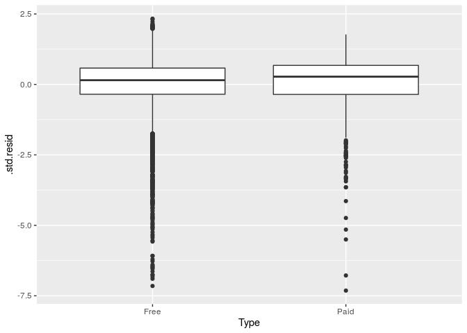
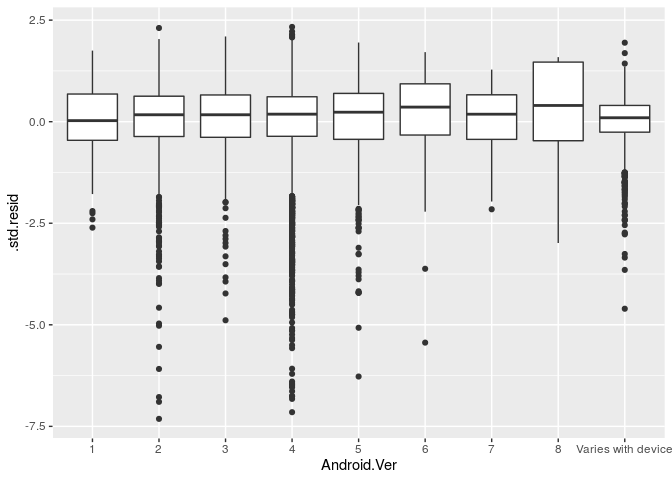

Understanding Google Play Application Reviews
================
RTime2Shine
11/20/19

To Do: - add explanations for univariate plots (Zoe) - fix model - check
all possible interactions - finish assumptions - add model assessment
(cooks distance, standard resid, VIF) - finish interpretation (ask
Tackett if we need to interpret every level bc we have a lot of
categorical vars) - final edits

Your regression analysis results go here. At a minimum, the regression
analysis should include the following:

  - Description of the response variable
  - Updated exploratory data analysis, incorporating any feedback from
    the proposal (Zoe, Sara, Lukengu)
      - Univariate analysis, include the changed variables, explain why
        we are taking out what we are taking out, response vs all
        predictor variables.
  - Explanation of the modeling process and why you chose those metohds,
    incorporating any feedback from the proposal (Sanjay)
  - Output of the final model (Sanjay)
  - Discussion of the assumptions for the final model (Zoe)
  - Interpretations / interesting findings from the model coefficients
    (Sara and Sanjay)
  - Additional work of other models or analylsis not included in the
    final model.(Sanjay)

<!-- end list -->

    ## Warning: 2 parsing failures.
    ##   row     col               expected     actual                                         file
    ## 10473 Reviews no trailing characters M          '/cloud/project/02-data/googleplaystore.csv'
    ## 10473 NA      13 columns             12 columns '/cloud/project/02-data/googleplaystore.csv'

### Research Question and Modeling Objective:

What are the relevant factors that affect the rating given for apps in
the Google Play store?

Our ultimate goal is to create a model which most accurately and
concisely predicts the Rating of an app given the predictors in the
dataset. This will enable us to see which predictor variables interact
with each other to effect the rating for a given app. We posit that
examining such relationships will help developers understand what
factors may influence an app’s rating and use that information to create
better applications for consumers. As well, conglomerates such as Google
(whom this dataset is from) can use this information to more accurately
display or promote apps that meet these characteristics or promote ads
related to these apps and generate revenue.

### Response Variable:

The response variable in our investigation is `Rating` which is the mean
rating out of 5.0 for an application in the Google Play Store. This is a
numeric variable.

### Updated Exploratory Data Analysis

Below is some additional exploratory data analysis to further understand
the response variable.

    ## Skim summary statistics
    ##  n obs: 10841 
    ##  n variables: 13 
    ## 
<<<<<<< HEAD
    ## ── Variable type:character ───────────────────────────────────────────────────────────────────────────
=======
    ## ── Variable type:character ──────────────────────────────────────────────────────────────────
>>>>>>> a37f8c12cae60c368d95ceb40dda82d6fc84269e
    ##        variable missing complete     n min max empty n_unique
    ##     Android Ver       1    10840 10841   3  18     0       34
    ##             App       0    10841 10841   1 194     0     9660
    ##        Category       0    10841 10841   3  19     0       34
    ##  Content Rating       1    10840 10841   4  12     0        6
    ##     Current Ver       1    10840 10841   1  50     0     2833
    ##          Genres       0    10841 10841   4  37     0      120
    ##        Installs       0    10841 10841   1  13     0       21
    ##    Last Updated       0    10841 10841   6  18     0     1378
    ##           Price       0    10841 10841   1   8     0       93
    ##            Size       0    10841 10841   2  18     0      462
    ##            Type       0    10841 10841   1   4     0        4
    ## 
<<<<<<< HEAD
    ## ── Variable type:numeric ─────────────────────────────────────────────────────────────────────────────
=======
    ## ── Variable type:numeric ────────────────────────────────────────────────────────────────────
>>>>>>> a37f8c12cae60c368d95ceb40dda82d6fc84269e
    ##  variable missing complete     n      mean         sd p0 p25    p50
    ##    Rating    1474     9367 10841      4.19       0.54  1   4    4.3
    ##   Reviews       1    10840 10841 444152.9  2927760.6   0  38 2094  
    ##      p75     p100     hist
    ##      4.5 19       ▁▇▁▁▁▁▁▁
    ##  54775.5  7.8e+07 ▇▁▁▁▁▁▁▁

#### Data Wrangling

##### Removing Missing Values

Upon examining our predictor variables, it looks like there are
occasionally one or two observations missing in the dataset, which does
not raise lots of concern. It is worth noting, however, that 1474 of our
response variable values are missing. This is roughly 10% of the data.
Given that the data was web scraped, we will assume that the reason
behind these missing values is that there was not a mean rating value
for those particular observations (app). Thus, we will omit all of the
NA values and continue to investigate only those apps for which we have
ratings.

Furthermore, here it is worth noting that the variable, `Genres`
contains the same information in the `category` variable - the only
difference being that the data is just displaid a bit differently.
Therefore, as to avoid being redundant, we will only be using `category`
in our analysis. We will not deleting the variable from the dataset as
to maintain integrity.

##### Recoding Variables

We also have a lot of predictors that are coded as characters in the
dataset, so we will recode them as factors. We also have some variables
that are coded as characters due to the existence of a particular a
symbol (ex. $), we will also recode these inot a format which will be
useable for our analysis.

Looking at the data, there are two variables related to the version, or
iteration of the app as provided by the developers. Given that Google
owns both Android and the Google Play Store, the company would likely be
more interested in the Android version of the app. Furthermore, Android
users are unlikely to be using other operating system’s application
stores, so a developer who is interested in creating apps for the
Andriod market would gain more information through an examination of the
compatibility of certain apps with a particular version of Android. Some
data wrangling is necessary to make this variable suitable for analysis.

##### Creating `date_since`

Now, we’re going to create a variable called `date_since`, which marks
the number of days that the app has been updated since the day that the
data was scraped on August 8, 2018. This will allow us to determine how
recent the last update was for a particular app and provides some
information related to the relative frequency of updates and how that
may affect an app’s rating.

Now we are ready to do some preliminary analysis and vizualization to
have a more complete idea of the data we are working with.

##### Releveling `Price`

Since our variable `Price` is currently not numeric and isn’t coded into
categories, it is best that we relevel and factorize this as to
streamline our analysis. We will relevel price into 3 categories: Free,
Between 0 and 4.99 dollars, and greater than 5 dollars.

    ## Skim summary statistics
    ##  n obs: 9365 
    ##  n variables: 15 
    ## 
<<<<<<< HEAD
    ## ── Variable type:factor ──────────────────────────────────────────────────────────────────────────────
=======
    ## ── Variable type:factor ─────────────────────────────────────────────────────────────────────
>>>>>>> a37f8c12cae60c368d95ceb40dda82d6fc84269e
    ##  variable missing complete    n n_unique
    ##     Price       0     9365 9365        3
    ##                            top_counts ordered
    ##  Fre: 8718, Bet: 507, Gre: 140, NA: 0   FALSE

##### Releveling `Installs`

Since our variable `Installs` is currently very widely distributed, we
will relevel this variable and create new bins as to streamline our
analysis. We will relevel installs into 3 categories: Less than 100,
Between 100 and 1,000, Between 1,000 and 10,000, Between 10,000 and
100,000, and 100,000 or Greater.

    ## Skim summary statistics
    ##  n obs: 9365 
    ##  n variables: 15 
    ## 
<<<<<<< HEAD
    ## ── Variable type:factor ──────────────────────────────────────────────────────────────────────────────
=======
    ## ── Variable type:factor ─────────────────────────────────────────────────────────────────────
>>>>>>> a37f8c12cae60c368d95ceb40dda82d6fc84269e
    ##  variable missing complete    n n_unique
    ##  Installs       0     9365 9365        5
    ##                                 top_counts ordered
    ##  100: 6096, Bet: 1477, Bet: 1145, Bet: 510   FALSE

##### Releveling `Size`

Since our variable `Size` is currently very widely distributed, we will
relevel this variable and create new bins as to streamline our analysis.
We will relevel size into 3 categories: Varies with Device, Less than
100, and Greater than
100.

#### Distribution of Response

    ## Warning: Removed 2 rows containing missing values (geom_bar).

<!-- -->

    ## # A tibble: 1 x 2
    ##   `median(Rating)` `IQR(Rating)`
    ##              <dbl>         <dbl>
    ## 1              4.3           0.5

As shown above, the distribution of our response variable, `rating`
appears to be left-skewed. This will be important to take into account
as we continue our analysis as it may require a transformation; however,
our model is robust to departures in normality so we will continue. We
determined to report median and IQR as our summary statistics because
the distribution of `rating` appears to be left-skewed. The median
rating of an app is approximately **4.3** and the IQR is **0.5**.

#### Univariate Analysis

We will now conduct a univariate analysis of all the possible predictor
variables. For the purposes of our regression, we will be examining the
following variables: `Category`, `Reviews`, `Size`, `date_since`,
`Installs`, `Type`, `Price`, `Content Rating`, and `Android Version`.

We have decided to not consider the other predictors as they are either
irrelevant to our analysis due to the fact that they are simply
indicator variables to distinguish the observations in our dataset -
such as with `App` , or for redundancy and clarity as mentioned in the
above sections in regards to `Current Version` and `Genres`.

##### Category

    ## # A tibble: 33 x 2
    ##    Category          n
    ##    <fct>         <int>
    ##  1 FAMILY         1747
    ##  2 GAME           1097
    ##  3 TOOLS           734
    ##  4 PRODUCTIVITY    351
    ##  5 MEDICAL         350
    ##  6 COMMUNICATION   328
    ##  7 FINANCE         323
    ##  8 SPORTS          319
    ##  9 PHOTOGRAPHY     317
    ## 10 LIFESTYLE       314
    ## # … with 23 more rows

<!-- -->

##### Reviews

<!-- -->

    ## # A tibble: 1 x 1
    ##   `median(Reviews)`
    ##               <dbl>
    ## 1              5928

    ## # A tibble: 1 x 1
    ##   `max(Reviews)`
    ##            <dbl>
    ## 1       78158306

Reviews is definetley one of our most skewed predictors, as shown by the
strong right skew in this histogram. This is because the median number
of reviews is about 6,000, while we have a max review number of
78158306, which partially explains the skew.

##### Size

<!-- --> As shown by
the distribution of app sizes, it is clear that most of our apps are
less than 100MB, and there are also some that vary with device (meaning
that nbo specific size information was availiable). There are very few
apps that have sizes greater than 100 MB.

##### Installs

<!-- --> The
distribution for number of installs is also left skewed but not
particularly abnormal. The majority of reviews have 100k installs or
more, and then from there on, the number of observations for each level
of installs decreases more than the previous one. Few apps have less
than 100 installs.

##### Type

<!-- -->

    ## # A tibble: 2 x 3
    ##   Type      n proportion
    ##   <fct> <int>      <dbl>
    ## 1 Free   8718     0.931 
    ## 2 Paid    647     0.0691

The vast majority (93%) of apps on the Google Play store are free, while
about 7% of the apps on the Google play store are paid.

##### Price

<!-- --> The
distribution of price is, as expected, pretty similar to the
distribution of `Type`. We see a right skewed distribution, with the
majority of apps being free, while the ones that are paid are between 0
and 4.99, and a very small proportion of apps being greater than 5
dollars.

##### Content Rating

<!-- --> The
distribution for content rating is pretty left skewed. The majorty of
apps are rated Everyone, while the next most occuring category is Teen.
After that, we see even less apps that are rated mature. \#\#\#\#\#
Andriod Version

<!-- --> The
distribution of Andriod version has a somewhat normal and unimodal
shape. We can see that most of the apps are on version 4 , while there
are also a significnat number of apps that are on version 2. It is also
imporant to note that there are a pretty good amount of apps whose
andriod version varies with device.

##### Date Since

<!-- --> This
is also another very right skewed variable. We can see that the majorty
of apps are last updated within 500 days of the scrape date, however
there are some outliers that go up to even 3000 days since the scrape
date. The plot is still unimodal.

#### Bivariate Analysis

To conduct a bivariate analysis, we will be making a pairs plot.

Given the above pairs plot, we will be investigating some relationships
more in depth:

<!-- -->

Although there is some variation in rating between app categories, the
most telling aspect of this exploratory model is the outliers. It
appears that some categories are more suspectible to outliers with low
ratings. More over there are notable discrepancies between minimum
boxplot rating among categories.

<!-- -->

Based on the scatterplot above, there is likely **not** a relationship
between number of reviews and app rating. As the number of reviews
increased the app rating was concentrated at approximately 4.5 - which
was consistent with apps holding smaller number of reviews.

<!-- -->

The boxplot above clearly shows a significant relationship between
number of installs and rating. As the number of installs increases the
IQR appears to decrease in conjunction. Moreover median rating also
increases with number of installs.

<!-- -->

The boxplots for free and paid apps sport nearly identical median and
IQR values. This tells us that whether an app is free or paid doesn’t
appear to have a major impact on the rating. Further analysis into the
variation of rating among apps of different price levels is needed.

#### Possible Interactions

First, there is a possible interaction between content rating and
categories.

<!-- -->

As shown in the plot above, there may be a correlation between having a
lower content rating and being in a “family-friendly” category such as
Family or game - a clear example of this phenomenon is in the category
dating. This interaction will have to be considered when building the
model. As well, there is a clear interaction between other categories
such as Mature or Teen being heavily represented among certain
Categories. Secondly, there may be an interaction between number of
reviews and rating.

<!-- -->

As shown in this plot, as the number of reviews for an app increases, so
does the rating generally. This is indicative of an app being popular so
as there are more reviews there is most likely more polarization in the
ratings. There is most likely some interaction between these two
variables in the dataset. Thirdly, there may be an interaction between
Type and Price. Since Type is an indicator measuring wether an app is
paid or free, all apps that are free will be correlated with apps that
have a price = 0 and apps that are paid will be correlated with apps
that have a price greater than 0.

<!-- -->

This is further illustrated through the above plot, which clearly shows
this interaction. These interactions along with any further ones we may
find after our preliminary analysis will have to be explored further and
considered when building our model.

#### Correlation

Since our variables are mostly categorial, we will not need to check a
correlation matrix to determine if we need to remove any highly
correlated variables. Instead, our preliminary analysis of interactions
should suffice.

### Explanation of the Model Process

The regression modeling technique we will use will be Multiple Linear
Regression (MLR). Since we are exploring the effect of multiple
predictor variables on our response, `rating`, it is apt that we use MLR
to model our data. MLR allows us to see the effect of multiple
predictors on a response and explore both the significance of each
predictor on the response as well as the effect of each predictor on the
response. As opposed to Simple Linear Regression, MLR allows us to
measure the effect of multiple predictors on your response in one model
- SLR only allows us to measure the effect of one predictor on the
response in one model. This is very taxing and inefficient for the
number of predictors we want to measure. As well, there may be
interactions between these predictors that we will be unable to view
using SLR. MLR allows us to both model and view the amalgamation of
these predictors in their effects on the response variable. MLR from
both an efficiency and relevancy perspective is much better suited to
model our data as opposed to other methods.

Our ultimate goal is to create the model which most accurately and
concisely predicts the Rating of an app given the predictors in the
dataset. We will attempt to choose a model using a minimization of both
BIC and AIC as our criteria as this will allow us to calculate a precise
prediction of our response variable while also removing extraneous
predictors. We will use BIC and AIC as our selection criteria as it
penalizes more for erroneous predictors as compared to adj. R-Squared.
We will not use R-squared as a criteria for model selection. R squared
increases strictly as the number of predictors increases and does not
tell us if these additional predictors are significant or not. If we
used r-squared we would always choose models with the largest numbers of
predictors, which would not always produce the simplest, most accurate
model. Unlike R squared, AIC, BIC, and adjusted R squared do penalize
for insignificant predictors and can give us a better idea of which
predictors actually contribute to the response variable.

In order to find our final model, we will use a process of both forwards
and backwards selection slowly adding a combination of relevant
predictors into our model. We will then check the BIC and AIC values for
each of these models and find the model with the lowest value overall,
or the fewest predictors - this will be the model that most accurately
predicts our response with the fewest number of predictors. We will then
plot each predictor on the response to determine if the effect is
relevant or if there are possible interactions between other variables.
As well, we will need to consider potential outliers and extraneous
values in our model. Using the distributions of standardized residuals
and a calculation of Cook’s distance, we will attempt to determine those
observations with high standardized residuals or cook’s distance and
determine if those observations have a significant effect on our model.
Lastly, we will need to find the VIF factor for each of our final
predictors to see if there is any collinearity between them. A VIF
greater than 10 would require us to explore possible ways to mitigate
interactions between variables or consider dropping predictors are are
too heavily correlated.

### Final Model

#### Full Model

We will attempt to use MLR to predict an app’s Rating given the
afformentioned predictors. Here is the output of our initial
model:

|                term                |  estimate   | std.error |  statistic   |  p.value  |
| :--------------------------------: | :---------: | :-------: | :----------: | :-------: |
|            (Intercept)             |  4.8159591  | 0.3043497 |  15.8237658  | 0.0000000 |
|    CategoryAUTO\_AND\_VEHICLES     | \-0.1821313 | 0.0853345 | \-2.1343217  | 0.0328426 |
|           CategoryBEAUTY           | \-0.0712948 | 0.0987081 | \-0.7222787  | 0.4701413 |
|   CategoryBOOKS\_AND\_REFERENCE    |  0.0216827  | 0.0729580 |  0.2971941   | 0.7663250 |
|          CategoryBUSINESS          | \-0.2417363 | 0.0689890 | \-3.5039823  | 0.0004605 |
|           CategoryCOMICS           | \-0.1985729 | 0.0910906 | \-2.1799502  | 0.0292862 |
|       CategoryCOMMUNICATION        | \-0.2481569 | 0.0687226 | \-3.6109957  | 0.0003066 |
|           CategoryDATING           | \-0.3950916 | 0.0773526 | \-5.1076717  | 0.0000003 |
|         CategoryEDUCATION          | \-0.0074781 | 0.0744094 | \-0.1004989  | 0.9199505 |
|       CategoryENTERTAINMENT        | \-0.3054110 | 0.0757039 | \-4.0342829  | 0.0000552 |
|           CategoryEVENTS           |  0.0488606  | 0.0969238 |  0.5041138   | 0.6141934 |
|           CategoryFAMILY           | \-0.1546144 | 0.0639499 | \-2.4177421  | 0.0156363 |
|          CategoryFINANCE           | \-0.2223632 | 0.0686369 | \-3.2397024  | 0.0012008 |
|      CategoryFOOD\_AND\_DRINK      | \-0.2401770 | 0.0787304 | \-3.0506261  | 0.0022901 |
|            CategoryGAME            | \-0.0939377 | 0.0649329 | \-1.4466890  | 0.1480178 |
|    CategoryHEALTH\_AND\_FITNESS    | \-0.1190098 | 0.0691396 | \-1.7212983  | 0.0852300 |
|      CategoryHOUSE\_AND\_HOME      | \-0.1869549 | 0.0847127 | \-2.2069287  | 0.0273434 |
|    CategoryLIBRARIES\_AND\_DEMO    | \-0.0988004 | 0.0907392 | \-1.0888396  | 0.2762529 |
|         CategoryLIFESTYLE          | \-0.2404189 | 0.0687604 | \-3.4964721  | 0.0004737 |
|   CategoryMAPS\_AND\_NAVIGATION    | \-0.3235334 | 0.0768947 | \-4.2074854  | 0.0000261 |
|          CategoryMEDICAL           | \-0.1518055 | 0.0685809 | \-2.2135235  | 0.0268858 |
|    CategoryNEWS\_AND\_MAGAZINES    | \-0.2473066 | 0.0711170 | \-3.4774618  | 0.0005085 |
|         CategoryPARENTING          | \-0.0768815 | 0.0938740 | \-0.8189864  | 0.4128152 |
|      CategoryPERSONALIZATION       | \-0.0150830 | 0.0690124 | \-0.2185549  | 0.8270016 |
|        CategoryPHOTOGRAPHY         | \-0.2003004 | 0.0687415 | \-2.9138226  | 0.0035788 |
|        CategoryPRODUCTIVITY        | \-0.1680089 | 0.0682704 | \-2.4609318  | 0.0138757 |
|          CategorySHOPPING          | \-0.1634177 | 0.0706002 | \-2.3146920  | 0.0206515 |
|           CategorySOCIAL           | \-0.1455733 | 0.0708918 | \-2.0534580  | 0.0400561 |
|           CategorySPORTS           | \-0.1643422 | 0.0687108 | \-2.3917944  | 0.0167860 |
|           CategoryTOOLS            | \-0.2903437 | 0.0655008 | \-4.4326773  | 0.0000094 |
|     CategoryTRAVEL\_AND\_LOCAL     | \-0.2721171 | 0.0709638 | \-3.8345926  | 0.0001266 |
|       CategoryVIDEO\_PLAYERS       | \-0.2889336 | 0.0740693 | \-3.9008561  | 0.0000965 |
|          CategoryWEATHER           | \-0.1557409 | 0.0849714 | \-1.8328625  | 0.0668550 |
|              Reviews               |  0.0000000  | 0.0000000 |  3.6856876   | 0.0002294 |
|        SizeLess than 100 MB        |  0.0082981  | 0.0381802 |  0.2173401   | 0.8279481 |
|       SizeVaries with device       |  0.0454229  | 0.0455824 |  0.9965018   | 0.3190323 |
|   InstallsBetween 100 and 1,000    | \-0.2216490 | 0.0476788 | \-4.6487992  | 0.0000034 |
|  InstallsBetween 1,000 and 10,000  | \-0.4595658 | 0.0448446 | \-10.2479701 | 0.0000000 |
| InstallsBetween 10,000 and 100,000 | \-0.4602558 | 0.0443761 | \-10.3717125 | 0.0000000 |
|     Installs100,000 or Greater     | \-0.3089959 | 0.0433235 | \-7.1322964  | 0.0000000 |
|              TypePaid              |  0.1056340  | 0.0436598 |  2.4194792   | 0.0155618 |
|     PriceBetween $0 and $4.99      |  0.0525784  | 0.0483457 |  1.0875506   | 0.2768218 |
|      `Content Rating`Everyone      | \-0.0435530 | 0.2885895 | \-0.1509167  | 0.8800447 |
|      `Content Rating`Everyone      | \-0.0386037 | 0.2896078 | \-0.1332965  | 0.8939618 |
|       `Content Rating`Mature       | \-0.0726717 | 0.2897916 | \-0.2507723  | 0.8019957 |
|        `Content Rating`Teen        | \-0.0424241 | 0.2887808 | \-0.1469076  | 0.8832082 |
|      `Content Rating`Unrated       |  0.4922664  | 0.5730467 |  0.8590337   | 0.3903441 |
|           `Android Ver`2           | \-0.0816476 | 0.0545446 | \-1.4968963  | 0.1344542 |
|           `Android Ver`3           | \-0.0630387 | 0.0615867 | \-1.0235779  | 0.3060613 |
|           `Android Ver`4           | \-0.0416205 | 0.0549414 | \-0.7575428  | 0.4487439 |
|           `Android Ver`5           | \-0.0734740 | 0.0588364 | \-1.2487863  | 0.2117747 |
|           `Android Ver`6           | \-0.2278209 | 0.0899831 | \-2.5318191  | 0.0113636 |
|           `Android Ver`7           | \-0.1907661 | 0.0917748 | \-2.0786335  | 0.0376784 |
|           `Android Ver`8           | \-0.2728152 | 0.2279401 | \-1.1968725  | 0.2313868 |
|  `Android Ver`Varies with device   | \-0.0297084 | 0.0608137 | \-0.4885146  | 0.6251969 |
|            date\_since             | \-0.0001632 | 0.0000167 | \-9.8022268  | 0.0000000 |

The full model output is shown above.

#### BIC

First to select the correct model, we will perform both forward and
backward selection using
    BIC:

    ## Warning in leaps.setup(x, y, wt = wt, nbest = nbest, nvmax = nvmax,
    ## force.in = force.in, : 2 linear dependencies found

    ## Reordering variables and trying again:

    ##                        (Intercept)                     CategoryDATING 
    ##                       4.527610e+00                      -2.261641e-01 
    ##                      CategoryTOOLS                            Reviews 
    ##                      -1.459422e-01                       8.680403e-09 
    ##      InstallsBetween 100 and 1,000   InstallsBetween 1,000 and 10,000 
    ##                      -2.429475e-01                      -4.817567e-01 
    ## InstallsBetween 10,000 and 100,000         Installs100,000 or Greater 
    ##                      -4.800877e-01                      -2.851041e-01 
    ##                           TypePaid                   `Android Ver`NaN 
    ##                       1.324406e-01                       0.000000e+00

    ## Warning in leaps.setup(x, y, wt = wt, nbest = nbest, nvmax = nvmax,
    ## force.in = force.in, : 2 linear dependencies found

    ## Reordering variables and trying again:

    ##                        (Intercept)        CategoryBOOKS_AND_REFERENCE 
    ##                         4.32767831                         0.18167532 
    ##                     CategoryDATING            CategoryPERSONALIZATION 
    ##                        -0.22625882                         0.12243328 
    ##                      CategoryTOOLS   InstallsBetween 1,000 and 10,000 
    ##                        -0.13884257                        -0.29267230 
    ## InstallsBetween 10,000 and 100,000         Installs100,000 or Greater 
    ##                        -0.28924039                        -0.08503444 
    ##                           TypePaid                   `Android Ver`NaN 
    ##                         0.12671255                         0.00000000

#### AIC

Second, we will perform both forward and backward selection using AIC:

    ## Start:  AIC=-13143.21
    ## Rating ~ Category + Reviews + Size + Installs + Type + Price + 
    ##     `Content Rating` + `Android Ver` + date_since
    ## 
    ## 
    ## Step:  AIC=-13143.21
    ## Rating ~ Category + Reviews + Size + Installs + Price + `Content Rating` + 
    ##     `Android Ver` + date_since
    ## 
    ##                    Df Sum of Sq    RSS    AIC
    ## - `Content Rating`  5     0.537 2264.1 -13151
    ## - Size              2     0.557 2264.1 -13145
    ## <none>                          2263.5 -13143
    ## - `Android Ver`     8     4.741 2268.3 -13140
    ## - Reviews           1     3.310 2266.8 -13132
    ## - Price             2    11.582 2275.1 -13100
    ## - date_since        1    23.409 2286.9 -13049
    ## - Category         32    65.296 2328.8 -12941
    ## - Installs          4    61.873 2325.4 -12899
    ## 
    ## Step:  AIC=-13150.99
    ## Rating ~ Category + Reviews + Size + Installs + Price + `Android Ver` + 
    ##     date_since
    ## 
    ##                 Df Sum of Sq    RSS    AIC
    ## - Size           2     0.575 2264.7 -13153
    ## <none>                       2264.1 -13151
    ## - `Android Ver`  8     4.728 2268.8 -13148
    ## - Reviews        1     3.424 2267.5 -13139
    ## - Price          2    11.570 2275.7 -13107
    ## - date_since     1    23.190 2287.3 -13058
    ## - Category      32    70.016 2334.1 -12930
    ## - Installs       4    61.746 2325.8 -12908
    ## 
    ## Step:  AIC=-13152.62
    ## Rating ~ Category + Reviews + Installs + Price + `Android Ver` + 
    ##     date_since
    ## 
    ##                 Df Sum of Sq    RSS    AIC
    ## <none>                       2264.7 -13153
    ## - Reviews        1     3.479 2268.1 -13140
    ## - `Android Ver`  8     7.259 2271.9 -13139
    ## - Price          2    11.651 2276.3 -13109
    ## - date_since     1    24.754 2289.4 -13053
    ## - Category      32    70.044 2334.7 -12932
    ## - Installs       4    62.492 2327.2 -12906

    ## Start:  AIC=-12384.79
    ## Rating ~ 1
    ## 
    ##                    Df Sum of Sq    RSS    AIC
    ## + Installs          4    90.251 2393.7 -12723
    ## + Category         32    75.856 2408.1 -12611
    ## + date_since        1    50.643 2433.3 -12575
    ## + `Android Ver`     8    29.485 2454.4 -12480
    ## + Size              2    21.170 2462.8 -12461
    ## + Reviews           1    11.419 2472.5 -12426
    ## + Price             2     4.315 2479.6 -12397
    ## + Type              1     3.784 2480.1 -12397
    ## + `Content Rating`  5     5.891 2478.0 -12397
    ## <none>                          2483.9 -12385
    ## 
    ## Step:  AIC=-12722.73
    ## Rating ~ Installs
    ## 
    ##                    Df Sum of Sq    RSS    AIC
    ## + Category         32    66.838 2326.8 -12923
    ## + date_since        1    32.161 2361.5 -12847
    ## + `Android Ver`     8    17.628 2376.0 -12776
    ## + Type              1     9.985 2383.7 -12760
    ## + Price             2    10.165 2383.5 -12758
    ## + Size              2     9.112 2384.6 -12754
    ## + Reviews           1     7.135 2386.5 -12749
    ## + `Content Rating`  5     4.889 2388.8 -12732
    ## <none>                          2393.7 -12723
    ## 
    ## Step:  AIC=-12923.44
    ## Rating ~ Installs + Category
    ## 
    ##                    Df Sum of Sq    RSS    AIC
    ## + date_since        1    38.604 2288.2 -13078
    ## + `Android Ver`     8    23.718 2303.1 -13003
    ## + Size              2    10.939 2315.9 -12964
    ## + Type              1     7.336 2319.5 -12951
    ## + Price             2     7.430 2319.4 -12949
    ## + Reviews           1     6.502 2320.3 -12948
    ## <none>                          2326.8 -12923
    ## + `Content Rating`  5     0.475 2326.4 -12915
    ## 
    ## Step:  AIC=-13077.81
    ## Rating ~ Installs + Category + date_since
    ## 
    ##                    Df Sum of Sq    RSS    AIC
    ## + Type              1   11.4924 2276.7 -13123
    ## + Price             2   11.7234 2276.5 -13122
    ## + `Android Ver`     8    8.6541 2279.6 -13097
    ## + Reviews           1    4.4474 2283.8 -13094
    ## + Size              2    4.7464 2283.5 -13093
    ## <none>                          2288.2 -13078
    ## + `Content Rating`  5    0.6327 2287.6 -13070
    ## 
    ## Step:  AIC=-13122.88
    ## Rating ~ Installs + Category + date_since + Type
    ## 
    ##                    Df Sum of Sq    RSS    AIC
    ## + `Android Ver`     8    8.3189 2268.4 -13141
    ## + Reviews           1    4.5810 2272.2 -13140
    ## + Size              2    4.0358 2272.7 -13136
    ## <none>                          2276.7 -13123
    ## + Price             1    0.2311 2276.5 -13122
    ## + `Content Rating`  5    0.6258 2276.1 -13115
    ## 
    ## Step:  AIC=-13141.09
    ## Rating ~ Installs + Category + date_since + Type + `Android Ver`
    ## 
    ##                    Df Sum of Sq    RSS    AIC
    ## + Reviews           1    3.4661 2264.9 -13153
    ## <none>                          2268.4 -13141
    ## + Price             1    0.2870 2268.1 -13140
    ## + Size              2    0.6388 2267.8 -13140
    ## + `Content Rating`  5    0.6729 2267.8 -13134
    ## 
    ## Step:  AIC=-13153.38
    ## Rating ~ Installs + Category + date_since + Type + `Android Ver` + 
    ##     Reviews
    ## 
    ##                    Df Sum of Sq    RSS    AIC
    ## <none>                          2264.9 -13153
    ## + Price             1   0.29952 2264.7 -13153
    ## + Size              2   0.58384 2264.4 -13152
    ## + `Content Rating`  5   0.55720 2264.4 -13146

    ## Start:  AIC=-12384.79
    ## Rating ~ 1
    ## 
    ##                    Df Sum of Sq    RSS    AIC
    ## + Installs          4    90.251 2393.7 -12723
    ## + Category         32    75.856 2408.1 -12611
    ## + date_since        1    50.643 2433.3 -12575
    ## + `Android Ver`     8    29.485 2454.4 -12480
    ## + Size              2    21.170 2462.8 -12461
    ## + Reviews           1    11.419 2472.5 -12426
    ## + Price             2     4.315 2479.6 -12397
    ## + Type              1     3.784 2480.1 -12397
    ## + `Content Rating`  5     5.891 2478.0 -12397
    ## <none>                          2483.9 -12385
    ## 
    ## Step:  AIC=-12722.73
    ## Rating ~ Installs
    ## 
    ##                    Df Sum of Sq    RSS    AIC
    ## + Category         32    66.838 2326.8 -12923
    ## + date_since        1    32.161 2361.5 -12847
    ## + `Android Ver`     8    17.628 2376.0 -12776
    ## + Type              1     9.985 2383.7 -12760
    ## + Price             2    10.165 2383.5 -12758
    ## + Size              2     9.112 2384.6 -12754
    ## + Reviews           1     7.135 2386.5 -12749
    ## + `Content Rating`  5     4.889 2388.8 -12732
    ## <none>                          2393.7 -12723
    ## - Installs          4    90.251 2483.9 -12385
    ## 
    ## Step:  AIC=-12923.44
    ## Rating ~ Installs + Category
    ## 
    ##                    Df Sum of Sq    RSS    AIC
    ## + date_since        1    38.604 2288.2 -13078
    ## + `Android Ver`     8    23.718 2303.1 -13003
    ## + Size              2    10.939 2315.9 -12964
    ## + Type              1     7.336 2319.5 -12951
    ## + Price             2     7.430 2319.4 -12949
    ## + Reviews           1     6.502 2320.3 -12948
    ## <none>                          2326.8 -12923
    ## + `Content Rating`  5     0.475 2326.4 -12915
    ## - Category         32    66.838 2393.7 -12723
    ## - Installs          4    81.233 2408.1 -12611
    ## 
    ## Step:  AIC=-13077.81
    ## Rating ~ Installs + Category + date_since
    ## 
    ##                    Df Sum of Sq    RSS    AIC
    ## + Type              1    11.492 2276.7 -13123
    ## + Price             2    11.723 2276.5 -13122
    ## + `Android Ver`     8     8.654 2279.6 -13097
    ## + Reviews           1     4.447 2283.8 -13094
    ## + Size              2     4.746 2283.5 -13093
    ## <none>                          2288.2 -13078
    ## + `Content Rating`  5     0.633 2287.6 -13070
    ## - date_since        1    38.604 2326.8 -12923
    ## - Category         32    73.281 2361.5 -12847
    ## - Installs          4    64.370 2352.6 -12826
    ## 
    ## Step:  AIC=-13122.88
    ## Rating ~ Installs + Category + date_since + Type
    ## 
    ##                    Df Sum of Sq    RSS    AIC
    ## + `Android Ver`     8     8.319 2268.4 -13141
    ## + Reviews           1     4.581 2272.2 -13140
    ## + Size              2     4.036 2272.7 -13136
    ## <none>                          2276.7 -13123
    ## + Price             1     0.231 2276.5 -13122
    ## + `Content Rating`  5     0.626 2276.1 -13115
    ## - Type              1    11.492 2288.2 -13078
    ## - date_since        1    42.760 2319.5 -12951
    ## - Category         32    69.571 2346.3 -12906
    ## - Installs          4    67.216 2343.9 -12859
    ## 
    ## Step:  AIC=-13141.09
    ## Rating ~ Installs + Category + date_since + Type + `Android Ver`
    ## 
    ##                    Df Sum of Sq    RSS    AIC
    ## + Reviews           1     3.466 2264.9 -13153
    ## <none>                          2268.4 -13141
    ## + Price             1     0.287 2268.1 -13140
    ## + Size              2     0.639 2267.8 -13140
    ## + `Content Rating`  5     0.673 2267.8 -13134
    ## - `Android Ver`     8     8.319 2276.7 -13123
    ## - Type              1    11.157 2279.6 -13097
    ## - date_since        1    25.622 2294.0 -13038
    ## - Category         32    71.394 2339.8 -12915
    ## - Installs          4    63.422 2331.8 -12891
    ## 
    ## Step:  AIC=-13153.38
    ## Rating ~ Installs + Category + date_since + Type + `Android Ver` + 
    ##     Reviews
    ## 
    ##                    Df Sum of Sq    RSS    AIC
    ## <none>                          2264.9 -13153
    ## + Price             1     0.300 2264.7 -13153
    ## + Size              2     0.584 2264.4 -13152
    ## + `Content Rating`  5     0.557 2264.4 -13146
    ## - Reviews           1     3.466 2268.4 -13141
    ## - `Android Ver`     8     7.204 2272.2 -13140
    ## - Type              1    11.352 2276.3 -13109
    ## - date_since        1    24.681 2289.6 -13054
    ## - Category         32    70.236 2335.2 -12932
    ## - Installs          4    62.787 2327.7 -12906

#### Final Model

|                term                |  estimate   | std.error |  statistic   |  p.value  |
| :--------------------------------: | :---------: | :-------: | :----------: | :-------: |
|            (Intercept)             |  4.8261579  | 0.0931485 |  51.8114157  | 0.0000000 |
|   InstallsBetween 100 and 1,000    | \-0.2289991 | 0.0477631 | \-4.7944785  | 0.0000017 |
|  InstallsBetween 1,000 and 10,000  | \-0.4705197 | 0.0448987 | \-10.4795801 | 0.0000000 |
| InstallsBetween 10,000 and 100,000 | \-0.4796423 | 0.0443657 | \-10.8111131 | 0.0000000 |
|     Installs100,000 or Greater     | \-0.3395710 | 0.0431104 | \-7.8767848  | 0.0000000 |
|    CategoryAUTO\_AND\_VEHICLES     | \-0.1874556 | 0.0855206 | \-2.1919364  | 0.0284088 |
|           CategoryBEAUTY           | \-0.0796777 | 0.0989208 | \-0.8054692  | 0.4205696 |
|   CategoryBOOKS\_AND\_REFERENCE    |  0.0163789  | 0.0731017 |  0.2240568   | 0.8227181 |
|          CategoryBUSINESS          | \-0.2480206 | 0.0691157 | \-3.5884842  | 0.0003343 |
|           CategoryCOMICS           | \-0.2088819 | 0.0904054 | \-2.3105032  | 0.0208821 |
|       CategoryCOMMUNICATION        | \-0.2455364 | 0.0688300 | \-3.5672848  | 0.0003625 |
|           CategoryDATING           | \-0.4255181 | 0.0722091 | \-5.8928573  | 0.0000000 |
|         CategoryEDUCATION          | \-0.0081408 | 0.0745714 | \-0.1091679  | 0.9130717 |
|       CategoryENTERTAINMENT        | \-0.3051132 | 0.0750845 | \-4.0635981  | 0.0000487 |
|           CategoryEVENTS           |  0.0350443  | 0.0970953 |  0.3609268   | 0.7181623 |
|           CategoryFAMILY           | \-0.1517179 | 0.0640344 | \-2.3693179  | 0.0178412 |
|          CategoryFINANCE           | \-0.2276402 | 0.0687769 | \-3.3098332  | 0.0009371 |
|      CategoryFOOD\_AND\_DRINK      | \-0.2414994 | 0.0789109 | \-3.0604066  | 0.0022167 |
|            CategoryGAME            | \-0.0892518 | 0.0647868 | \-1.3776220  | 0.1683532 |
|    CategoryHEALTH\_AND\_FITNESS    | \-0.1208424 | 0.0692948 | \-1.7438872  | 0.0812118 |
|      CategoryHOUSE\_AND\_HOME      | \-0.1922732 | 0.0849001 | \-2.2646982  | 0.0235541 |
|    CategoryLIBRARIES\_AND\_DEMO    | \-0.1212103 | 0.0904727 | \-1.3397445  | 0.1803612 |
|         CategoryLIFESTYLE          | \-0.2461984 | 0.0688969 | \-3.5734342  | 0.0003541 |
|   CategoryMAPS\_AND\_NAVIGATION    | \-0.3274633 | 0.0770605 | \-4.2494330  | 0.0000216 |
|          CategoryMEDICAL           | \-0.1378188 | 0.0684605 | \-2.0131143  | 0.0441314 |
|    CategoryNEWS\_AND\_MAGAZINES    | \-0.2549620 | 0.0708595 | \-3.5981341  | 0.0003222 |
|         CategoryPARENTING          | \-0.0763369 | 0.0940828 | \-0.8113800  | 0.4171683 |
|      CategoryPERSONALIZATION       |  0.0020479  | 0.0690963 |  0.0296386   | 0.9763559 |
|        CategoryPHOTOGRAPHY         | \-0.1968676 | 0.0688719 | \-2.8584605  | 0.0042665 |
|        CategoryPRODUCTIVITY        | \-0.1688838 | 0.0683981 | \-2.4691302  | 0.0135620 |
|          CategorySHOPPING          | \-0.1669750 | 0.0707047 | \-2.3615812  | 0.0182177 |
|           CategorySOCIAL           | \-0.1581922 | 0.0702154 | \-2.2529561  | 0.0242851 |
|           CategorySPORTS           | \-0.1594587 | 0.0688370 | \-2.3164674  | 0.0205544 |
|           CategoryTOOLS            | \-0.2895650 | 0.0656228 | \-4.4125701  | 0.0000103 |
|     CategoryTRAVEL\_AND\_LOCAL     | \-0.2741509 | 0.0711146 | \-3.8550575  | 0.0001165 |
|       CategoryVIDEO\_PLAYERS       | \-0.2923870 | 0.0741870 | \-3.9412179  | 0.0000817 |
|          CategoryWEATHER           | \-0.1488894 | 0.0851544 | \-1.7484644  | 0.0804166 |
|            date\_since             | \-0.0001564 | 0.0000163 | \-9.6180476  | 0.0000000 |
|           `Android Ver`2           | \-0.0900782 | 0.0533611 | \-1.6880892  | 0.0914276 |
|           `Android Ver`3           | \-0.0748078 | 0.0603652 | \-1.2392527  | 0.2152832 |
|           `Android Ver`4           | \-0.0554221 | 0.0535656 | \-1.0346594  | 0.3008549 |
|           `Android Ver`5           | \-0.0845289 | 0.0575571 | \-1.4686099  | 0.1419724 |
|           `Android Ver`6           | \-0.2452176 | 0.0892732 | \-2.7468221  | 0.0060292 |
|           `Android Ver`7           | \-0.1756351 | 0.0911630 | \-1.9266042  | 0.0540594 |
|           `Android Ver`8           | \-0.2754779 | 0.2280736 | \-1.2078465  | 0.2271370 |
|  `Android Ver`Varies with device   | \-0.0041972 | 0.0554211 | \-0.0757322  | 0.9396338 |
|              Reviews               |  0.0000000  | 0.0000000 |  3.6560195   | 0.0002576 |

The model which gave us the fewest predictors is

### Exploring Interactions

### Final Model Assumptions

Becuase we have conducted Multipule Linear Regression, the model
assumptions we will check are Linearity, Constant Variance, Normality,
and Independence.

#### Linearity

The Linearity Assumptions assumes that the response variable has a
linear relationship with the predictor variables used in the final
model. To assess linearity, we look at the plots created in the
Exploratory Data Analysis. None of these plots seem to have a non-linear
relationship such as one that would be polynomial; however, some are
quite skewed but this should not matter for the purposes of our model.

#### Constant Variance

The Constant Variance Assumption assumges that the regression variance
is the same for all of the predictor variables in the model. To test
this assumption, we will plot the residual values against predictors.

#### Normality

The Normality Assumption assumes that for any given set of predictors,
the response variable, `ratings`, follows a Normal distribution around
its mean. To test this, we will make a Normal QQ plot.

#### Independence

The Independence Assumption assumes that all observations in the data
used to construct the model are independent of each other. Given that
each observation and is not dependent on the time frame or location of
collection for its mean rating. The observations are independent of each
other and thus the Independence Assumption is
maintained.

### Model Assessment

#### Cook’s Distance

    ## Warning: Removed 1 rows containing missing values (geom_point).

    ## Warning: Removed 1 rows containing missing values (geom_text).

<!-- -->

<!-- -->

#### Standardized Residuals

    ## Warning: Removed 1 rows containing missing values (geom_point).

    ## Warning: Removed 1 rows containing missing values (geom_text).

<!-- -->

    ## Warning: Removed 1 rows containing non-finite values (stat_boxplot).

<!-- -->

    ## Warning: Removed 1 rows containing missing values (geom_point).

<!-- -->

    ## Warning: Removed 1 rows containing non-finite values (stat_boxplot).

<!-- -->

    ## Warning: Removed 1 rows containing non-finite values (stat_boxplot).

<!-- -->

    ## Warning: Removed 1 rows containing non-finite values (stat_boxplot).

<!-- -->

    ## Warning: Removed 1 rows containing non-finite values (stat_boxplot).

<!-- -->

    ## Don't know how to automatically pick scale for object of type difftime. Defaulting to continuous.

    ## Warning: Removed 1 rows containing missing values (geom_point).

<!-- -->

    ## Warning: Removed 1 rows containing non-finite values (stat_boxplot).

<!-- -->

    ## Warning: Removed 1 rows containing non-finite values (stat_boxplot).

<!-- -->

### VIF

    ## Warning: 'tidy.numeric' is deprecated.
    ## See help("Deprecated")

    ## # A tibble: 46 x 2
    ##    names                                  x
    ##    <chr>                              <dbl>
    ##  1 InstallsBetween 100 and 1,000       4.49
    ##  2 InstallsBetween 1,000 and 10,000    8.26
    ##  3 InstallsBetween 10,000 and 100,000  9.99
    ##  4 Installs100,000 or Greater         16.1 
    ##  5 CategoryAUTO_AND_VEHICLES           2.16
    ##  6 CategoryBEAUTY                      1.67
    ##  7 CategoryBOOKS_AND_REFERENCE         3.81
    ##  8 CategoryBUSINESS                    5.72
    ##  9 CategoryCOMICS                      1.92
    ## 10 CategoryCOMMUNICATION               6.13
    ## # … with 36 more rows

`CategoryAUTO_AND_VEHICLES`, `CategoryFAMILY`, `CategoryGAME`,
`CategoryTOOLS`, `Android Ver2`, `Android Ver4`, & `Android Ver-Varies
with device` all have VIF \> 10, indicating concern with
multicollinearity.

### Interpretations and Findings

  - Interpretations / interesting findings from the model coefficients

### Aditional Model Work

  - Additional work of other models or analysis not included in the
    final model.
