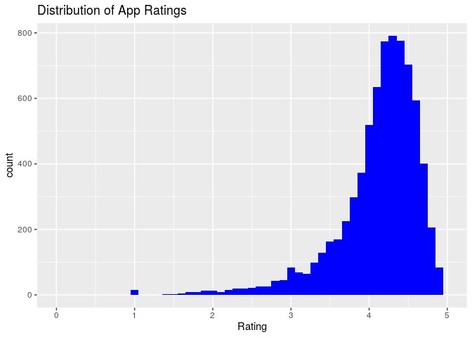

Understanding Google Play Application Reviews
================
RTime2Shine
12/7/19

    ## Skim summary statistics
    ##  n obs: 7731 
    ##  n variables: 15 
    ## 
    ## ── Variable type:factor ────────────────────────────────────────────────────────────────────────────────────────────────────────────────────────────────────────────────────────
    ##  variable missing complete    n n_unique
    ##  Installs       0     7731 7731        5
    ##                                 top_counts ordered
    ##  100: 4462, Bet: 1477, Bet: 1145, Bet: 510   FALSE

<!-- -->

<!-- -->

    ## # A tibble: 1 x 3
    ##   `median(log_reviews)` `max(log_reviews)` `IQR(log_reviews)`
    ##                   <dbl>              <dbl>              <dbl>
    ## 1                  7.55               12.2               5.44

    ## # A tibble: 33 x 3
    ##    Category            n   freq
    ##    <fct>           <int>  <dbl>
    ##  1 FAMILY           1543 0.200 
    ##  2 GAME              671 0.0868
    ##  3 TOOLS             646 0.0836
    ##  4 MEDICAL           350 0.0453
    ##  5 LIFESTYLE         301 0.0389
    ##  6 FINANCE           299 0.0387
    ##  7 BUSINESS          289 0.0374
    ##  8 PERSONALIZATION   275 0.0356
    ##  9 SPORTS            269 0.0348
    ## 10 PRODUCTIVITY      262 0.0339
    ## # … with 23 more rows

    ## # A tibble: 33 x 3
    ##    Category        category_simp        n
    ##    <fct>           <chr>            <int>
    ##  1 FAMILY          Top 6 Categories  1543
    ##  2 GAME            Top 6 Categories   671
    ##  3 TOOLS           Top 6 Categories   646
    ##  4 MEDICAL         Top 6 Categories   350
    ##  5 LIFESTYLE       Top 6 Categories   301
    ##  6 FINANCE         Top 6 Categories   299
    ##  7 BUSINESS        Others             289
    ##  8 PERSONALIZATION Others             275
    ##  9 SPORTS          Others             269
    ## 10 PRODUCTIVITY    Others             262
    ## # … with 23 more rows

    ## Warning: Factor `Android Ver` contains implicit NA, consider using
    ## `forcats::fct_explicit_na`

    ## # A tibble: 10 x 2
    ##    `Android Ver`          n
    ##    <fct>              <int>
    ##  1 4                   4972
    ##  2 2                   1085
    ##  3 Varies with device   735
    ##  4 5                    512
    ##  5 3                    229
    ##  6 1                    103
    ##  7 7                     45
    ##  8 6                     43
    ##  9 8                      5
    ## 10 <NA>                   2

    ## # A tibble: 9 x 3
    ##   `Android Ver`      androidver_simp        n
    ##   <fct>              <chr>              <int>
    ## 1 4                  1-4                 4964
    ## 2 2                  1-4                 1085
    ## 3 Varies with device Varies with Device   735
    ## 4 5                  5-8                  510
    ## 5 3                  1-4                  229
    ## 6 1                  1-4                  103
    ## 7 7                  5-8                   45
    ## 8 6                  5-8                   43
    ## 9 8                  5-8                    5

    ## # A tibble: 6 x 3
    ##   `Content Rating` content_simp     n
    ##   <chr>            <chr>        <int>
    ## 1 Everyone         Everyone      6319
    ## 2 Teen             Teen           770
    ## 3 "Mature "        <NA>           355
    ## 4 "Everyone "      <NA>           271
    ## 5 "Adults only "   <NA>             3
    ## 6 Unrated          Unrated          1

# Model Selection

|                term                |  estimate   | std.error |  statistic   |  p.value  |
| :--------------------------------: | :---------: | :-------: | :----------: | :-------: |
|            (Intercept)             |  4.5102346  | 0.0610922 |  73.8267328  | 0.0000000 |
|   category\_simpTop 6 Categories   | \-0.0251939 | 0.0128826 | \-1.9556589  | 0.0505447 |
|            log\_reviews            |  0.0762331  | 0.0044198 |  17.2479395  | 0.0000000 |
|        SizeLess than 100 MB        |  0.0177410  | 0.0391701 |  0.4529227   | 0.6506183 |
|       SizeVaries with device       | \-0.0300761 | 0.0530362 | \-0.5670858  | 0.5706739 |
|   InstallsBetween 100 and 1,000    | \-0.3458200 | 0.0522721 | \-6.6157667  | 0.0000000 |
|  InstallsBetween 1,000 and 10,000  | \-0.6921395 | 0.0501573 | \-13.7993746 | 0.0000000 |
| InstallsBetween 10,000 and 100,000 | \-0.8444331 | 0.0525226 | \-16.0775220 | 0.0000000 |
|     Installs100,000 or Greater     | \-1.0113334 | 0.0603295 | \-16.7634839 | 0.0000000 |
|     PriceBetween $0 and $4.99      |  0.1038402  | 0.0266711 |  3.8933537   | 0.0000998 |
|        PriceGreater than $5        |  0.0667458  | 0.0485501 |  1.3747826   | 0.1692424 |
|        `Content Rating`Teen        | \-0.0175642 | 0.0204726 | \-0.8579400  | 0.3909547 |
|      `Content Rating`Unrated       |  0.1946908  | 0.5318177 |  0.3660856   | 0.7143122 |
|        androidver\_simp5-8         | \-0.0389748 | 0.0236899 | \-1.6452092  | 0.0999711 |
| androidver\_simpVaries with Device | \-0.0195554 | 0.0395636 | \-0.4942787  | 0.6211247 |
|            date\_since             | \-0.0001243 | 0.0000166 | \-7.5107911  | 0.0000000 |

    ## Warning: 'tidy.numeric' is deprecated.
    ## See help("Deprecated")

    ## # A tibble: 15 x 2
    ##    names                                  x
    ##    <chr>                              <dbl>
    ##  1 category_simpTop 6 Categories       1.05
    ##  2 log_reviews                         5.07
    ##  3 SizeLess than 100 MB                4.84
    ##  4 SizeVaries with device              7.30
    ##  5 InstallsBetween 100 and 1,000       4.33
    ##  6 InstallsBetween 1,000 and 10,000    8.26
    ##  7 InstallsBetween 10,000 and 100,000 10.9 
    ##  8 Installs100,000 or Greater         22.5 
    ##  9 PriceBetween $0 and $4.99           1.11
    ## 10 PriceGreater than $5                1.03
    ## 11 `Content Rating`Teen                1.02
    ## 12 `Content Rating`Unrated             1.00
    ## 13 androidver_simp5-8                  1.04
    ## 14 androidver_simpVaries with Device   3.37
    ## 15 date_since                          1.22

    ##                        (Intercept)                        log_reviews 
    ##                       4.5124715854                       0.0744108983 
    ##      InstallsBetween 100 and 1,000   InstallsBetween 1,000 and 10,000 
    ##                      -0.3447278672                      -0.6891663588 
    ## InstallsBetween 10,000 and 100,000         Installs100,000 or Greater 
    ##                      -0.8405412693                      -1.0072240860 
    ##          PriceBetween $0 and $4.99                         date_since 
    ##                       0.0978316624                      -0.0001211124

    ##                        (Intercept)                        log_reviews 
    ##                       4.5124715854                       0.0744108983 
    ##      InstallsBetween 100 and 1,000   InstallsBetween 1,000 and 10,000 
    ##                      -0.3447278672                      -0.6891663588 
    ## InstallsBetween 10,000 and 100,000         Installs100,000 or Greater 
    ##                      -0.8405412693                      -1.0072240860 
    ##          PriceBetween $0 and $4.99                         date_since 
    ##                       0.0978316624                      -0.0001211124

## Section 1: Introduction (includes introduction and exploratory data analysis)

Lukengu: relevel categories, log transform and remove the outliers of
reviews

Sanjay: finish EDA,
etc.

## Section 2: Regression Analysis (includes the final model and discussion of assumptions)

## Section 3: Discussion and Limitations

## Section 4: Conclusion

## Section 5: Additional Work
