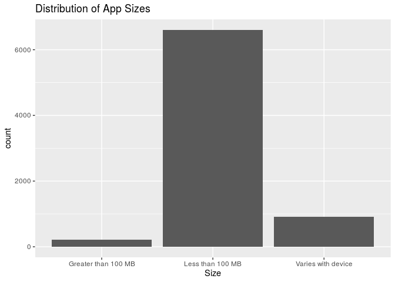
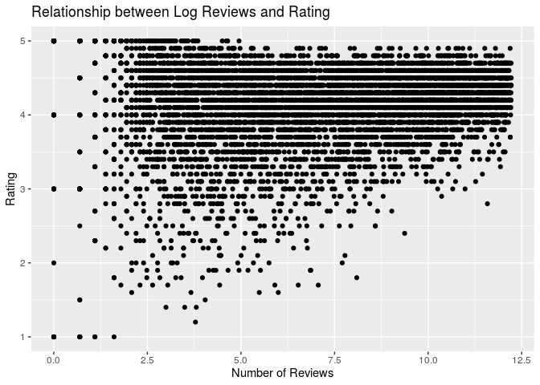
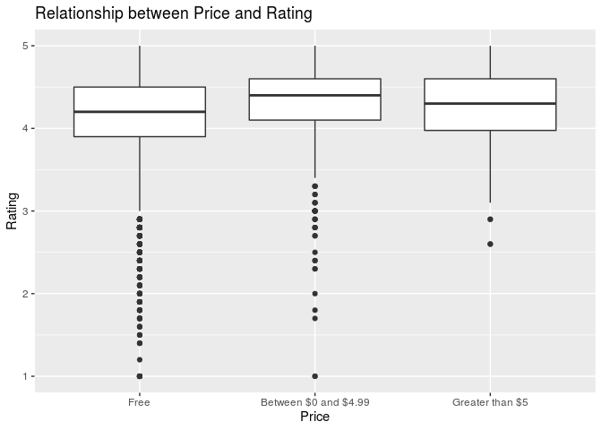
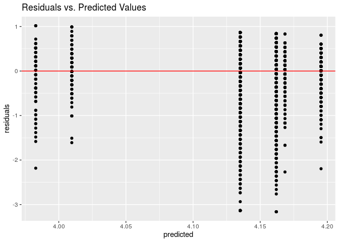
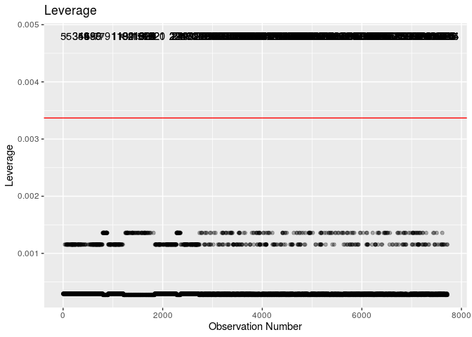

Understanding Google Play Application Reviews
================
RTime2Shine
12/7/19

## Section 1: Introduction (includes introduction and exploratory data analysis)

### Motivaton

As technology has become increasingly prevalent around the world, there
has been a change in the consumption of media. One of these ways is via
the purchase of applications (apps) for various smartphones and other
devices. Several technology companies, including Apple and Google, run
virtual stores for these apps in which a person can download an app for
their device. These apps can be for various purposes like socializing,
playing games, or watching television and movies, among others. While
any user of a phone can agree that apps hold an important effect on how
one interacts with technology on a daily basis, the weight of the impact
becomes even more shocking when one looks at the figures- in 2018,
global app downloads topped 194 billion (Dignan).

Our motivation for this project is to understand what makes apps (from
the Google Play store specifically) have favorable ratings.
Understanding the ratings of an app is important for several reasons.
First, ratings can be important to the provider- in this case Google-
who can decide whether an app should continue to be sold to maintain
their quality standards. Ratings are additionally useful as a direct
line of communication between the user and the developers- often,
developers are made aware of changes that need to be made to their apps
through user feedback. Lastly, reviews serve to inform potential users
of an app whether or not it is worth their time and can affect future
downloads. Considering that app users are predicted to spend about $120
billion in app stores in 2019, understanding which apps do well on the
Play Store and what factors affect app performance is an immensely
important question to gain more insight into.

### Research Question & Hypothesis

Our ultimate goal is to create a model which most accurately and
concisely predicts the Rating of an app given the predictors in the
dataset. This will enable us to see which predictor variables interact
with each other to effect the rating for a given app. We posit that
examining such relationships will help developers understand what
factors may influence an app’s rating and use that information to create
better applications for consumers. As well, conglomerates such as Google
(whom this dataset is from) can use this information to more accurately
display or promote apps that meet these characteristics or promote ads
related to these apps and generate revenue.

This leads us to introduce our main research question: What are the
relevant factors that affect the rating given for apps in the Google
Play store? Although this project will give a detailed attempt to answer
this question, our preliminary hypothesis is that the variables
Category, Price, Installs, and Content Rating are the predictor
variables that will most affect a given app rating and popularity, as
measured by the number of installs of the app. We believe that these
variables are indicative of an apps useability and likeness (as
determined by variables like content rating and categories in how people
may be drawn to an app) as well as its accessibility (price).
Furthermore, once we test our hypothesis and determine which factors are
relevant, we will attempt to use that information to predict the success
of an app as measured by its rating.

### The Data

The dataset was obtained from Kaggle. According to Kaggle, the dataset
was scraped directly from the Google Play Store in August 2018. Each
observation represents one individual app on the Google Play Store. This
particular dataset has 13 variables with 10841 observations. The
variables consist of various information collected about each
application (which represents a row) in the dataset. This information
includes the apps category in the app store, its average rating, price,
content rating, the number of installs, among other metrics. In our
Exploratory Data Analysis, we will further explain the use of each of
these variables and determine which of these may be significant for and
relevant in our analysis. The response variable in our investigation is
`Rating` which is the mean rating out of 5.0 for an application in the
Google Play Store. This is a numeric variable.

### Exploratory Data Analysis

    ## Skim summary statistics
    ##  n obs: 10841 
    ##  n variables: 13 
    ## 
    ## ── Variable type:character ──────────────────────────────────────────────────────────────────────────────────────────────────────────────────────────────────────────────────────────────────
    ##        variable missing complete     n min max empty n_unique
    ##     Android Ver       1    10840 10841   3  18     0       34
    ##             App       0    10841 10841   1 194     0     9660
    ##        Category       0    10841 10841   3  19     0       34
    ##  Content Rating       1    10840 10841   4  15     0        6
    ##     Current Ver       1    10840 10841   1  50     0     2833
    ##          Genres       0    10841 10841   4  37     0      120
    ##        Installs       0    10841 10841   1  14     0       22
    ##    Last Updated       0    10841 10841   6  18     0     1378
    ##           Price       0    10841 10841   1   8     0       93
    ##            Size       0    10841 10841   3  18     0      462
    ##            Type       0    10841 10841   1   4     0        4
    ## 
    ## ── Variable type:numeric ────────────────────────────────────────────────────────────────────────────────────────────────────────────────────────────────────────────────────────────────────
    ##  variable missing complete     n      mean         sd p0 p25    p50
    ##    Rating    1474     9367 10841      4.19       0.54  1   4    4.3
    ##   Reviews       1    10840 10841 444152.9  2927760.6   0  38 2094  
    ##      p75     p100     hist
    ##      4.5 19       ▁▇▁▁▁▁▁▁
    ##  54775.5  7.8e+07 ▇▁▁▁▁▁▁▁

#### Data Wrangling

Upon examining our predictor variables, it looks like there are
occasionally one or two observations missing in the dataset, which does
not raise lots of concern. It is worth noting, however, that 1474 of our
response variable values are missing. This is roughly 10% of the data.
Given that the data was web scraped, we will assume that the reason
behind these missing values is that there was not a mean rating value
for those particular observations (app). Thus, we will omit all of the
NA values and continue to investigate only those apps for which we have
ratings.

Furthermore, here it is worth noting that the variable, `Genres`
contains the same information in the `category` variable - the only
difference being that the data is just displayed a bit differently.
Therefore, as to avoid being redundant, we will only be using `category`
in our analysis. As well, the information contained in the variable
`Type` is also contained in `Price`. Since `Price` provides the prices
of an app and `Type` simply denotes wether or not an app is paid or
free. There is mostly likely a large linear dependency between these two
variables as they measure the same thing, so we will use `Price` instead
of `Type.` We will not deleting theese variables from the dataset as to
maintain integrity, but will not examine them in our analysis.

As well, we also have many of predictors that are coded as characters in
the dataset, so we decided to recode them as factors. We also have some
variables that are coded as characters due to the existence of a
particular a symbol (ex. $), we will recoded these into a format which
will be usable for our analysis.

Looking at the data, there are two variables related to the version, or
iteration of the app as provided by the developers: `Current Ver` and
`Android Ver`. Given that Google owns both Android and the Google Play
Store, the company would likely be more interested in the Android
version of the app. Furthermore, Android users are unlikely to be using
other operating system’s application stores, so a developer who is
interested in creating apps for the Android market would gain more
information through an examination of the compatibility of certain apps
with a particular version of Android. Some data wrangling was necessary
to make this variable suitable for analysis.

We also created a variable called `date_since`, which marks the number
of days that the app has been updated since the day that the data was
scraped on August 8, 2018. This will allow us to determine how recent
the last update was for a particular app and provides some information
related to the relative frequency of updates and how that may affect an
app’s rating.

There are also a number of variables which required releveling. Many of
our predictors have multiple levels and these may have made our model
too complicated. To reduce the probabiltiy that the model overfits the
data and is too complicated, we will relevel our variables as follows:

Since our variable `Price` is currently not numeric and isn’t coded into
categories, we will relevel price into 3 categories: Free, Between 0 and
4.99 dollars, and greater than 5 dollars.

Since our variable `Size` is currently very widely distributed, we will
relevel size into 3 categories: Varies with Device, Less than 100, and
Greater than 100.

Since our variable `Installs` is currently very widely distributed, we
will relevel installs into 3 categories: Less than 100, Between 100 and
1,000, Between 1,000 and 10,000, Between 10,000 and 100,000, and 100,000
or Greater.

Our variable `Category` is extremely large and has many levels as shown
in the graphiic below. To simplify this, we will create a new variable
called `category_simp` with two levels: one for the top 6 categories
(“FAMILY”,“GAME”, “TOOLS”,“MEDICAL”, “LIFESTYLE”, and “FINANCE”) and
another for all the other categories.

    ## # A tibble: 33 x 3
    ##    Category            n   freq
    ##    <fct>           <int>  <dbl>
    ##  1 FAMILY           1543 0.200 
    ##  2 GAME              671 0.0868
    ##  3 TOOLS             646 0.0836
    ##  4 MEDICAL           350 0.0453
    ##  5 LIFESTYLE         301 0.0389
    ##  6 FINANCE           299 0.0387
    ##  7 BUSINESS          289 0.0374
    ##  8 PERSONALIZATION   275 0.0356
    ##  9 SPORTS            269 0.0348
    ## 10 PRODUCTIVITY      262 0.0339
    ## # … with 23 more rows

    ## # A tibble: 33 x 3
    ##    Category        category_simp        n
    ##    <fct>           <chr>            <int>
    ##  1 FAMILY          Top 6 Categories  1543
    ##  2 GAME            Top 6 Categories   671
    ##  3 TOOLS           Top 6 Categories   646
    ##  4 MEDICAL         Top 6 Categories   350
    ##  5 LIFESTYLE       Top 6 Categories   301
    ##  6 FINANCE         Top 6 Categories   299
    ##  7 BUSINESS        Others             289
    ##  8 PERSONALIZATION Others             275
    ##  9 SPORTS          Others             269
    ## 10 PRODUCTIVITY    Others             262
    ## # … with 23 more rows

As shown in the above table, we can see that the top 6 categories are in
one level and the others are stored in another level.

    ## # A tibble: 10 x 2
    ##    `Android Ver`          n
    ##    <fct>              <int>
    ##  1 4                   4972
    ##  2 2                   1085
    ##  3 Varies with device   735
    ##  4 5                    512
    ##  5 3                    229
    ##  6 1                    103
    ##  7 7                     45
    ##  8 6                     43
    ##  9 8                      5
    ## 10 <NA>                   2

    ## # A tibble: 9 x 3
    ##   `Android Ver`      androidver_simp        n
    ##   <fct>              <chr>              <int>
    ## 1 4                  1-4                 4964
    ## 2 2                  1-4                 1085
    ## 3 Varies with device Varies with Device   735
    ## 4 5                  5-8                  510
    ## 5 3                  1-4                  229
    ## 6 1                  1-4                  103
    ## 7 7                  5-8                   45
    ## 8 6                  5-8                   43
    ## 9 8                  5-8                    5

As well, the variable `Android Ver` is quite complicated. To simplify
our analysis we decided to bin this variable into two levels, one for
apps that support the first “generation” of Android, versions 1-4, and
another for apps that support the second generation, 5-8. For apps that
vary with device, we kept those observations as is. As shown in the
final graphic, our new variable, `androidver_simp` reduces some of the
complexity in the previous variable while retaining ease of use for
analysis.

    ## # A tibble: 6 x 3
    ##   `Content Rating` content_simp     n
    ##   <chr>            <chr>        <int>
    ## 1 Everyone         Everyone      6319
    ## 2 Teen             Teen           770
    ## 3 "Mature "        Mature         355
    ## 4 "Everyone "      Everyone       271
    ## 5 "Adults only "   Adults only      3
    ## 6 Unrated          Unrated          1

Lastly, there were also issues with our variable `Content Rating`. This
particular variable had two categories for the rating “Everyone,” one of
which happend to be coded with a space (“Everyone”) in the dataset.
Knowing that content ratings are finite, we decided to combine these
categories together as to reduce the number of levels in this variable
and its redundancy.

#### Univariate Analysis

##### Ratings

<!-- -->

    ## # A tibble: 1 x 2
    ##   `median(Rating)` `IQR(Rating)`
    ##              <dbl>         <dbl>
    ## 1              4.2           0.6

##### Reviews

<!-- -->

    ## # A tibble: 1 x 1
    ##   `median(Reviews)`
    ##               <dbl>
    ## 1              1902

    ## # A tibble: 1 x 1
    ##   `max(Reviews)`
    ##            <dbl>
    ## 1         203130

<!-- -->

    ## # A tibble: 1 x 3
    ##   `median(log_reviews)` `max(log_reviews)` `IQR(log_reviews)`
    ##                   <dbl>              <dbl>              <dbl>
    ## 1                  7.55               12.2               5.44

Reviews is definetley one of our most skewed predictors, as shown by the
strong right skew in this histogram. Originally, the skew was even more
extreme, since there was one outlier that had 78 million reviews.
Therefore, to correct this issue, we removed the outlier from the
variable as well as log transformed it in order to make it easier to see
trends as well as make the variable less skewed.

##### Category

<!-- -->

<!-- -->

As demonstrated above, there are a number of levels within the variable
`Category`, this will cause problems with overfitting down the line, so
we decided to create two levels- one for the most popular levels, and
one with the least popular levels. Once binned into those two levels,
there is a much more even spread.

##### Size

<!-- -->

##### Installs

<!-- -->

##### Price

<!-- -->

##### Content Rating

<!-- -->

##### Android Version

<!-- -->

<!-- -->

#### Bivariate Analysis

A bivariate analysis between variables will help understand the
interaction between indidivual predictor variables and the response.

<!-- -->

Although there is some variation in rating between app categories, the
most telling aspect of this exploratory model is the outliers. It
appears that some categories are more susceptible to outliers with low
ratings. More over there are notable discrepancies between minimum
boxplot rating among categories. \*\*NOTE THIS NEEDS TO BE FIXED this
was copy pasted from the old one i think

<!-- -->

Based on the scatterplot above, there is likely a relationship between
number of reviews and app rating. As the number of reviews increased the
app rating was concentrated at approximately 4.5 - which was consistent
with apps holding smaller number of reviews. IS THIS RIGHT??

<!-- -->

<!-- -->

The boxplot above clearly shows a significant relationship between
number of installs and rating. As the number of installs increases the
IQR appears to decrease in conjunction. Moreover median rating also
increases with number of
installs.

<!-- -->

<!-- -->

<!-- -->

<!-- -->

## Section 2: Regression Analysis (includes the final model and discussion of assumptions)

### Model Process

The regression modeling technique we will use will be Multiple Linear
Regression (MLR). Since we are exploring the effect of multiple
predictor variables on our response, `rating`, it is apt that we use MLR
to model our data. MLR allows us to see the effect of multiple
predictors on a response and explore both the significance of each
predictor on the response as well as the effect of each predictor on the
response. As opposed to Simple Linear Regression, MLR allows us to
measure the effect of multiple predictors on your response in one model
- SLR only allows us to measure the effect of one predictor on the
response in one model. This is very taxing and inefficient for the
number of predictors we want to measure. As well, there may be
interactions between these predictors that we will be unable to view
using SLR. MLR allows us to both model and view the amalgamation of
these predictors in their effects on the response variable. MLR from
both an efficiency and relevancy perspective is much better suited to
model our data as opposed to other methods.

Our ultimate goal is to create the model which most accurately and
concisely predicts the Rating of an app given the predictors in the
dataset. We will attempt to choose a model using a minimization of both
BIC and AIC as our criteria as this will allow us to calculate a precise
prediction of our response variable while also removing extraneous
predictors. We will use BIC and AIC as our selection criteria as it
penalizes more for erroneous predictors as compared to adj. R-Squared.
We will not use R-squared as a criteria for model selection. R squared
increases strictly as the number of predictors increases and does not
tell us if these additional predictors are significant or not. If we
used r-squared we would always choose models with the largest numbers of
predictors, which would not always produce the simplest, most accurate
model. Unlike R squared, AIC, BIC, and adjusted R squared do penalize
for insignificant predictors and can give us a better idea of which
predictors actually contribute to the response variable.

In order to find our final model, we will use a process of both forwards
and backwards selection slowly adding a combination of relevant
predictors into our model. We will then check the BIC and AIC values for
each of these models and find the model with the lowest value overall,
or the fewest predictors - this will be the model that most accurately
predicts our response with the fewest number of predictors. We will then
plot each predictor on the response to determine if the effect is
relevant or if there are possible interactions between other variables.
As well, we will need to consider potential outliers and extraneous
values in our model. Using the distributions of standardized residuals
and a calculation of Cook’s distance, we will attempt to determine those
observations with high standardized residuals or cook’s distance and
determine if those observations have a significant effect on our model.
Lastly, we will need to find the VIF factor for each of our final
predictors to see if there is any collinearity between them. A VIF
greater than 10 would require us to explore possible ways to mitigate
interactions between variables or consider dropping predictors are are
too heavily
correlated.

### Model Selection

|                term                |  estimate   | std.error |  statistic   |  p.value  |
| :--------------------------------: | :---------: | :-------: | :----------: | :-------: |
|            (Intercept)             |  4.5304426  | 0.3096064 |  14.6329098  | 0.0000000 |
|   category\_simpTop 6 Categories   | \-0.0162242 | 0.0123100 | \-1.3179729  | 0.1875519 |
|            log\_reviews            |  0.0777440  | 0.0041803 |  18.5976712  | 0.0000000 |
|        SizeLess than 100 MB        |  0.0279575  | 0.0386000 |  0.7242887   | 0.4689105 |
|       SizeVaries with device       | \-0.0159581 | 0.0516082 | \-0.3092162  | 0.7571654 |
|   InstallsBetween 100 and 1,000    | \-0.3191929 | 0.0508824 | \-6.2731538  | 0.0000000 |
|  InstallsBetween 1,000 and 10,000  | \-0.6744637 | 0.0488825 | \-13.7976379 | 0.0000000 |
| InstallsBetween 10,000 and 100,000 | \-0.8323129 | 0.0510409 | \-16.3067913 | 0.0000000 |
|     Installs100,000 or Greater     | \-1.0055035 | 0.0582664 | \-17.2570087 | 0.0000000 |
|     PriceBetween $0 and $4.99      |  0.1110619  | 0.0255403 |  4.3484964   | 0.0000139 |
|        PriceGreater than $5        |  0.0740294  | 0.0461711 |  1.6033729   | 0.1088934 |
|       content\_simpEveryone        | \-0.0554695 | 0.3039621 | \-0.1824883  | 0.8552043 |
|        content\_simpMature         | \-0.1523154 | 0.3051214 | \-0.4991961  | 0.6176555 |
|         content\_simpTeen          | \-0.0740452 | 0.3044730 | \-0.2431913  | 0.8078637 |
|        content\_simpUnrated        |  0.1282107  | 0.6088399 |  0.2105819   | 0.8332191 |
|        androidver\_simp5-8         | \-0.0571445 | 0.0227166 | \-2.5155335  | 0.0119054 |
| androidver\_simpVaries with Device | \-0.0252211 | 0.0378350 | \-0.6666081  | 0.5050425 |
|            date\_since             | \-0.0001225 | 0.0000159 | \-7.7071746  | 0.0000000 |

Above is the output of our full model using the predictors we deemed to
be relevant in our Exploratory Data Analysis. As shown, there are a
number of predictors that appear to have p-values greater than 0.05,
deeming them insiginifcant. To find the most parsimonious model for our
purporses of prediction, we used a model selection process comparing
both BIC and AIC using a combination of backwards, forwards, and hybrid
selection. The final model we chose was that selected using both AIC
forward and hybrid selection as this particular model (as displayed
below) gave us the shortest model while retaining assumptions better
than the other models we tried. After going through the model process,
we found that the constant variance assumption was violated using our
BIC model. As well, it had far too many levels and we afraid that it was
“overfitting” our data. Our model determines its coefficients through
the relative variance of different variables in our data. If there are
some predictors which have high frequency in the data, it is most likely
that those predictors will account for the highest amount of variance
when developing our final model. Thus, our model would tend to
“memorize” our data rather than rather assessing the variability in
response through particular trends in our predictors generalizable to
the app store as a whole - as opposed to this singular dataset. In our
additional work section, we have attached the final versions of those
models as well as a plot of the residuals to illustrate this violation.

    ## Start:  AIC=-9224.82
    ## Rating ~ 1
    ## 
    ##                   Df Sum of Sq    RSS     AIC
    ## + Installs         4    63.534 2272.2 -9429.7
    ## + log_reviews      1    34.937 2300.8 -9339.2
    ## + date_since       1    28.974 2306.8 -9319.2
    ## + Price            2     9.927 2325.8 -9253.7
    ## + Size             2     6.307 2329.5 -9241.7
    ## + category_simp    1     1.723 2334.1 -9228.5
    ## + androidver_simp  2     1.773 2334.0 -9226.7
    ## <none>                         2335.8 -9224.8
    ## + content_simp     4     2.345 2333.4 -9224.6
    ## 
    ## Step:  AIC=-9429.69
    ## Rating ~ Installs
    ## 
    ##                   Df Sum of Sq    RSS     AIC
    ## + log_reviews      1   113.172 2159.1 -9822.1
    ## + date_since       1    22.116 2250.1 -9503.2
    ## + Price            2    12.007 2260.2 -9466.6
    ## + Size             2     3.529 2268.7 -9437.7
    ## + content_simp     4     2.721 2269.5 -9430.9
    ## + category_simp    1     0.793 2271.4 -9430.4
    ## <none>                         2272.2 -9429.7
    ## + androidver_simp  2     0.844 2271.4 -9428.6
    ## 
    ## Step:  AIC=-9822.05
    ## Rating ~ Installs + log_reviews
    ## 
    ##                   Df Sum of Sq    RSS     AIC
    ## + date_since       1   14.4627 2144.6 -9871.9
    ## + Size             2    3.6109 2155.5 -9831.0
    ## + Price            2    3.0574 2156.0 -9829.0
    ## + androidver_simp  2    1.5735 2157.5 -9823.7
    ## + content_simp     4    2.2472 2156.8 -9822.1
    ## <none>                         2159.1 -9822.1
    ## + category_simp    1    0.3084 2158.8 -9821.2
    ## 
    ## Step:  AIC=-9871.93
    ## Rating ~ Installs + log_reviews + date_since
    ## 
    ##                   Df Sum of Sq    RSS     AIC
    ## + Price            2    5.4111 2139.2 -9887.4
    ## + androidver_simp  2    3.1047 2141.5 -9879.1
    ## + Size             2    2.1523 2142.5 -9875.7
    ## + content_simp     4    2.9571 2141.7 -9874.6
    ## <none>                         2144.6 -9871.9
    ## + category_simp    1    0.0417 2144.6 -9870.1
    ## 
    ## Step:  AIC=-9887.43
    ## Rating ~ Installs + log_reviews + date_since + Price
    ## 
    ##                   Df Sum of Sq    RSS     AIC
    ## + androidver_simp  2    3.3511 2135.8 -9895.5
    ## + Size             2    2.3133 2136.9 -9891.8
    ## + content_simp     4    2.8066 2136.4 -9889.6
    ## <none>                         2139.2 -9887.4
    ## + category_simp    1    0.1137 2139.1 -9885.8
    ## 
    ## Step:  AIC=-9895.54
    ## Rating ~ Installs + log_reviews + date_since + Price + androidver_simp
    ## 
    ##                 Df Sum of Sq    RSS     AIC
    ## + content_simp   4   3.10133 2132.8 -9898.8
    ## <none>                       2135.8 -9895.5
    ## + category_simp  1   0.29422 2135.6 -9894.6
    ## + Size           2   0.52198 2135.3 -9893.4
    ## 
    ## Step:  AIC=-9898.75
    ## Rating ~ Installs + log_reviews + date_since + Price + androidver_simp + 
    ##     content_simp
    ## 
    ##                 Df Sum of Sq    RSS     AIC
    ## <none>                       2132.8 -9898.8
    ## + category_simp  1   0.43981 2132.3 -9898.3
    ## + Size           2   0.54839 2132.2 -9896.7

|              term              |  estimate   | std.error | statistic  |  p.value  |
| :----------------------------: | :---------: | :-------: | :--------: | :-------: |
|          (Intercept)           |  4.0096938  | 0.0380781 | 105.301857 | 0.0000000 |
| category\_simpTop 6 Categories | \-0.0268642 | 0.0126225 | \-2.128288 | 0.0333448 |
|      SizeLess than 100 MB      |  0.1523095  | 0.0381560 |  3.991756  | 0.0000662 |
|     SizeVaries with device     |  0.1856302  | 0.0418267 |  4.438079  | 0.0000092 |

As shown above, our final model is as follows:

`Rating`^ = 4.00969938 - 0.0268642 \* `category_simpTop 6 Categories`+
0.1523095 \* `SizeLess than 100 MB` + 0.1856302 \* `SizeVaries with
device`

As well, it can be seen that all of the predictors in our final model
have p-values less than 0.05, which allows us to conclude that they are
all statistically significant - indicating that a lot of the terms in
the model are making a significant contribution to understanding the
variation in the response, `Rating`.

### Interactions & Our Updated Model

Now, we will conduct an f-test including the possible interaction
effects in our model to determine if there are any interaction effects
which are significant.

Our hypotheses for this F-test is as follows:

Since the number of levels of our categorical variables are k \> 2 we
can use a nested F test to determine if any of these interaction effects
are significant.

Ho: B(1) = B(2) = … = 0

Ha: Atleast one Beta\_j is not equal to 0

In this case, we are measuring the interaction between `category_simp`
and `Size`, so our Beta j’s denotate the coefficient for both of these
predictors as well as the interaction term. Our null hypothesis can
essentially be read as there are no interactions between any of the
variables in our model and our alternative can be read as that there is
a significant interaction effect in the model since there are only two
predictors in our final model.

| Res.Df |   RSS    | Df | Sum of Sq |     F     |  Pr(\>F)  |
| :----: | :------: | :-: | :-------: | :-------: | :-------: |
|  7715  | 2328.105 | NA |    NA     |    NA     |    NA     |
|  7713  | 2327.768 | 2  | 0.3364261 | 0.5573695 | 0.5727367 |

Since our p-value of approximately 0.5727 is greater than our
significance level of 0.05, we do not have evidence that there is a
statistically significant interaction between both `Size` and
`category_simp`. Thus, our final model will not include this interaction
term and we will proceed with our previously defined final model.

### Assumptions

#### Linearity

The Linearity Assumptions assumes that the response variable has a
linear relationship with the predictor variables used in the final
model. To assess linearity, we look at the plots created in the
Exploratory Data Analysis. None of these plots seem to have a non-linear
relationship such as one that would be polynomial; however, some are
quite skewed but this should not matter for the purposes of our model.
To illustrate this, we will re-display the bivariate plots with our
final predictor
variables.

<!-- --><!-- -->

As shown in the plots above, both the predictor variables appear to
satisfy the linearity assumption.

#### Constant Variance

The Constant Variance Assumption assumes that the regression variance is
the same for all of the predictor variables in the model. To test this
assumption, we will plot the residual values against predictors.

<!-- -->

As shown, it appears that the constant variance assumption is violated.
There appears to be a clear pattern in our residuals relating to the
significance of large amounts of negative values. Since our response was
normally distributed at the beginning of our EDA, we did not see the
need for a transformation of our response; however, it may be the case
that there is a need for more, higher-order interaction terms. Since our
model satisfies the linearity assumption and also realtively satisfies
our normality assumption it is reasonable to assume that this is not a
great cause for concern. As well, as stated above and in our additional
work we did try to choose multiple models and this particular one was
the one with the least noticeable violation of constant variance and
normality. Therefore, we believe that given this sufficient effort, this
model is mostly likely the one that is grestest for predicting the
majority of applications given our dataset.

#### Normality

The Normality Assumption assumes that for any given set of predictors,
the response variable, `ratings`, follows a Normal distribution around
its mean. To test this, we will make a Normal QQ
plot.

<!-- --><!-- -->

As shown, our residuals are relatively normally distributed in our
histogram. The center is around 0 which is good; however there is a
slight left skew. As well, our Normal-QQ plot doesn’t closely match the
idea line at the beginning of the more negative values. It may be the
case that there are many outliers or high leverage points in our model
that are causing this skew and if they were removed then we wouldn’t see
this. However, since our distribution of residuals is relatively normal
and the Normal QQ Plot is mostly following the trend line it is
reasonable to assume that this assumption is satisfied due to the
robustness of our model. In our model Assessment, we can further fix
these issues and improve our model.

#### Independence

The Independence Assumption assumes that all observations in the data
used to construct the model are independent of each other. Given that
each observation and is not dependent on the time frame or location of
collection for its mean rating. The observations are independent of each
other and thus the Independence Assumption is maintained.

### Model Assesment

#### Leverage

According to lecture, the threshold we should use for determining if
observations are high leverage points is: hi \> (2(p+1))/n

<!-- -->

Let’s filter to see the total \# of points that crossed the threshold.

    ## # A tibble: 214 x 2
    ##    category_simp    Size               
    ##    <chr>            <chr>              
    ##  1 Others           Greater than 100 MB
    ##  2 Others           Greater than 100 MB
    ##  3 Others           Greater than 100 MB
    ##  4 Others           Greater than 100 MB
    ##  5 Others           Greater than 100 MB
    ##  6 Others           Greater than 100 MB
    ##  7 Others           Greater than 100 MB
    ##  8 Others           Greater than 100 MB
    ##  9 Others           Greater than 100 MB
    ## 10 Top 6 Categories Greater than 100 MB
    ## # … with 204 more rows

As shown, there are 214 high leverage points. This is problematic but
before we assess our model’s strength we should check cook’s distance.
However, in our previous model we had 8,134 leverage points. Thus, this
model is a significant improvement over that.

#### Cook’s Distance

Now let’s check how many of these points cross our threshold for Cook’s
Distance (Di \> 1) to determine if these high leverage points do in fact
have a significant influence on our model coefficients.

<!-- -->

Let’s check to see the number of points that violated this threshold.

    ## # A tibble: 0 x 2
    ## # … with 2 variables: category_simp <chr>, Size <chr>

As shown, none of these violate Cook’s Distance - so it is most likely
the case that although there may be some skew or slight violation of
assumptions, our model still is relatively strong in predicting Rating
and that there isn’t a cause for concern. It is unlikley that any of
these high leverage points have a significant influence on the model
coefficients.

#### Standardized Residuals

Now, let’s plot our standardized residuals to see if there are any
points which break the threshold |resid std.| \>
2.

<!-- -->

As depicted the plot, there are a number of points which violate this
threshold, so let’s filter the data to get an exact number.

    ## # A tibble: 363 x 2
    ##    category_simp Size            
    ##    <chr>         <chr>           
    ##  1 Others        Less than 100 MB
    ##  2 Others        Less than 100 MB
    ##  3 Others        Less than 100 MB
    ##  4 Others        Less than 100 MB
    ##  5 Others        Less than 100 MB
    ##  6 Others        Less than 100 MB
    ##  7 Others        Less than 100 MB
    ##  8 Others        Less than 100 MB
    ##  9 Others        Less than 100 MB
    ## 10 Others        Less than 100 MB
    ## # … with 353 more rows

As illustrated, there are 363 observations with a standardized residual
greater than +/- 2. These observations are considered to have
standardized residuals with large magnitude. This us much better than
our previous model which had greater than 470 points that violated this
threshold

<!-- -->

    ## [1] 4.702682

The proportion of observations that have standardized residuals with
magnitude \> 2 is about 0.4702682, or 4.702% of the observations. Since
this proportion is less than 5%, it is most likely the case that it is
not statistically significant and is relatively small. Therefore, there
is most likely not a concern with the number of observations flagged as
having standardized residuals with large magnitude as the proportion of
these residuals is relatively small. Although our proportion is somewhat
close to 5% it is still most likely the case that these flagged
residuals are a relatively small proportion of the data, as well since
none of our points violated Cook’s Distance, it is most likely the case
that our model is sound. As well, it is most likely these 5% of
observations which may have caused the skew in our residual variance.

### VIF

We will check the VIF of our model without interactions:

    ## # A tibble: 3 x 2
    ##   names                             x
    ##   <chr>                         <dbl>
    ## 1 category_simpTop 6 Categories  1.02
    ## 2 SizeLess than 100 MB           4.62
    ## 3 SizeVaries with device         4.63

None of our variables have VIF \> 10, indicating that there were no
concerns with multicollinearity in our final model and there was no need
for an interaction, confirming the results of our F-test.

### Model Interpretation

Will finish after we get model

## Section 3: Discussion and Limitations

Our model allows us to make various predictions about what impacts an
application’s mean rating. We see that the predictor variable with the
most influence on the response- if a review has more than 100,000
installs, the mean rating is expected to be 1.0113334 less than the mean
rating of an app with less than 100,00 installs. It is also worth noting
that the three other most influential predictors are the other levels
within the Installs predictors. Thus, for an application developer, the
number of installs will be a factor that they would want to focus on if
they are attempting to alter the mean rating of their application. The
predictor variable with the least influence on the mean rating of an
application is the number of days that the app has been updated since
the day that the data was scraped on August 8, 2018. The predictor
variables deemed to be too insignificant, via VIF, for the model are

Another thing worth noting is that the intercept is quite high. At
4.5102346, it is stating that for an application with less than 100
installations, 0 reviews, is free, and has been 0 days since being
updated we can expect the mean rating of the application to be
4.5102346, which is quite close to the highest possible rating, 5.

It is also worth noting that the data we used was web scrapped all at
one point by a third party. Therefore, due to time and human error,
there is bound to be false or missing data. Another thing to note is
that several of our variables, such as reviews and content rating, were
incredibly skewed. On of the more major issues with this dataset was
that 1474 of the 10841 observations were missing a response. That means
that 10% of our observations were missing throughout the modelling
process potentially creating bias and skew.

If we were to start over with this project, we would probably look more
closely at the dataset. Many of our variables had issues that needed to
be taken care of in order to conduct multilinear regression. For
instance, we needed to completely relevel a categorical variable,
Category. There were other variables that were challenging such as a
time related variable and variables related to the version of the
applications. If we were to restart the project, we would probably find
a different dataset.

If we were to continue the current project with the current dataset, we
would set different baseline levels for every combination of categorical
variables and redo the models and model selection. To improve our
analysis, we would make training and test cases and conduct a k-folf
cross validation that will allow us to assess the model’s fit allowing
us to make sure that the model is not too closely fit as to check
generalizability, but also make sure that it is specific enough to the
data. Regarding the data itself, we would probably attempt to webscrape
the data now as to have data that more closely reflects the current
situation.

## Section 4: Conclusion

In conclusion, our project’s goal was to understand what factors
contribute to an apps success as measured by the average rating given to
an application. By conducting multinormial regression analysis, we found
that \_\_\_\_\_\_\_\_ variables are vital to the outcome of the mean
ratings for an application. This can be useful to app developers, users,
and application stores in how to view, change, and ustiliza
applications.

## Section 5: Additional Work

### Model Selection

    ##                        (Intercept)                        log_reviews 
    ##                       4.4912514453                       0.0758591553 
    ##      InstallsBetween 100 and 1,000   InstallsBetween 1,000 and 10,000 
    ##                      -0.3194153798                      -0.6723565620 
    ## InstallsBetween 10,000 and 100,000         Installs100,000 or Greater 
    ##                      -0.8289290318                      -1.0026226107 
    ##          PriceBetween $0 and $4.99                 content_simpMature 
    ##                       0.1046628972                      -0.0878715403 
    ##                         date_since 
    ##                      -0.0001177867

    ##                        (Intercept)                        log_reviews 
    ##                       4.4912514453                       0.0758591553 
    ##      InstallsBetween 100 and 1,000   InstallsBetween 1,000 and 10,000 
    ##                      -0.3194153798                      -0.6723565620 
    ## InstallsBetween 10,000 and 100,000         Installs100,000 or Greater 
    ##                      -0.8289290318                      -1.0026226107 
    ##          PriceBetween $0 and $4.99                 content_simpMature 
    ##                       0.1046628972                      -0.0878715403 
    ##                         date_since 
    ##                      -0.0001177867

Above is our model selection using BIC, we chose not to include this
particular model for multiple reasons, including the fact that the
constant variance assumption of this model is violated.

    ## Start:  AIC=-9896.48
    ## Rating ~ category_simp + log_reviews + Size + Installs + Price + 
    ##     content_simp + androidver_simp + date_since
    ## 
    ##                   Df Sum of Sq    RSS     AIC
    ## - Size             2     0.589 2132.3 -9898.3
    ## - category_simp    1     0.481 2132.2 -9896.7
    ## <none>                         2131.7 -9896.5
    ## - androidver_simp  2     1.802 2133.5 -9894.0
    ## - content_simp     4     3.282 2135.0 -9892.6
    ## - Price            2     5.683 2137.4 -9879.9
    ## - date_since       1    16.443 2148.2 -9839.2
    ## - log_reviews      1    95.741 2227.5 -9559.4
    ## - Installs         4   122.340 2254.1 -9473.7
    ## 
    ## Step:  AIC=-9898.34
    ## Rating ~ category_simp + log_reviews + Installs + Price + content_simp + 
    ##     androidver_simp + date_since
    ## 
    ##                   Df Sum of Sq    RSS     AIC
    ## - category_simp    1     0.440 2132.8 -9898.8
    ## <none>                         2132.3 -9898.3
    ## - content_simp     4     3.247 2135.6 -9894.6
    ## - androidver_simp  2     3.886 2136.2 -9888.3
    ## - Price            2     5.671 2138.0 -9881.8
    ## - date_since       1    18.913 2151.2 -9832.2
    ## - log_reviews      1    95.335 2227.6 -9562.7
    ## - Installs         4   122.218 2254.5 -9476.1
    ## 
    ## Step:  AIC=-9898.75
    ## Rating ~ log_reviews + Installs + Price + content_simp + androidver_simp + 
    ##     date_since
    ## 
    ##                   Df Sum of Sq    RSS     AIC
    ## <none>                         2132.8 -9898.8
    ## - content_simp     4     3.101 2135.8 -9895.5
    ## - androidver_simp  2     3.646 2136.4 -9889.6
    ## - Price            2     5.499 2138.2 -9882.9
    ## - date_since       1    19.394 2152.1 -9830.9
    ## - log_reviews      1    95.621 2228.4 -9562.2
    ## - Installs         4   122.505 2255.2 -9475.6

    ## Start:  AIC=-9224.82
    ## Rating ~ 1
    ## 
    ##                   Df Sum of Sq    RSS     AIC
    ## + Installs         4    63.534 2272.2 -9429.7
    ## + log_reviews      1    34.937 2300.8 -9339.2
    ## + date_since       1    28.974 2306.8 -9319.2
    ## + Price            2     9.927 2325.8 -9253.7
    ## + Size             2     6.307 2329.5 -9241.7
    ## + category_simp    1     1.723 2334.1 -9228.5
    ## + androidver_simp  2     1.773 2334.0 -9226.7
    ## <none>                         2335.8 -9224.8
    ## + content_simp     4     2.345 2333.4 -9224.6
    ## 
    ## Step:  AIC=-9429.69
    ## Rating ~ Installs
    ## 
    ##                   Df Sum of Sq    RSS     AIC
    ## + log_reviews      1   113.172 2159.1 -9822.1
    ## + date_since       1    22.116 2250.1 -9503.2
    ## + Price            2    12.007 2260.2 -9466.6
    ## + Size             2     3.529 2268.7 -9437.7
    ## + content_simp     4     2.721 2269.5 -9430.9
    ## + category_simp    1     0.793 2271.4 -9430.4
    ## <none>                         2272.2 -9429.7
    ## + androidver_simp  2     0.844 2271.4 -9428.6
    ## - Installs         4    63.534 2335.8 -9224.8
    ## 
    ## Step:  AIC=-9822.05
    ## Rating ~ Installs + log_reviews
    ## 
    ##                   Df Sum of Sq    RSS     AIC
    ## + date_since       1    14.463 2144.6 -9871.9
    ## + Size             2     3.611 2155.5 -9831.0
    ## + Price            2     3.057 2156.0 -9829.0
    ## + androidver_simp  2     1.573 2157.5 -9823.7
    ## + content_simp     4     2.247 2156.8 -9822.1
    ## <none>                         2159.1 -9822.1
    ## + category_simp    1     0.308 2158.8 -9821.2
    ## - log_reviews      1   113.172 2272.2 -9429.7
    ## - Installs         4   141.770 2300.8 -9339.2
    ## 
    ## Step:  AIC=-9871.93
    ## Rating ~ Installs + log_reviews + date_since
    ## 
    ##                   Df Sum of Sq    RSS     AIC
    ## + Price            2     5.411 2139.2 -9887.4
    ## + androidver_simp  2     3.105 2141.5 -9879.1
    ## + Size             2     2.152 2142.5 -9875.7
    ## + content_simp     4     2.957 2141.7 -9874.6
    ## <none>                         2144.6 -9871.9
    ## + category_simp    1     0.042 2144.6 -9870.1
    ## - date_since       1    14.463 2159.1 -9822.1
    ## - log_reviews      1   105.519 2250.1 -9503.2
    ## - Installs         4   137.869 2282.5 -9399.0
    ## 
    ## Step:  AIC=-9887.43
    ## Rating ~ Installs + log_reviews + date_since + Price
    ## 
    ##                   Df Sum of Sq    RSS     AIC
    ## + androidver_simp  2     3.351 2135.8 -9895.5
    ## + Size             2     2.313 2136.9 -9891.8
    ## + content_simp     4     2.807 2136.4 -9889.6
    ## <none>                         2139.2 -9887.4
    ## + category_simp    1     0.114 2139.1 -9885.8
    ## - Price            2     5.411 2144.6 -9871.9
    ## - date_since       1    16.816 2156.0 -9829.0
    ## - log_reviews      1    94.083 2233.3 -9557.2
    ## - Installs         4   121.169 2260.4 -9470.1
    ## 
    ## Step:  AIC=-9895.54
    ## Rating ~ Installs + log_reviews + date_since + Price + androidver_simp
    ## 
    ##                   Df Sum of Sq    RSS     AIC
    ## + content_simp     4     3.101 2132.8 -9898.8
    ## <none>                         2135.8 -9895.5
    ## + category_simp    1     0.294 2135.6 -9894.6
    ## + Size             2     0.522 2135.3 -9893.4
    ## - androidver_simp  2     3.351 2139.2 -9887.4
    ## - Price            2     5.657 2141.5 -9879.1
    ## - date_since       1    18.541 2154.4 -9830.8
    ## - log_reviews      1    96.003 2231.8 -9558.2
    ## - Installs         4   122.523 2258.4 -9473.0
    ## 
    ## Step:  AIC=-9898.75
    ## Rating ~ Installs + log_reviews + date_since + Price + androidver_simp + 
    ##     content_simp
    ## 
    ##                   Df Sum of Sq    RSS     AIC
    ## <none>                         2132.8 -9898.8
    ## + category_simp    1     0.440 2132.3 -9898.3
    ## + Size             2     0.548 2132.2 -9896.7
    ## - content_simp     4     3.101 2135.8 -9895.5
    ## - androidver_simp  2     3.646 2136.4 -9889.6
    ## - Price            2     5.499 2138.2 -9882.9
    ## - date_since       1    19.394 2152.1 -9830.9
    ## - log_reviews      1    95.621 2228.4 -9562.2
    ## - Installs         4   122.505 2255.2 -9475.6

Above is the model selection for both Hybrid and Backward AIC selection.
Our final model was the one that was produced with both Hybrid and
forward selection.

Here is the residual plot for the model produced by BIC selection:

<!-- -->

As shown there is a sigificantly visible pattern in this model’s
residuals, far worse than our current model.

These are the VIFs for our full model:

    ## # A tibble: 17 x 2
    ##    names                                   x
    ##    <chr>                               <dbl>
    ##  1 category_simpTop 6 Categories        1.06
    ##  2 log_reviews                          5.00
    ##  3 SizeLess than 100 MB                 5.15
    ##  4 SizeVaries with device               7.69
    ##  5 InstallsBetween 100 and 1,000        4.45
    ##  6 InstallsBetween 1,000 and 10,000     8.41
    ##  7 InstallsBetween 10,000 and 100,000  11.2 
    ##  8 Installs100,000 or Greater          23.1 
    ##  9 PriceBetween $0 and $4.99            1.11
    ## 10 PriceGreater than $5                 1.03
    ## 11 content_simpEveryone               322.  
    ## 12 content_simpMature                 114.  
    ## 13 content_simpTeen                   232.  
    ## 14 content_simpUnrated                  1.34
    ## 15 androidver_simp5-8                   1.04
    ## 16 androidver_simpVaries with Device    3.44
    ## 17 date_since                           1.22

As shown many of our variables had multicollinearity issues, which is
why we removed them at the beginning as shown in the Data Wrangling.

### References

Gupta, Lavanya. Kaggle. Jan. 2019,
www.kaggle.com/lava18/google-play-store-apps?fbclid=IwAR36EMS2jg5fhPi-BQlX6Mv4MCk8YUm2XmyOLt0zsKkNyc9JK-JD7aLy-6I.
Accessed 30 Oct. 2019.

Dignan, Larry. “App Economy Expected to Be $120 Billion in 2019 as Small
Screen Leads Digital Transformation Efforts.” ZDNet, ZDNet, 16
Jan. 2019,
www.zdnet.com/article/app-economy-expected-to-be-120-billion-in-2019-as-small-screen-leads-digital-transformation-efforts/
